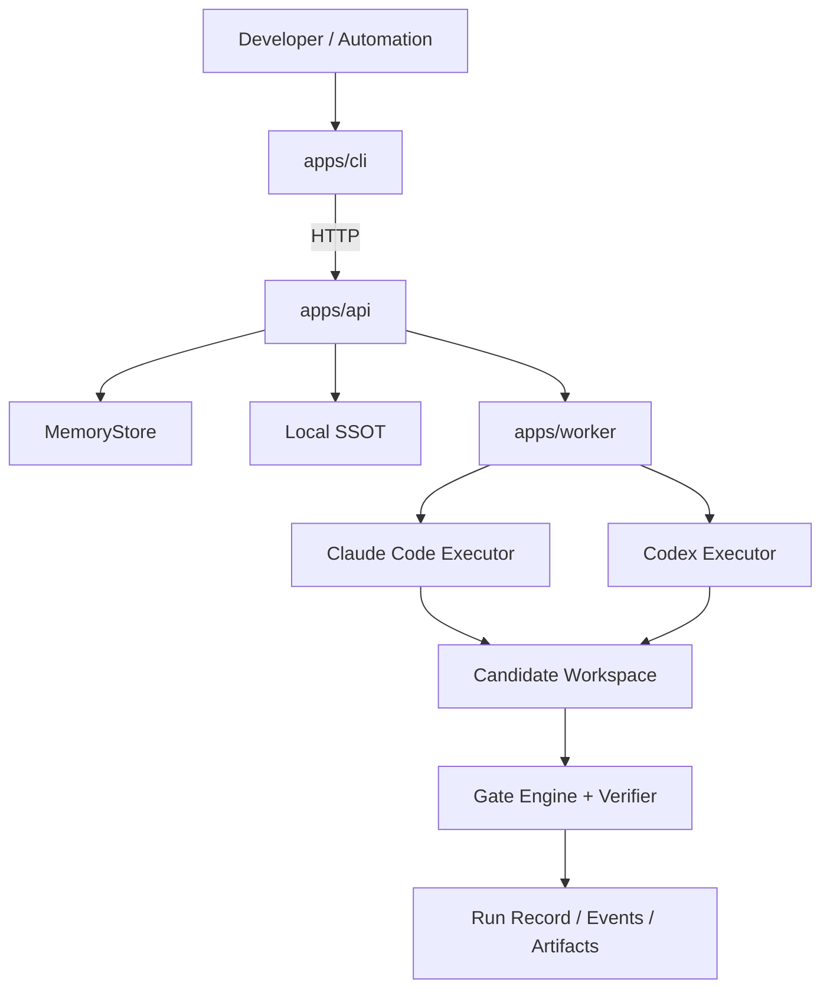
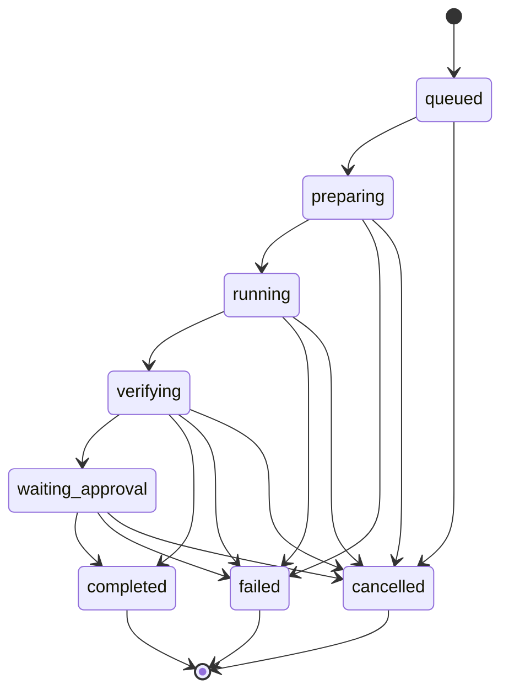

# mn（木牛）

`mn` 是面向企业微服务研发场景的 AI Coding Agent 控制平面。它把 Claude Code 与 Codex CLI 作为同级执行器，围绕项目、任务、候选实现、隔离工作区、确定性门禁、候选对比和审计事件组织一次可恢复、可验证的工程闭环。

中文名“木牛”取自“木牛流马”之意：它不是替代工匠的魔法，而是服务工程运输、调度和供给的机械化载具。`mn` 也取这个含义，把分散的 agent、候选实现、门禁和审批装进一套可搬运、可追踪、可复用的工程流程里。

当前仓库同时提供 `local` 与 `enterprise` profile。local 保留桌面端、单机 SSOT 和 classic-v1 体验；enterprise 提供版本化 Spec、可定制 Standard Pack、不可变 Governance/Harness、受限 Loop、OIDC/RBAC、PostgreSQL queue/metadata、S3-compatible artifact、OTLP 和追加式审计。默认执行器仍是 Claude Code 与 Codex CLI；Mock 模式适合 CI、演示和排障。

## 目录

- [适用场景](#适用场景)
- [当前可用能力](#当前可用能力)
- [企业 SpecHarnessLoop](#企业-specharnessloop)
- [架构与目录](#架构与目录)
- [环境要求](#环境要求)
- [安装与构建](#安装与构建)
- [核心概念](#核心概念)
- [运行模式](#运行模式)
- [CLI 使用手册](#cli-使用手册)
- [HTTP API 使用手册](#http-api-使用手册)
- [完整案例一：Mock 模式端到端跑通](#完整案例一mock-模式端到端跑通)
- [完整案例二：策略拒绝与人工审批](#完整案例二策略拒绝与人工审批)
- [完整案例三：真实 Claude Code/Codex 执行器](#完整案例三真实-claude-codecodex-执行器)
- [完整案例四：纯 HTTP API 流程](#完整案例四纯-http-api-流程)
- [门禁与候选选择](#门禁与候选选择)
- [工作区与数据](#工作区与数据)
- [仓库索引](#仓库索引)
- [环境变量](#环境变量)
- [开发与验证](#开发与验证)
- [故障排查](#故障排查)
- [安全边界与限制](#安全边界与限制)
- [路线图](#路线图)

## 适用场景

`mn` 适合把 AI coding agent 纳入工程控制面的团队，而不是只想临时调用一次模型的个人脚本。

典型场景：

- 在一个仓库或 monorepo 中注册项目，并自动发现服务边界。
- 把自然语言需求转成结构化任务，指定目标服务、验收标准、候选数量和门禁。
- 同时或轮换使用 Claude Code 与 Codex 生成多个候选实现。
- 在隔离工作区里运行候选实现，避免直接污染源仓库。
- 用 `test`、`typecheck`、`lint` 和 verifier 信号筛选 winner。
- 对跨服务任务或高风险任务保留人工审批状态。
- 通过 API/CLI/桌面 Run Detail 查询 run、events、gates 和 artifacts，并可下载 artifact content，形成审计链路。

不适合的场景：

- 期望 v0.1 自动合并 PR、自动部署或直接改生产数据。
- 期望仅凭源码仓库内验证就宣称真实企业 IdP、Vault/KMS、生产集群或灾备已经验收。
- 期望定制规范可以绕过不可豁免安全底线、伪造审批主体或让 required Gate 以 skipped 通过。

## 当前可用能力

- 本地 API：项目注册、项目查询、仓库索引、任务创建、后台 run 创建、SSE 事件流、artifact 查询/内容下载、审批、取消和显式 replacement resume。
- 本地 CLI：`init`、`doctor`、`diagnostics export`、`provider list/add/export/import/enable/test/delete`、`proxy status/start/stop/logs/health/health-reset/takeover/restore`、`usage summary/requests/models`、`session list/show/export`、`artifact-store summary/cleanup`、`mcp list/add/project`、`prompt list/add/activate`、`skill discover/list/add/registry-sync/registry-profile/install/uninstall/delete`、`project register`、`project index`、`task create`、`run`、`run worker`、`run workers`、`run artifacts`、`run artifacts-download`、`run artifact`、`run resume`、`run cleanup`、`run watch`、`gates report`；`provider add` 可通过 flags 写入 legacy replay opt-in 和工具级 replay policy。
- Provider 管理：Claude/Codex provider 预设、本地 SSOT、加密本地 secret vault、可选 macOS Keychain backend、duplicate、安全导入/导出、`mniu://import/provider` 深链导入预览、live HTTP probe、临时 HOME 配置投影、Codex `auth.json` 默认保护。
- 配置适配器：Claude `settings.json` 与 Codex `config.toml` 结构化读写、原子写入、自动备份、dry-run。
- 本地代理基础：可启动/停止本地 HTTP/SSE proxy，按 Claude/Codex 当前 provider 转发请求，记录请求日志、token usage、可选成本估算、run/candidate 关联和 provider health，并在 429/5xx/timeout 时切到后备 provider；连续失败会打开基础熔断并临时跳过异常 provider，默认阈值/窗口为 3 次/60 秒，也可通过 provider `config.healthPolicy.failureThreshold` 和 `config.healthPolicy.circuitOpenMs` 调整，桌面 Provider 表单也可编辑这两个字段；用户可通过 API/CLI/桌面清除指定 provider/app 的 health/circuit 记录，让下一次真实请求重新评估。proxy 支持从内部 header 或 `/mn/runs/:runId/candidates/:candidateId/...` 路径前缀恢复关联，并在转发 upstream 前剔除内部元数据；API 在 proxy 运行时会给 executor 进程注入带此前缀的 base URL。已关联 run/candidate 的非流式和文本 event-stream 2xx provider 响应会写入本地 replay cache，重复请求命中时返回 `x-mn-proxy-replay: hit` 并在 proxy logs 标记 `replayed`；包含 tool-call 的响应默认不缓存也不回放；provider 可用 `config.toolReplayPolicy.tools` 按工具名声明 `readonly` 或 `idempotent` 后允许安全工具 replay，旧 `config.replayToolCalls: true` 仍作为兼容的全量 opt-in。
- Provider replay policy 桌面编辑：Provider 表单可编辑 legacy `replayToolCalls` checkbox，以及 readonly、idempotent、side-effect 三类工具名；保存后写入 `config.toolReplayPolicy.tools`，由 local proxy 按工具级安全契约决定是否 replay。
- Provider replay policy CLI 编辑：`mn provider add` 支持 `--replay-tool-calls`、`--tool-readonly`、`--tool-idempotent` 和 `--tool-side-effect`，创建 provider 时可直接写入同一 `config.toolReplayPolicy.tools`。
- Proxy tool replay 可观测性：proxy request log 会记录 tool-call 响应中的工具名、effect 和 replaySafe，桌面 Proxy Logs 行会显示紧凑的工具 replay 摘要，便于审计被允许或阻断的工具级 replay。
- Session/log 基础：可从本机 Codex/Claude JSONL 会话目录流式索引 session 概要、消息、cwd、模型和 usage，并通过 API/CLI 查询、搜索、分页、导出和可选脱敏输出；CLI session export 默认脱敏，显式 `--raw` 才导出原始本地内容；索引会按 JSONL 文件 mtime/size 做进程内增量缓存。API `GET /v1/system/diagnostics` 可收集 `~/.mniu/logs` 下日志文件尾部样本、`~/Library/Logs/dev.muniu.desktop` 专属 app 日志尾部样本，以及 `~/Library/Logs/DiagnosticReports` 中仅匹配 Muniu/木牛 文件名的 `.crash` / `.ips` / `.log` 尾部样本，限制文件数/字节数并脱敏常见 Bearer/API key/token/secret/password 形态；`mn diagnostics export` 可在无桌面端时导出同一诊断包。桌面 Observability 面板已能展示 usage、provider health/circuit 状态、对 degraded/circuit provider 执行 health reset、session 预览/详情、session 搜索/翻页、默认开启的 session 脱敏开关、按当前脱敏状态导出 session JSON、本地敏感内容提示和 proxy logs。
- Extensions 基础：本地管理 MCP server、prompt preset 和 skill source；支持 `mniu://import/mcp` 与 `mniu://import/prompt` 深链导入到本地 SSOT，导入后仍需显式 project/activate 才会写 live 文件；同一 MCP server 可投影为 Claude `.claude.json` 与 Codex `.codex/config.toml` 两种格式，Codex 投影使用官方 `mcp_servers.*` 表、`args = [...]` 和 `mcp_servers.*.env` 子表；prompt activation 会写入 Claude `CLAUDE.md` 或 Codex `AGENTS.md`，切换前回填用户对 live prompt 的手动修改；skill 支持从 `~/.mniu/skills` / `~/.agents/skills` 发现，也可从 JSON registry 同步到本地 source store，registry 条目会校验 sha256，可强制 Ed25519 签名，entry 可声明 `publicKeyId`，index 可声明 `publicKeys` / `revokedPublicKeyIds` 和可签名 release metadata，API/CLI/桌面可额外传入 trusted key、revoked key policy 和 `requireReleaseMetadata`，撤销 key、release hash/signature mismatch 或过期 metadata 会拒绝同步，并可把 registry URL、签名要求、release metadata 要求、trusted keys、revoked IDs 保存为本地 trust profile 后复用同步；skill 以 copy 或 symlink 安装到 Claude/Codex，更新/卸载前自动备份。
- Mac 桌面端 scaffold：Tauri 2 + React，展示 API、Claude/Codex、Provider、Extensions、Proxy、Observability、任务闭环和 Settings 状态；Provider 行可新增、编辑、复制、删除、导入、导出、dry-run 后启用、触发 live HTTP probe 并展示 status/error 与 latency；Settings 面板可手动预览 `mniu://import/provider|mcp|prompt` 深链并在确认后导入本地 SSOT，Tauri 配置也已注册 `mniu` scheme；Settings Doctor 区块可展示 process env、shell profile、launchd LaunchAgent 和 VS Code/Cursor/Windsurf user settings 中的 managed env 冲突，并对 shell profile、launchd 与 IDE settings 冲突执行 dry-run 预览和确认清理，确认时由 API 先备份再删除匹配项；process env 冲突会显示 `unset NAME` manual action，不会显示成自动清理；同一区块也可导出不含原始 secret 的 `mniu.diagnostics` JSON 排障包，包含 doctor/runtime/settings、脱敏后的本地日志尾部样本、专属 app 日志尾部样本和 Muniu-scoped macOS DiagnosticReports 尾部样本；Extensions 面板可按应用查看 MCP、Prompt、Skills 和本地发现的 skill source，支持基础新增/编辑/删除、保存/选择 registry trust profile、带 trusted key ID / revoked key ID / release metadata 要求的 signed registry sync 预览确认，并在投影、激活、安装前先 dry-run 再确认写入；Observability 面板展示 usage 指标、provider health/circuit 状态、degraded/circuit provider health reset、session 搜索/翻页/预览/详情、默认开启的 session 脱敏开关、当前 session JSON 导出按钮、本地敏感内容提示和 proxy logs，关联日志会显示短 run/candidate；Task Fusion 面板可从桌面创建项目/task、启动后台 mock run、查看 candidates/gates/events/artifacts、按 candidate/kind/persisted 筛选 artifacts、下载单个 artifact content 或当前筛选的 artifacts archive、查看 artifact store 汇总、dry-run/确认本地 retention cleanup、查看 worker fleet summary 与 idle/running/stale worker、取消运行中 run、对 failed/cancelled run 启动 replacement resume，并在 Run Detail 展示 run-scoped usage、candidate workspace 打开入口和 terminal run workspace cleanup 确认入口；桌面 Provider/Session/artifact/archive 导出下载在 Tauri 环境中优先打开原生保存对话框，非 Tauri 或保存失败时回退浏览器下载；Settings 面板支持 theme、关闭行为、开机自启、轻量模式和 API URL，开机自启在 Tauri 环境通过 autostart plugin 同步 login item，非 Tauri/E2E 环境回退为偏好保存；`npm run verify:desktop-extensions`、`npm run verify:desktop-observability`、`npm run verify:desktop-task-fusion` 与 `npm run verify:desktop-settings` 可重复验证核心交互并生成截图证据。
- 桌面关闭行为：Tauri 环境会订阅当前窗口 `onCloseRequested`，`quit` 放行原生关闭，`tray` 阻止关闭并隐藏窗口，`lightweight` 阻止关闭后销毁主 WebView；托盘打开入口会在主窗口不存在时按 Tauri window config 重建。Rust 已编译并通过测试，universal packaged app 也已运行；真实已安装窗口的 close/tray/lightweight 交互仍需系统级验收。
- Mac 本地发布工程：可重复生成包含受管双架构 daemon 的 unsigned universal APP、ZIP、带背景/安装说明/Finder 布局的 DMG，以及版本化 updater archive；`npm run verify:mac-packaged-app` 覆盖 DMG 挂载内容、隔离 Keychain CRUD、daemon 生命周期和 `mniu://` 处理。发布脚本在正式模式下会从完成 staple 的 app 重建 updater archive、签名并生成 `latest.json`。Developer ID 签名、公证、Gatekeeper、真实 updater 下载/安装和干净机验收仍需外部 Apple 凭据。
- 执行器：Claude Code、Codex CLI、Mock executor。
- 工作区：默认 `isolated-worktree`；Git 仓库优先使用 `git worktree`，非 Git 目录复制源码 snapshot。
- 门禁：classic-v1 保持历史兼容；governed-increment-v1 使用 capability registry，支持 Node、Go、Java、Python、Rust 项目命令，以及 Spec、protected path、diff scope、OpenAPI/AsyncAPI contract、migration safety 和 security adapter。企业 required Gate fail-closed。
- 策略：跨服务任务默认需要人工审批；违反策略的任务会被 API 拒绝。
- 候选对比：只有执行完成且无阻塞门禁的 candidate 才能成为 winner。
- 存储：Provider/Projection/Proxy/MCP/Prompt/Skill 和 proxy replay records 使用本地 SSOT；project、task、run、run job 和 event 默认使用 API 进程内存 store，配置 `MN_API_STATE_PATH` 后可写入本地 JSON snapshot 并跨重启保留历史。run job snapshot 会记录 `queued` / `running` / terminal 状态、attempt、是否恢复执行、开始/结束时间和 interrupted 标记；API 会在 `~/.mniu/run-job-leases/` 下用带 TTL/heartbeat 的本地 lock 文件防止多个 API 进程重复执行同一 run job，并在 `~/.mniu/run-job-queue/<run-id>.json` 写入 queued/running/terminal 队列 item，保留 project/task、attempt、owner、claim token/TTL 和时间戳，队列 API 已支持基础 claim/heartbeat/release；API 还会在 `~/.mniu/run-job-workers/<owner-id>.json` 维护本地 worker registry，记录 worker idle/running/stale、activeRunId、lastSeenAt、heartbeatExpiresAt 和完成/失败/释放计数，`mn run workers` 和桌面 Task Fusion 的 Worker Fleet 面板可查询 fleet 状态；配置 `MN_API_AUTO_RESUME_RUNS=1` 后，尚未进入候选执行的 pending run 会在 API 重启后用原 runId 自动重放，active run 可跳过 completed candidate checkpoint，并可继续执行已登记但尚未开始的 queued candidate checkpoint；真实 executor 的 stdout/stderr 会按 candidate 写入 checkpoint 文件，API 重启恢复 interrupted running candidate 时会把已落盘的部分输出挂回 failed result 并进入 artifact persistence；配置 `MN_ARTIFACT_REMOTE_STORE_PATH` 后，terminal run artifacts 会镜像到 filesystem-backed remote store；配置 `MN_ARTIFACT_REMOTE_STORE_TYPE=s3|gcs`、bucket、prefix 和本地 backend path 后，可按 S3/GCS-compatible object key/URI 布局镜像 artifacts，并在本地持久内容缺失时按 sha256 校验后从 remote backend 兜底下载；API/CLI cleanup 可用 `scope=remote|both` 显式清理 filesystem mirror 或对象 backend。

## 企业 Spec–Harness–Loop

企业闭环把一次需求交付固定为 `SpecRevision → GovernanceSnapshot → HarnessManifest → Bounded Loop → Evidence Graph → Learning Proposal`。每次 governed Run 绑定不可变 digest；规范按 `builtin < organization < team < project < service < task` 单调收紧，Learning 只能生成提案，经过 review、canary、签名和回滚准备后才能成为新 StandardPackRevision。

完整的定制规则、profile 配置、安全边界、API/CLI 和本地验收方法见 [Enterprise Spec–Harness–Loop](docs/ENTERPRISE_SDD_LOOP.md)。仓库内完成级别称为 `locally_verified`，不等同于生产环境验收。

## 架构与目录



目录职责：

| 路径 | 说明 |
|---|---|
| `apps/api` | HTTP API、运行态内存 store、项目/任务/run 生命周期入口和本地 SSOT API。 |
| `apps/cli` | 本地命令行入口。 |
| `apps/desktop-mac` | Tauri + React macOS 桌面端 scaffold。 |
| `apps/worker` | 候选编排、工作区准备、执行器调用、门禁聚合。 |
| `packages/core` | 领域模型、状态机、策略、上下文 harness、门禁评分。 |
| `packages/specs` | SpecSet/SpecRevision、严格校验、legacy 包装与 Spec Kit 适配。 |
| `packages/governance` | Standard Pack、单调解析、waiver、签名 registry、lock 与不可变 GovernanceSnapshot。 |
| `packages/harness` | 确定性 context 编译、Gate/Sandbox 能力绑定、预算与不可变 HarnessManifest。 |
| `packages/loop` | governed-increment-v1 七阶段、有界 repair、checkpoint/resume 与人工审批。 |
| `packages/evidence` | Eval Asset、Trace Graph、drift、Learning Proposal 与成熟度指标。 |
| `packages/provider-catalog` | Claude/Codex provider 类型、预设和脱敏工具。 |
| `packages/usage` | token usage 归一、代理请求日志聚合、用量 summary、session JSONL 索引和基于模型定价的基础成本估算。 |
| `packages/store` | 本地 Provider/Projection/Proxy/MCP/Prompt/Skill SSOT 与加密本地 secret vault。 |
| `packages/config-manager` | Claude/Codex live config 读写、备份、dry-run、环境变量冲突检测。 |
| `packages/extensions` | MCP server、prompt preset 和 skill source 的本地模型、投影、prompt live backfill、skill registry 校验同步、skill copy/symlink 同步。 |
| `packages/local-proxy` | 本地 HTTP/SSE proxy、provider 路由、请求日志、provider health 和基础故障转移/熔断。 |
| `packages/executors` | Claude Code、Codex CLI 和 Mock executor。 |
| `packages/verifier` | 候选评分、候选对比和 winner 选择。 |
| `packages/connectors` | `.mn/project.yaml`、服务/字段所有权、契约/迁移发现与 L0–L4 影响分析。 |
| `docs/TECHNICAL_DESIGN.md` | 技术实现设计。 |
| `examples/microservice-repo` | 两服务企业验收 fixture，含正例和四类 fail-closed 负例。 |

## 环境要求

- Node.js 22+
- npm 11+
- Mock 模式不需要模型凭据。
- 真实执行器模式需要：
  - Claude Code CLI：`claude --version`
  - Codex CLI：`codex --version`

检查当前工具链：

```bash
node --version
npm --version
```

## 安装与构建

安装依赖：

```bash
npm install
```

构建所有 workspace：

```bash
npm run build
```

运行本地验证：

```bash
npm run typecheck
npm test
```

根目录脚本：

| 脚本 | 作用 |
|---|---|
| `npm run build` | 按依赖顺序构建 core、provider-catalog、usage、config-manager、extensions、store、local-proxy、executors、verifier、connectors、worker、api、cli。 |
| `npm run typecheck` | 对全部 workspace 执行 TypeScript no-emit 检查。 |
| `npm test` | 先构建，再运行各 workspace 的 Node test。 |
| `npm run dev:api` | 构建后启动 API。 |
| `npm run dev:worker` | 构建后启动 worker 入口。当前本地 run 由 API 进程内后台 job 调用 worker orchestrator。 |
| `npm run dev:cli -- <args>` | 构建 CLI 后执行 CLI 命令。 |
| `npm run typecheck:desktop` | 对 macOS/Tauri React 桌面端执行 TypeScript no-emit 检查。 |
| `npm run build:desktop` | 构建 macOS/Tauri React 桌面端前端资源。 |
| `npm run verify:desktop-extensions` | 构建 API，启动临时 API/Vite，用 system Chrome 验证桌面 Extensions MCP/Prompt/Skill CRUD、MCP/Prompt deep link 导入、signed registry trust profile 保存/选择、trusted key/revoked key/release metadata policy、确认写入和截图证据。 |
| `npm run verify:desktop-observability` | 构建 API，启动临时 API/proxy/upstream/Vite，用 system Chrome 验证桌面 Provider CRUD/导入/导出/深链导入/测速、usage、provider health/circuit、health reset、session、proxy logs 和截图证据。 |
| `npm run verify:desktop-task-fusion` | 构建 API，启动临时 API/Vite，用 system Chrome 验证桌面创建 task、后台 mock run、打开 candidate workspace 的浏览器 fallback、artifact 筛选、单个 artifact 下载、筛选后的 artifacts archive 下载、artifact store cleanup、取消长任务、展示 gates/events 和截图证据。 |
| `npm run verify:desktop-settings` | 构建 config-manager/API，启动临时 API/Vite，用 system Chrome 验证桌面 Settings 保存/重载、diagnostics export、环境变量冲突清理、移动布局和截图证据。 |
| `npm run verify:desktop-close-behavior` | 静态校验桌面 Tauri close-request wiring：latest settings ref、`quit` 放行、`tray` hide、`lightweight` destroy、托盘重建主窗口和 listener cleanup。 |
| `npm run verify:enterprise-fixture` | 验证签名 Pack、批准 Spec、微服务影响分析、两服务正例和四类 Gate/架构负例。 |
| `npm run verify:enterprise-dependencies` | 用 Docker Compose 启动并验证 PostgreSQL、MinIO 和 JWKS/OTLP stub。 |
| `npm run verify:enterprise-e2e` | 运行完整企业 API 闭环，包含真实 Gate fail/repair、approval/resume、S3、OTLP、audit、evidence 与 Learning no-auto-activation。 |
| `npm run verify:mac-release` | 校验 macOS Homebrew cask 草案、Tauri 元数据一致性、Ruby 语法和发布文档必要章节。 |
| `npm run dev:desktop` | 启动桌面端 Vite 开发预览。 |

更快的本地命令方式：

```bash
npm run build
node apps/api/dist/index.js
node apps/cli/dist/index.js --help
```

## 核心概念

### Project（项目）

`Project` 表示一个本地代码仓库或工作区。

关键字段：

| 字段 | 说明 |
|---|---|
| `id` | API 创建的 UUID。 |
| `name` | 项目名称。 |
| `rootPath` | 本地绝对路径。 |
| `defaultBranch` | 默认分支，CLI 注册时固定传 `main`。 |
| `services` | `project index` 发现的服务列表。 |
| `policyId` | 当前为默认策略 `default`。 |

### Service（服务）

`Service` 是仓库索引器发现的服务边界。v0.1 根据常见 marker 识别服务，例如 `package.json`、`go.mod`、`openapi.yaml` 和 `proto/`。

### AgentTask（代理任务）

`AgentTask` 是一次要交给 agent 的结构化任务。

关键字段：

| 字段 | 说明 |
|---|---|
| `title` | 任务标题。 |
| `intent` | `analyze`、`design`、`implement`、`review`、`repair`，CLI 当前固定为 `implement`。 |
| `targetServices` | 目标服务名称或 ID。CLI 一次只能传一个 `--service`，HTTP API 可传数组。 |
| `prompt` | 交给执行器的任务描述。 |
| `acceptanceCriteria` | 验收标准，会进入上下文 prompt。 |
| `strategy` | provider、candidate 数、sandbox、gates、审批和超时。 |

### Run（运行记录）

`RunRecord` 是一次任务执行记录。

状态流转：



说明：

- `POST /v1/tasks/:id/runs` 默认立即返回 queued run，并由 API 进程内后台 job 执行 orchestrator；传 `{ "wait": true }` 可等待本次 run 完成后返回。
- `run watch` 优先读取 `/v1/runs/:id/events/stream` SSE 事件流；服务端不支持流时才退回事件快照。
- candidate 在 v0.1 中按顺序执行，不是并行执行。

### Candidate（候选实现）

每个 candidate 绑定一个 provider 和一个候选工作区。候选 ID 形如 `claude-1`、`codex-2`。当 candidates 数量大于 providers 数量时，provider 会按顺序轮换。

例子：

| providers | candidates | 生成的 candidates |
|---|---:|---|
| `claude,codex` | `2` | `claude-1`、`codex-2` |
| `claude,codex` | `3` | `claude-1`、`codex-2`、`claude-3` |
| `codex` | `2` | `codex-1`、`codex-2` |

## 运行模式

### Mock 模式

Mock 模式不会调用真实 Claude Code 或 Codex CLI。API 仍然会创建 candidate workspace、运行 gate engine、记录 events，并按 verifier 选择 winner。

启动方式：

```bash
mkdir -p /tmp/mn-worktrees
MN_USE_MOCK_EXECUTORS=1 \
MN_WORKSPACE_ROOT=/tmp/mn-worktrees \
node apps/api/dist/index.js
```

适用：

- 第一次确认 API/CLI 能跑通。
- CI 或本地 smoke test。
- 没有模型凭据的环境。
- 排查 policy、workspace、gate 和 verifier 行为。

### 真实执行器模式

不设置 `MN_USE_MOCK_EXECUTORS=1` 时，API 会使用真实 Claude Code 和 Codex CLI。

启动方式：

```bash
mkdir -p /tmp/mn-worktrees
MN_WORKSPACE_ROOT=/tmp/mn-worktrees \
node apps/api/dist/index.js
```

Claude Code executor 默认命令形态：

```bash
claude --print --output-format stream-json --verbose --permission-mode default
```

实际任务 prompt 会通过 stdin 传给 Claude Code。

Codex executor 默认命令形态：

```bash
codex --ask-for-approval never exec \
  --cd <candidate-workspace> \
  --sandbox workspace-write \
  --skip-git-repo-check \
  --ephemeral <prompt>
```

真实模式建议：

- 先用 Mock 模式跑通控制平面。
- 把 `MN_WORKSPACE_ROOT` 指到临时目录或专用磁盘路径。
- 第一次接真实模型时，把 `--providers` 设为单个 provider，并把 `--candidates` 设为 `1`。
- 对跨服务、迁移、权限、数据写入任务使用 `--approval on-risk` 或 `--approval before-merge`。
- 真实执行器可能产生模型费用，也可能在 candidate workspace 中修改文件。

## CLI 使用手册

CLI 可以通过 `npm run dev:cli -- ...` 调用，也可以在构建后直接运行 `node apps/cli/dist/index.js ...`。下面为了减少 `npm run` 的构建输出，示例使用构建后的入口。

```bash
npm run build
node apps/cli/dist/index.js --help
```

### 配置优先级

CLI 解析 API 地址的优先级：

1. `MN_API_URL` 环境变量。
2. 当前目录 `.mn/config.json` 中的 `apiUrl`。
3. 默认 `http://127.0.0.1:7318`。

`mn init` 会创建 `.mn/config.json`。`project register` 会把 `projectId` 写入同一个配置文件，后续 `project index` 和 `task create` 会读取它。

### `mn init`

初始化当前目录的 `.mn/config.json`：

```bash
node apps/cli/dist/index.js init
```

输出：

```text
Initialized .mn/config.json
```

生成文件示例：

```json
{
  "apiUrl": "http://127.0.0.1:7318"
}
```

### `mn doctor`

检查 API 和本机执行器 binary：

```bash
node apps/cli/dist/index.js doctor
```

典型输出：

```text
API: ok (mn-api)
API URL: http://127.0.0.1:7318
Executor mode: mock
Workspace root: /tmp/mn-worktrees
Claude Code: failed (claude: spawn claude ENOENT)
Codex CLI: failed (codex: spawn codex ENOENT)
```

说明：

- Mock 模式下，Claude/Codex binary 检查失败不影响 mock run。
- 真实模式下，需要先修复 binary 路径或设置 `MN_CLAUDE_BINARY`、`MN_CODEX_BINARY`。
- 新版 API 会额外返回 Claude/Codex 配置目录和 `ANTHROPIC_API_KEY`、`ANTHROPIC_BASE_URL`、`OPENAI_API_KEY` 环境变量冲突，密钥会脱敏显示；shell profile 中明确写出的 `export ...`、`declare/typeset -x ...`、fish `set -gx/-Ux ...`、fish `conf.d/*.fish`、csh/tcsh `setenv ...`，以及用户 `LaunchAgents/*.plist` 的 `EnvironmentVariables`、VS Code/Cursor/Windsurf user `settings.json` 的 `terminal.integrated.env.*`，都会带来源、文件和行号显示。

环境变量清理默认只 dry-run；没有指定 `--source` 时保持 shell profile-only 兼容行为，确认时会先备份目标文件到 `~/.mniu/backups/env-profile-cleanup/`，再删除匹配项。当前进程里的 `process.env` 无法由子进程反向修改父 shell 环境，因此 `/v1/system/env-cleanup` 会返回 manual action，例如 `unset OPENAI_API_KEY`，并提示重启相关终端或 IDE；launchd LaunchAgent 和 IDE settings 需要显式 `--source`：

```bash
node apps/cli/dist/index.js doctor env-cleanup --name OPENAI_API_KEY
node apps/cli/dist/index.js doctor env-cleanup --name OPENAI_API_KEY --yes
node apps/cli/dist/index.js doctor env-cleanup --source all --yes
```

桌面 Settings 的 Doctor 区块也会读取同一组冲突信息，并提供清理预览与确认入口；确认清理会显式覆盖 shell profile、launchd 和 IDE settings 三类来源。shell profile 清理包括 bash/zsh/fish/csh/tcsh 的常见一行赋值形式；launchd 清理只删除 `EnvironmentVariables` 中的 managed env key/string pair；IDE settings 清理会解析 JSONC 并删除 `terminal.integrated.env.*` 里的 managed env 字段。`process.env` 冲突会显示 manual action 命令，不会显示成已自动清理。

### `mn diagnostics export`

导出与桌面 Settings/Doctor 相同来源的 `mniu.diagnostics` JSON 排障包。输出会复用 API 的截断与脱敏逻辑，包含 doctor 摘要、`~/.mniu/logs` tail、`~/Library/Logs/dev.muniu.desktop` 专属 app log tail 和 Muniu-scoped DiagnosticReports tail：

```bash
node apps/cli/dist/index.js diagnostics export --out mniu-diagnostics.json
node apps/cli/dist/index.js diagnostics export
```

### `mn provider`

列出 provider：

```bash
node apps/cli/dist/index.js provider list --app codex
```

添加预设 provider。推荐优先使用环境变量引用，避免把 API key 写入命令历史：

```bash
node apps/cli/dist/index.js provider add \
  --preset deepseek \
  --api-key-env OPENAI_API_KEY
```

导出 provider 配置。导出文件只包含可迁移元数据和环境变量名引用；本地加密 secret / keychain 引用会被省略：

```bash
node apps/cli/dist/index.js provider export \
  --app codex \
  --out providers.json
```

导入 provider 配置。默认只 dry-run 预览；加 `--yes` 后才写入本地 SSOT，导入的 provider 默认不启用，需要再显式 enable：

```bash
node apps/cli/dist/index.js provider import --file providers.json
node apps/cli/dist/index.js provider import --file providers.json --yes
```

同步 provider model catalog/价格表。`catalog.json` 可以是 `{ "models": [...] }` 或直接是 model 数组；默认只 dry-run 预览 added/updated/removed，`--yes` 后才写入。确认同步会在 provider `config.modelCatalogSync` 记录来源、同步时间、模型 hash、模型数量和最大时效天数；`audit` 可检查当前目录是否从未同步、仍新鲜、过期或被手动改动。URL 同步可用 `--save-policy` 保存 `config.modelCatalogSyncPolicy`，后续 `sync-due` 会按 app/provider/limit 找到从未同步、过期、被手动改动或已到 refresh interval 的 provider 并 dry-run/确认刷新。API 也可通过 `MN_PROVIDER_MODEL_CATALOG_SYNC_INTERVAL_MS` 显式启用内置 scheduler，配合 `MN_PROVIDER_MODEL_CATALOG_SYNC_APP`、`MN_PROVIDER_MODEL_CATALOG_SYNC_PROVIDER_IDS` 和 `MN_PROVIDER_MODEL_CATALOG_SYNC_LIMIT` 限定刷新范围。`--url` 由 API 拉取远程 JSON，适合后续接入官方或企业维护的价格 catalog；木牛不会在代码中硬编码当前官方价格：

```bash
node apps/cli/dist/index.js provider model-catalog sync <provider-id> --file catalog.json
node apps/cli/dist/index.js provider model-catalog sync <provider-id> --url https://example.test/catalog.json --mode merge --max-age-days 30 --save-policy --refresh-interval-hours 24 --yes
node apps/cli/dist/index.js provider model-catalog audit <provider-id> --max-age-days 30
node apps/cli/dist/index.js provider model-catalog sync-due --app codex --dry-run
node apps/cli/dist/index.js provider model-catalog sync-due --app codex --yes
```

启用 provider 到临时 HOME。`--dry-run` 只返回脱敏后的投影内容，不写 live config：

```bash
node apps/cli/dist/index.js provider enable <provider-id> \
  --app codex \
  --home /tmp/mn-test-home \
  --dry-run
```

真正启用时会：

- 写入 Codex `~/.codex/config.toml` 或 Claude `~/.claude/settings.json`。
- 修改前自动备份已有 live config。
- 默认保留 Codex `~/.codex/auth.json`。

其他命令：

```bash
node apps/cli/dist/index.js provider test <provider-id>
node apps/cli/dist/index.js provider delete <provider-id>
```

`provider test` 会按 provider 的 API format 发起一次最小 live HTTP probe，并返回 `mode`、`targetUrl`、`statusCode`、`latencyMs` 和错误摘要；本地 secret 只用于请求 header，不会出现在响应中。探测结果也会写入 provider health，可通过 `mn proxy health` 查询。

### `mn proxy`

启动或停止本地代理：

```bash
node apps/cli/dist/index.js proxy start --port 15721
node apps/cli/dist/index.js proxy status
node apps/cli/dist/index.js proxy stop
```

查看请求日志：

```bash
node apps/cli/dist/index.js proxy logs --app codex
```

查看 provider health 与熔断状态：

```bash
node apps/cli/dist/index.js proxy health --app codex
```

清除某个 provider/app 的 health/circuit 记录，让下一次真实请求重新评估：

```bash
node apps/cli/dist/index.js proxy health-reset provider-id --app codex
```

接管或恢复应用 live config。接管会把 Claude/Codex 配置投影到本地代理地址，恢复会在 live config 仍等于木牛接管投影时从备份还原：

```bash
node apps/cli/dist/index.js proxy takeover codex --home /tmp/mn-test-home
node apps/cli/dist/index.js proxy restore codex
```

如果用户在接管后手动修改了 live config，`restore` 会拒绝覆盖并返回冲突。当前代理支持 HTTP/SSE 透传，并会在 429/5xx/timeout 时从同 app provider 队列切到后备 provider；连续失败会写入 provider health 并打开基础熔断，默认 3 次失败打开 60 秒，可通过 provider `config.healthPolicy.failureThreshold` / `config.healthPolicy.circuitOpenMs` 调整，桌面 Provider 新增/编辑表单也会写入同一 config，`proxy health-reset` / 桌面 Proxy Health reset 可清除本地 health/circuit 记录，让下一次真实请求重新评估。代理会把 `x-mn-run-id` / `x-mn-candidate-id` 或 `/mn/runs/:runId/candidates/:candidateId/...` 路径前缀作为内部关联元数据写入请求日志，并在转发 upstream 前剔除所有 `x-mn-*` 头和内部路径前缀。API 在本地 proxy 运行时会给 executor 进程注入 `MN_RUN_ID`、`MN_CANDIDATE_ID` 和带内部路径前缀的 Claude/Codex base URL 环境变量。已关联 run/candidate 的非流式和文本 event-stream 2xx provider 响应会按 app/provider/model/method/target URL/request hash/run/candidate 写入本地 replay cache；event-stream replay 保存的是实际发送给客户端的 SSE body。重复请求命中时不会访问 upstream，会返回缓存响应和 `x-mn-proxy-replay: hit`，并在请求日志上标记 `replayed: true`。包含 `tool_calls` / `tool_use` / `function_call` 的响应默认不写入 replay cache，旧 tool-call replay record 默认也不会回放，避免恢复或重试时重复触发客户端工具执行；provider 可用 `config.toolReplayPolicy.tools` 按工具名声明 `readonly` 或 `idempotent` 后允许安全工具 replay，旧 `config.replayToolCalls: true` 仍作为兼容的全量 opt-in，桌面 Provider 表单保留 legacy checkbox。provider `config.idempotencyHeaderName` 可显式开启上游原生幂等 header 注入，local proxy 会为已关联且可构造 replay key 的请求写入确定性的 `mn-<hash>` 值，并保留调用方已有同名 header。replay cache 只保存响应 body 和请求 hash，不保存请求 body；完整 provider tool-call 幂等重放和 provider 原生 idempotency 结果仍不纳入该基础缓存。对 Codex 请求，已支持将 `/v1/responses` 基础文本请求转换为 OpenAI Chat Completions provider 请求，非流式响应会包装回 Responses JSON，Chat Completions SSE 会转换为基础 Responses SSE 事件；对 Claude 请求，已支持将 Anthropic Messages 基础文本请求转换为 OpenAI Chat Completions 或 OpenAI Responses，并将 Chat/Responses 非流式与 SSE 文本响应包装回 Anthropic Messages/Events。非流式转换已覆盖基础 tool definitions、tool_choice、tool calls 和 tool results 映射；流式转换已覆盖 Chat `tool_calls` delta 到 Responses function_call SSE / Anthropic tool_use Events、Responses function_call delta 到 Anthropic tool_use Events，以及 Chat SSE multi-tool delta 到 Responses/Anthropic 的本地回归。可见 usage 会归一写入请求日志，并可基于 provider `modelCatalog` 中的模型单价估算成本；桌面 Provider 表单可编辑模型 ID、展示名、上下文窗口、input/output 每百万 token 单价，以及 cached input、cache creation、cache read、reasoning output 分项单价；CLI/API 也支持从 inline JSON、文件或 URL dry-run/确认同步 provider model catalog、保存 sync policy、audit 同步来源/时间/hash/freshness，通过 `sync-due` 手动刷新到期目录，并可显式开启 API 内置 scheduler 自动刷新。流式文本和工具调用在 upstream 未返回 final usage 时会用请求文本、文本 delta 和工具参数做基础 token 估算。OpenAI cached input / reasoning output 与 Anthropic cache creation/read token 已做基础归一，并支持 provider `modelCatalog` 中可选分项单价估算；复杂真实 provider 流差异验证、真实官方/企业价格源 preset 和真实源差异验证仍在后续阶段。

### `mn usage`

查看基于代理请求日志归一后的 token 用量：

```bash
node apps/cli/dist/index.js usage summary --app codex
node apps/cli/dist/index.js usage requests --app codex --limit 50
node apps/cli/dist/index.js usage models --app codex
node apps/cli/dist/index.js usage summary --run run-1 --candidate codex-1
```

当前用量统计来自代理响应中的常见 usage 字段，支持 Anthropic Messages、OpenAI Responses 和 OpenAI Chat Completions 的基础 token 归一；`summary`、`requests` 和 `models` 都可按 `--run` / `--candidate` 过滤，summary 还会返回 `byRun` / `byCandidate` 分组。流式文本或工具调用缺少 final usage 时会记录基础估算值。若 provider `modelCatalog` 为模型配置了 `inputTokenUsdPerMillion` / `outputTokenUsdPerMillion`，或可选的 `cachedInputTokenUsdPerMillion`、`cacheCreationInputTokenUsdPerMillion`、`cacheReadInputTokenUsdPerMillion`、`reasoningOutputTokenUsdPerMillion`，`summary` 和 `models` 会返回 `estimatedCostUsd`；桌面 Provider 表单已支持常用模型目录、input/output 单价和 cache/reasoning 分项单价编辑，CLI/API 已支持从 JSON 文件或 URL dry-run/确认同步 model catalog、审计同步 freshness、手动刷新到期 policy，并可显式启用 API 内置 scheduler 自动刷新。真实官方/企业价格源 preset 和真实源差异验证仍在后续阶段。

### `mn session`

列出或查看本机 Claude/Codex JSONL 会话记录。测试和排障时建议先传 `--home` 指向临时 HOME：

```bash
node apps/cli/dist/index.js session list --app codex --home /tmp/mn-test-home --query "billing" --offset 0 --limit 25 --redact
node apps/cli/dist/index.js session show <session-id> --app codex --home /tmp/mn-test-home --redact
node apps/cli/dist/index.js session export <session-id> --app codex --home /tmp/mn-test-home --out session.json
node apps/cli/dist/index.js session export <session-id> --app codex --home /tmp/mn-test-home --raw
```

`session list` 返回 session 概要，包括 app、标题、cwd、时间、模型、消息数和 token usage；可用 `--query` 搜索 title、cwd、sourceRoot、模型、provider、时间戳和消息文本，用 `--offset` / `--limit` 分页。`session show` 返回同一 session 的解析消息。`session export` 输出 `mniu.session.export` JSON 文档，包含 metadata、是否脱敏和完整 session detail；默认传 `redact=true`，用 `--raw` 才请求原始本地内容。当前 parser 使用流式读取避免大 JSONL 一次性进内存，覆盖真实 Codex `event_msg` / `response_item` + `payload.type` / `payload.message` 等 schema，并排除无内容内部事件；重复索引会按文件 mtime/size 复用进程内缓存。`--redact` 会遮蔽常见 API key、Bearer token 和用户 HOME 路径。桌面 Observability 面板已提供 session 搜索、翻页、概要和详情预览，当前 session 可按脱敏开关状态导出 JSON，并提示 session 内容可能包含代码、密钥或私有路径。

### `mn mcp`

列出 MCP server：

```bash
node apps/cli/dist/index.js mcp list --app claude
```

新增 MCP server。`--env` 默认写入本地加密 secret vault；当 `MN_SECRET_VAULT_BACKEND=keychain` 时会写入同一 Keychain backend。API 响应和投影响应会脱敏；投影到应用 live config 时会解析为目标 MCP server 需要的环境变量：

```bash
node apps/cli/dist/index.js mcp add \
  --name weather \
  --command node \
  --args weather.js \
  --env WEATHER_TOKEN=secret-token \
  --apps claude,codex
```

投影到临时 HOME：

```bash
node apps/cli/dist/index.js mcp project <server-id> \
  --apps claude,codex \
  --home /tmp/mn-test-home
```

同一个 MCP server 会按目标应用写成两种 live config：Claude 使用 `~/.claude.json` 的 `mcpServers`，Codex 使用 `~/.codex/config.toml` 的 `[mcp_servers.<name>]` 表、`command`、`args = [...]` 和 `[mcp_servers.<name>.env]` 子表。`--dry-run` 会返回脱敏后的 projected config，不写文件。

### `mn prompt`

列出 prompt preset：

```bash
node apps/cli/dist/index.js prompt list --app codex
```

新增 prompt preset：

```bash
node apps/cli/dist/index.js prompt add \
  --name review \
  --content "Review the change and focus on regressions." \
  --apps claude,codex
```

激活 prompt 到临时 HOME：

```bash
node apps/cli/dist/index.js prompt activate <prompt-id> \
  --app codex \
  --home /tmp/mn-test-home
```

激活会写入 Claude `~/.claude/CLAUDE.md` 或 Codex `~/.codex/AGENTS.md`。如果切换前用户手动改过 live prompt，API 会先把当前 live 内容回填到上一次激活的 preset，再写入新 preset。

### `mn skill`

发现本地 skill source。默认扫描 `~/.mniu/skills`，并兼容 `~/.agents/skills`：

```bash
node apps/cli/dist/index.js skill discover --home /tmp/mn-test-home
```

登记 skill source：

```bash
node apps/cli/dist/index.js skill add \
  --name review \
  --source /tmp/mn-test-home/.mniu/skills/review \
  --apps claude,codex
```

从 registry 预览/同步 skill source。registry 可以是本地 JSON 文件、`file://` URL 或 HTTP(S) URL；条目必须包含 `SKILL.md` 文件清单和 `sha256`，可提供 Ed25519 `signature`、`publicKeyId`、`publicKeys` 和 `revokedPublicKeyIds`。默认 dry-run，传 `--yes` 才写入 `~/.mniu/skills/<name>` 并登记/更新本地 skill source；`--require-signature` 会拒绝缺签名、验签失败、未受信 key ID 或 revoked key：

```bash
node apps/cli/dist/index.js skill registry-sync \
  --url /tmp/mn-test-home/skill-registry.json \
  --require-signature \
  --require-release-metadata \
  --public-key <base64-spki-public-key> \
  --trusted-public-key registry-2026=<base64-spki-public-key> \
  --revoked-public-key-id registry-2025 \
  --yes
```

保存并复用 registry trust profile：

```bash
node apps/cli/dist/index.js skill registry-profile add \
  --name trusted \
  --url /tmp/mn-test-home/skill-registry.json \
  --require-signature \
  --require-release-metadata \
  --trusted-public-key registry-2026=<base64-spki-public-key> \
  --revoked-public-key-id registry-2025

node apps/cli/dist/index.js skill registry-profile list
node apps/cli/dist/index.js skill registry-profile sync <profile-id> --yes
node apps/cli/dist/index.js skill registry-profile delete <profile-id>
```

安装到临时 HOME。`install` 也可用于 update：source 内容变化时会先备份现有目标目录，再按新 source 同步：

```bash
node apps/cli/dist/index.js skill install <skill-id> \
  --app claude \
  --mode copy \
  --home /tmp/mn-test-home
```

也可以使用 symlink：

```bash
node apps/cli/dist/index.js skill install <skill-id> \
  --app codex \
  --mode symlink \
  --home /tmp/mn-test-home
```

卸载前会自动备份目标 skill 目录：

```bash
node apps/cli/dist/index.js skill uninstall <skill-id> \
  --app claude \
  --home /tmp/mn-test-home
```

目标目录为 Claude `~/.claude/skills/<name>` 或 Codex `~/.codex/skills/<name>`。`--dry-run` 会返回目标路径和变更判断，不写文件。

### `mn project register`

注册当前目录：

```bash
node apps/cli/dist/index.js project register --root . --name mn
```

注册其他目录：

```bash
node apps/cli/dist/index.js project register \
  --root /absolute/path/to/repo \
  --name demo
```

参数：

| 参数 | 必填 | 默认 | 说明 |
|---|---|---|---|
| `--root` | 否 | `.` | 项目根目录，会解析为绝对路径。 |
| `--name` | 否 | root 目录名 | 项目名称。 |

输出是 project JSON，并会把 `projectId` 写入 `.mn/config.json`。

### `mn project index`

索引当前配置中的项目：

```bash
node apps/cli/dist/index.js project index
```

输出示例：

```json
{
  "project": {
    "id": "<project-id>",
    "name": "demo",
    "rootPath": "/tmp/mn-demo-repo",
    "defaultBranch": "main",
    "services": [
      {
        "id": "mn-demo-repo",
        "name": "mn-demo-repo",
        "path": "/tmp/mn-demo-repo",
        "owners": [],
        "language": "typescript",
        "contracts": []
      }
    ],
    "policyId": "default"
  },
  "warnings": []
}
```

### `mn task create`

创建任务：

```bash
node apps/cli/dist/index.js task create \
  --title "smoke task" \
  --service mn-demo-repo \
  --prompt "Make no changes. This is a mock smoke run." \
  --acceptance "unit tests and typecheck pass" \
  --providers claude,codex \
  --candidates 2 \
  --gates unit_test,typecheck,llm_verifier \
  --approval never \
  --timeout 60
```

参数：

| 参数 | 必填 | 默认 | 说明 |
|---|---|---|---|
| `--title` | 否 | `Untitled task` | 任务标题。 |
| `--service` | 否 | 空数组 | 单个目标服务名称或 ID。 |
| `--prompt` | 否 | title | 交给执行器的任务描述。 |
| `--acceptance` | 否 | 空数组 | 单条验收标准。 |
| `--providers` | 否 | `claude,codex` | 逗号分隔，支持 `claude`、`codex`。 |
| `--candidates` | 否 | `2` | 候选数量，策略最大值为 `4`。 |
| `--gates` | 否 | 默认策略 | 逗号分隔的 gate 列表。 |
| `--timeout` | 否 | `3600` | 单个 candidate 超时秒数，策略最大值为 `7200`，最小归一为 `60`。 |
| `--approval` | 否 | `on-risk` | `never`、`on-risk`、`before-merge`。 |

可用 gates：

```text
unit_test,lint,typecheck,contract,migration_safety,security,llm_verifier,human_approval
```

首跑建议显式传入：

```text
unit_test,typecheck,llm_verifier
```

原因是默认策略包含 `lint`、`contract`、`security`。如果项目没有 `lint` script，或者使用当前 v0.1 尚未实现的 scanner，这些 gate 会显示为 `skipped`。

### `mn run`

按 task ID 创建并执行 run：

```bash
node apps/cli/dist/index.js run --task <task-id>
```

也可以省略 `--task`：

```bash
node apps/cli/dist/index.js run <task-id>
```

输出是 run JSON。当前 run 是后台 job，命令默认立即返回 `queued`，可用 `mn run watch <run-id>` 或桌面 Run Detail 继续观察状态、events 和 artifacts。

若只想入队并交给外部 worker 进程执行，可以加 `--queue-only`。本地队列还支持 `--priority -1000..1000`，数值越高越先被 worker claim，同 priority 下仍按创建时间 FIFO：

```bash
node apps/cli/dist/index.js run --task <task-id> --queue-only
node apps/cli/dist/index.js run --task <task-id> --queue-only --priority 10
```

### `mn run worker`

认领 queued run job，并在 CLI 进程内用 worker orchestrator 执行。`--once` 只处理一个任务后退出，`--mock` 使用 mock executors，`--capacity` 声明该 owner 可同时持有的本地 active run slots。默认 capacity 为 1，同一个 owner 在已有 active claim 且心跳未过期时不会再次 claim 新 job：

```bash
node apps/cli/dist/index.js run worker --once --mock
node apps/cli/dist/index.js run worker --capacity 2
```

企业 profile 使用 machine JWT、capability heartbeat 和受 claim digest 约束的执行 bundle。仓库内验收命令如下；它在真实 Docker enforced backend 中运行 mock agent、项目 Gate 和一次有界 repair，并在 `waiting_approval` checkpoint 持久化后释放 claim，供批准后立即 reclaim/resume：

```bash
MN_API_TOKEN="$WORKER_JWT" node apps/cli/dist/index.js run worker \
  --enterprise --once --mock --owner "$WORKER_SUB" \
  --sandbox-image node:22-alpine --provider codex \
  --language javascript --tool node --tool npm
```

企业 `--mock` 是本地验收能力，不是生产 agent 替身。当前 enforced container 不注入 Claude/Codex 凭据，也不开放 provider 网络，因此未带 `--mock` 的 enterprise worker 会在 heartbeat/claim 前 fail-closed；接入受治理的 remote provider broker、Secret delivery 和网络策略后才能启用真实 managed coding app。

### `mn run workers`

查询 API 本地 worker registry。外部 worker claim/heartbeat/release/finish 会自动更新状态；空队列轮询也会让 worker 以 `idle` 形态保持可见：

```bash
node apps/cli/dist/index.js run workers
node apps/cli/dist/index.js run workers --state running
node apps/cli/dist/index.js run workers --owner mn-cli-worker-12345
```

同一 registry 也会显示在桌面 Task Fusion 的 `Worker Fleet` 面板中，包含 total/running/idle/stale summary、active run、slots/capacity 和完成/失败/释放计数。

worker 会通过 queue claim token 上报 events、run updates 和 terminal result；失败时会释放 claim，让队列重新回到 `queued`。

### `mn run watch`

查看 run events 快照：

```bash
node apps/cli/dist/index.js run watch <run-id>
```

输出示例：

```json
{
  "events": [
    {
      "runId": "<run-id>",
      "type": "status",
      "message": "Preparing run",
      "timestamp": "2026-07-04T03:00:00.000Z"
    }
  ]
}
```

### `mn run artifacts`

查看 run 的候选产物、gate evidence 和由 run record 合成的 inline artifacts：

```bash
node apps/cli/dist/index.js run artifacts <run-id>
```

输出示例：

```json
{
  "artifacts": [
    {
      "id": "codex-1:stdout",
      "kind": "log",
      "path": "mn://runs/<run-id>/candidates/codex-1/stdout.txt"
    }
  ]
}
```

下载单个 artifact content：

```bash
node apps/cli/dist/index.js run artifact <run-id> codex-1:stdout --out stdout.txt
```

`mn run artifacts` 和 `mn run artifacts-download` 支持同一组筛选参数：

```bash
node apps/cli/dist/index.js run artifacts <run-id> --candidate codex-1 --kind log --persisted true
node apps/cli/dist/index.js run artifacts-download <run-id> --candidate codex-1 --kind log --out codex-logs.tar
```

可用筛选包括 `--candidate`、`--provider`、`--kind`、`--gate`、`--source` 和 `--persisted true|false`。

### `mn run artifacts-download`

下载 run 的全部可读取 artifacts archive：

```bash
node apps/cli/dist/index.js run artifacts-download <run-id> --out artifacts.tar
```

archive 是标准 tar，包含 `manifest.json` 和可读取 artifact 内容；manifest 会记录本次筛选条件以及每个 artifact 的 `archivePath`。

### `mn run resume`

对 `failed` 或 `cancelled` run 启动 replacement run，并在旧 run 和新 run 的 events 中保留关联：

```bash
node apps/cli/dist/index.js run resume <run-id>
```

当前显式 resume 语义是从同一 task 创建 replacement run。API 启动恢复的安全 checkpoint 续跑由 `MN_API_AUTO_RESUME_RUNS=1` 控制：completed/result candidate 会被跳过，queued/no-result candidate 会复用原工作区继续执行，并补跑剩余 candidate。已经进入 `running` 的真实 executor 不会自动重跑；其 stdout/stderr 会在执行时写入 checkpoint 文件，重启恢复为 interrupted failed 时会尽力恢复成可下载 artifact。

### `mn run cleanup`

显式清理 terminal run 下位于 workspace root 内的候选工作区：

```bash
node apps/cli/dist/index.js run cleanup <run-id> --yes
```

CLI 需要 `--yes` 才会调用 cleanup API。cleanup 会跳过项目根目录、非隔离 `workspace-write` 路径和任何不在 workspace root 内的路径。

### `mn artifact-store summary`

查看本地 artifact store 汇总：

```bash
node apps/cli/dist/index.js artifact-store summary
```

### `mn artifact-store cleanup`

按 retention policy 预览或确认清理 run 级 artifact store 目录：

```bash
node apps/cli/dist/index.js artifact-store cleanup --keep-latest-runs 20
node apps/cli/dist/index.js artifact-store cleanup --max-age-days 30 --dry-run
node apps/cli/dist/index.js artifact-store cleanup --max-bytes 104857600 --dry-run
node apps/cli/dist/index.js artifact-store cleanup --scope remote --keep-latest-runs 20 --dry-run
node apps/cli/dist/index.js artifact-store cleanup --scope both --max-age-days 30 --yes
node apps/cli/dist/index.js artifact-store cleanup --keep-latest-runs 20 --yes
```

cleanup 默认 dry-run 且默认 `--scope local`；只有传 `--yes` 且未传 `--dry-run` 时才会删除。`--scope remote` / `--scope both` 需要 API 已配置 remote store：默认 `MN_ARTIFACT_REMOTE_STORE_TYPE=filesystem` 使用 `MN_ARTIFACT_REMOTE_STORE_PATH`；`s3|gcs` 使用 `MN_ARTIFACT_REMOTE_STORE_BUCKET`、可选 `MN_ARTIFACT_REMOTE_STORE_PREFIX` 和本地 backend path。响应不会暴露本地 artifact store 绝对路径；remote scope 响应会包含 remote 类型、bucket/prefix 或 mirror root 摘要。每次手动 cleanup 请求都会在 `~/.mniu/artifacts/cleanup-policy.json` 保存最后策略，并向 `~/.mniu/artifacts/cleanup-audit.jsonl` 追加审计记录；配额自动清理也会写入 `trigger: "quota"` 的审计记录。

### `mn gates report`

查看 run 的 gate 结果：

```bash
node apps/cli/dist/index.js gates report <run-id>
```

输出示例：

```json
[
  {
    "gate": "unit_test",
    "status": "pass",
    "summary": "npm run test passed.",
    "evidence": []
  }
]
```

## HTTP API 使用手册

默认地址：

```text
http://127.0.0.1:7318
```

接口列表：

| 方法 | 路径 | 说明 |
|---|---|---|
| `GET` | `/healthz` | 健康检查、executor mode、workspace root。 |
| `GET` | `/v1/system/doctor` | 查询本机 Claude/Codex binary、配置目录和环境变量冲突。 |
| `GET` | `/v1/system/diagnostics` | 导出本机诊断基础包，包含 doctor 摘要、`~/.mniu/logs` 下日志文件尾部样本、`~/Library/Logs/dev.muniu.desktop` 专属 app 日志尾部样本和 Muniu-scoped macOS DiagnosticReports 尾部样本；正文会截断并脱敏常见 Bearer/API key/token/secret/password 形态。 |
| `POST` | `/v1/system/env-cleanup` | 默认 dry-run 预览 shell profile 环境变量清理；可传 `sources` 显式选择 shell profile、launchd、IDE settings，确认时备份后删除匹配的 managed env 项；`process.env` 冲突返回 `unset NAME` manual action。 |
| `GET` | `/v1/system/desktop` | 桌面端状态聚合。 |
| `GET` | `/v1/apps` | 查询托管应用，仅 Claude Code 与 Codex。 |
| `GET` | `/v1/providers` | 查询 provider，可用 `?app=claude|codex` 过滤。 |
| `POST` | `/v1/providers` | 创建 provider，可使用预设或自定义配置；`modelCatalog` 可携带模型窗口和每百万 token 单价，`config.healthPolicy` 可配置熔断阈值/窗口。 |
| `GET` | `/v1/providers/export` | 导出 provider 迁移 JSON，支持 `?app=claude|codex`；只导出 env secret 引用，本地加密/keychain 引用会省略。 |
| `POST` | `/v1/providers/import` | 导入 provider 迁移 JSON，默认可 dry-run；写入时创建 disabled provider 并跳过重复项。 |
| `POST` | `/v1/deep-links/preview` | 预览 `mniu://import/provider|mcp|prompt` 深链导入，返回 dry-run 结果，不写本地 SSOT。 |
| `POST` | `/v1/deep-links/import` | 确认导入 `mniu://import/provider|mcp|prompt` 深链；Provider 写入时创建 disabled provider，MCP/Prompt 只写本地 SSOT，不自动 project/activate。 |
| `POST` | `/v1/providers/model-catalog/sync-due` | 按保存的 `modelCatalogSyncPolicy` dry-run/确认刷新到期 provider model catalog，也可通过 API 内置 scheduler 调度。 |
| `GET` | `/v1/providers/:id` | 查询 provider。 |
| `PATCH` | `/v1/providers/:id` | 更新 provider，包括 `modelCatalog` 定价字段和 `config.healthPolicy`。 |
| `POST` | `/v1/providers/:id/model-catalog/sync` | 从 inline JSON 或 `sourceUrl` dry-run/确认同步 provider `modelCatalog`，支持 `replace` / `merge`，确认后写入同步来源/时间/hash/时效 metadata。 |
| `GET` | `/v1/providers/:id/model-catalog/audit` | 审计 provider model catalog freshness，返回 `never_synced` / `fresh` / `stale` / `changed` 和 hash 匹配结果。 |
| `POST` | `/v1/providers/:id/enable` | 投影并启用 provider，支持 `dryRun` 与临时 `homeDir`。 |
| `POST` | `/v1/providers/:id/duplicate` | 复制 provider 元数据和本地 secret 引用，默认不启用。 |
| `POST` | `/v1/providers/:id/test-endpoint` | Provider 端点 live HTTP probe，按 API format 探测 Chat/Responses/Messages 路径并写入 provider health。 |
| `DELETE` | `/v1/providers/:id` | 删除 provider。 |
| `GET` | `/v1/proxy/status` | 查询本地代理运行状态。 |
| `POST` | `/v1/proxy/start` | 启动本地代理。 |
| `POST` | `/v1/proxy/stop` | 停止本地代理。 |
| `POST` | `/v1/proxy/apps/:app/takeover` | 将 Claude/Codex live config 投影到本地代理地址并记录接管状态。 |
| `POST` | `/v1/proxy/apps/:app/restore` | 从接管前备份恢复 live config，若用户后续手改则返回冲突。 |
| `GET` | `/v1/proxy/logs` | 查询代理请求日志，支持 `app`、`providerId`、`runId`、`candidateId`、`limit` 查询参数。 |
| `GET` | `/v1/proxy/health` | 查询 provider health、连续失败次数和熔断状态，支持 `app`/`providerId` 查询参数。 |
| `POST` | `/v1/proxy/health/reset` | 清除指定 `providerId` 与可选 `app` 的 health/circuit 记录，下一次真实请求会重新评估 provider 状态。 |
| `GET` | `/v1/usage/summary` | 按 app/provider/model/run/candidate 聚合代理 token 用量，并在有模型单价时返回成本估算。 |
| `GET` | `/v1/usage/requests` | 查询带 token 字段的代理请求日志，支持 run/candidate 过滤。 |
| `GET` | `/v1/usage/models` | 按模型聚合代理 token 用量，支持 run/candidate 过滤，并在有模型单价时返回成本估算。 |
| `GET` | `/v1/sessions` | 从本机 Codex/Claude JSONL 会话目录索引 session 概要，支持 `app`、`homeDir`、`query`、`offset`、`limit`、`redact` 查询参数，并返回 pagination。 |
| `GET` | `/v1/sessions/:id` | 读取单个本地 session 的解析消息和 usage 概要，支持 `app`、`homeDir`、`redact` 查询参数。 |
| `GET` | `/v1/sessions/:id/export` | 导出单个本地 session 的 `mniu.session.export` JSON 文档，默认 `redact=true`，可显式传 `redact=false` 导出原始本地内容。 |
| `GET` | `/v1/mcp/servers` | 查询 MCP server，可用 `?app=claude|codex` 过滤；env 响应脱敏。 |
| `POST` | `/v1/mcp/servers` | 创建 MCP server；env 值写入当前 secret vault backend。 |
| `GET` | `/v1/mcp/servers/:id` | 查询 MCP server；env 响应脱敏。 |
| `PATCH` | `/v1/mcp/servers/:id` | 更新 MCP server；传入 env 时重新写入当前 secret vault backend。 |
| `POST` | `/v1/mcp/servers/:id/project` | 投影 MCP server 到 Claude/Codex live config，支持 `dryRun`、临时 `homeDir` 和 app 过滤。 |
| `DELETE` | `/v1/mcp/servers/:id` | 删除 MCP server。 |
| `GET` | `/v1/prompts/presets` | 查询 prompt preset，可用 `?app=claude|codex` 过滤。 |
| `POST` | `/v1/prompts/presets` | 创建 prompt preset。 |
| `GET` | `/v1/prompts/presets/:id` | 查询 prompt preset。 |
| `PATCH` | `/v1/prompts/presets/:id` | 更新 prompt preset。 |
| `POST` | `/v1/prompts/presets/:id/activate` | 激活 prompt 到 Claude `CLAUDE.md` 或 Codex `AGENTS.md`，切换前回填 live edits。 |
| `DELETE` | `/v1/prompts/presets/:id` | 删除 prompt preset 及其 activation 记录。 |
| `GET` | `/v1/skills/discover` | 扫描 `~/.mniu/skills` 和 `~/.agents/skills` 下包含 `SKILL.md` 的 source。 |
| `GET` | `/v1/skills` | 查询 skill source，可用 `?app=claude|codex` 过滤。 |
| `POST` | `/v1/skills` | 登记 skill source。 |
| `POST` | `/v1/skills/registry/sync` | 从本地/HTTP(S) skill registry dry-run 或确认同步 source，校验 sha256，可强制 Ed25519 entry 签名与 signed release metadata，并按版本判定 new/update/current/downgrade。 |
| `GET` | `/v1/skills/registry/profiles` | 查询本地 registry trust profile。 |
| `POST` | `/v1/skills/registry/profiles` | 保存 registry URL、entry 签名要求、release metadata 要求、trusted keys 和 revoked key IDs。 |
| `GET` | `/v1/skills/registry/profiles/:id` | 查询单个 registry trust profile。 |
| `PATCH` | `/v1/skills/registry/profiles/:id` | 更新 registry trust profile。 |
| `DELETE` | `/v1/skills/registry/profiles/:id` | 删除 registry trust profile。 |
| `POST` | `/v1/skills/registry/profiles/:id/sync` | 使用保存的 trust profile dry-run 或确认同步 registry。 |
| `GET` | `/v1/skills/:id` | 查询 skill source。 |
| `PATCH` | `/v1/skills/:id` | 更新 skill source。 |
| `POST` | `/v1/skills/:id/install` | 以 copy 或 symlink 安装/更新到 Claude/Codex skills 目录，支持 `dryRun` 与临时 `homeDir`。 |
| `POST` | `/v1/skills/:id/uninstall` | 卸载前备份目标 skill 目录，并删除安装记录。 |
| `DELETE` | `/v1/skills/:id` | 删除 skill source 及其安装记录。 |
| `POST` | `/v1/projects` | 注册项目。 |
| `GET` | `/v1/projects/:id` | 查询项目。 |
| `POST` | `/v1/projects/:id/index` | 索引服务。 |
| `POST` | `/v1/tasks` | 创建任务。 |
| `GET` | `/v1/tasks/:id` | 查询任务。 |
| `POST` | `/v1/tasks/:id/runs` | 创建后台 run。默认立即返回 queued；请求体 `{ "wait": true }` 可同步等待完成，`{ "queueOnly": true }` 只入队并等待外部 worker claim；`queuePriority` 可设置 `-1000..1000` 的本地队列优先级；`wait` 和 `queueOnly` 不能同时使用。 |
| `GET` | `/v1/run-jobs/queue` | 查询 run job 持久队列 item；`?status=claimable` 返回 queued 或 claim 已过期的 item。 |
| `GET` | `/v1/run-jobs/queue/:id` | 查询单个 run job 队列 item。 |
| `POST` | `/v1/run-jobs/queue/claim` | 认领一个可 claim 的 queue item，写入 `ownerId`、`claimToken` 和 `claimExpiresAt`；请求体可带 `capacity`，同一 owner 已满载时返回 `item:null` 和 `reason:"worker_at_capacity"`。 |
| `POST` | `/v1/run-jobs/queue/:id/heartbeat` | 用 `ownerId` + `claimToken` 续期已认领的 queue item。 |
| `POST` | `/v1/run-jobs/queue/:id/release` | 用 `ownerId` + `claimToken` 释放 queue item 回到 `queued`。 |
| `POST` | `/v1/run-jobs/queue/:id/events` | 外部 worker 用 active claim token 追加 run event，并顺带续期 claim。 |
| `POST` | `/v1/run-jobs/queue/:id/update` | 外部 worker 用 active claim token 写入 running run snapshot，并保持 run job running。 |
| `POST` | `/v1/run-jobs/queue/:id/finish` | 外部 worker 用 active claim token 提交 terminal run，持久化 artifacts，并把队列 item 标记为 completed/failed/cancelled。 |
| `GET` | `/v1/run-jobs/workers` | 查询本地 worker registry，支持 `state=idle|running|stale` 和 `ownerId` 过滤，并返回 total/running/idle/stale 以及 capacity/active/available slots summary。 |
| `POST` | `/v1/run-jobs/workers/heartbeat` | 直接登记或续期 worker idle/running 心跳；queue claim/heartbeat/release/finish 也会自动更新该 registry。 |
| `GET` | `/v1/runs/:id` | 查询 run。 |
| `GET` | `/v1/runs/:id/events` | 查询 run events。 |
| `GET` | `/v1/runs/:id/events/stream` | 订阅 run events SSE，包含历史重放和实时事件。 |
| `POST` | `/v1/runs/:id/approve` | 将 `waiting_approval` run 标记为 `completed`。 |
| `POST` | `/v1/runs/:id/cancel` | 取消 run。 |
| `POST` | `/v1/runs/:id/resume` | 对 `failed` / `cancelled` run 创建 replacement run，并通过 events 关联新旧 run。 |
| `GET` | `/v1/runs/:id/artifacts` | 查询候选 executor artifacts、gate evidence、run record 合成的 candidate summary/stdout/stderr/gate report inline artifacts，并标记已落入本地 artifact store 的条目；支持 `candidateId`、`provider`、`kind`、`gate`、`source`、`persisted` query 筛选。 |
| `GET` | `/v1/runs/:id/artifacts/archive` | 下载 run artifacts tar archive，包含 `manifest.json` 和可读取 artifact 内容；复用 artifact 查询筛选并在 manifest 中记录 filters。 |
| `GET` | `/v1/runs/:id/artifacts/:artifactId` | 优先从本地 artifact store 下载持久化内容；若配置了 filesystem/S3/GCS-compatible remote backend 且本地内容缺失，会校验 sha256 后从 remote 兜底；最后回退到 synthesized artifact 或 candidate workspace 内文件 artifact。 |
| `GET` | `/v1/artifacts/store` | 汇总本地 artifact store 的 run 数、artifact 数、bytes 和 run 摘要，不暴露本地绝对路径；配置 remote backend 时附带 remote 类型、bucket/prefix、URI prefix 和 run 汇总；同时返回 cleanup audit 最近记录和最后手动策略摘要。 |
| `POST` | `/v1/artifacts/store/cleanup` | 按 `keepLatestRuns` / `maxAgeDays` / `maxBytes` 生成 dry-run cleanup 计划，或确认删除 run 级 artifact store 目录；`scope=local|remote|both`，默认 `local`，remote/both 需要配置 filesystem/S3/GCS-compatible remote backend；请求会追加 cleanup audit，手动请求会保存最后策略。 |
| `POST` | `/v1/runs/:id/workspaces/cleanup` | 显式清理 terminal run 下位于 workspace root 内的 candidate workspace；项目根或越界路径会跳过。 |

### 健康检查

```bash
curl -sS http://127.0.0.1:7318/healthz
```

响应示例：

```json
{
  "ok": true,
  "service": "mn-api",
  "executorMode": "mock",
  "workspaceRoot": "/tmp/mn-worktrees"
}
```

### 注册项目

```bash
curl -sS -X POST http://127.0.0.1:7318/v1/projects \
  -H 'content-type: application/json' \
  -d '{
    "name": "demo",
    "rootPath": "/absolute/path/to/repo",
    "defaultBranch": "main"
  }'
```

### 索引项目

```bash
curl -sS -X POST http://127.0.0.1:7318/v1/projects/<project-id>/index \
  -H 'content-type: application/json' \
  -d '{}'
```

### 创建任务

```bash
curl -sS -X POST http://127.0.0.1:7318/v1/tasks \
  -H 'content-type: application/json' \
  -d '{
    "projectId": "<project-id>",
    "title": "fix bug",
    "intent": "implement",
    "prompt": "Find and fix the bug, then run checks.",
    "targetServices": ["api"],
    "acceptanceCriteria": ["unit tests pass"],
    "strategy": {
      "providers": ["claude", "codex"],
      "candidates": 2,
      "sandbox": "isolated-worktree",
      "requiredGates": ["unit_test", "typecheck", "llm_verifier"],
      "humanApproval": "on-risk",
      "timeoutSeconds": 1800
    }
  }'
```

### 创建 run

```bash
curl -sS -X POST http://127.0.0.1:7318/v1/tasks/<task-id>/runs \
  -H 'content-type: application/json' \
  -d '{}'
```

### 审批 run

当 run 状态是 `waiting_approval` 时：

```bash
curl -sS -X POST http://127.0.0.1:7318/v1/runs/<run-id>/approve \
  -H 'content-type: application/json' \
  -d '{}'
```

说明：v0.1 的 approve 只会把 run 状态更新为 `completed`，不会自动 merge、push 或部署。

## 完整案例一：Mock 模式端到端跑通

这个案例会创建一个无外部依赖的临时 npm 项目，用 Mock executor 完整跑通：

```text
init -> doctor -> project register -> project index -> task create -> run -> watch -> gates report -> artifacts
```

为什么不直接注册当前 `mn` 仓库作为首个 smoke？因为 CLI 默认使用 `isolated-worktree`。对于非 Git 目录，mn 会复制源码 snapshot，并忽略 `node_modules`、`dist`、`dist-test` 等目录。当前 `mn` 仓库的 `npm test` 依赖已安装的 devDependencies，Mock executor 又不会在候选 workspace 里执行 `npm install`，所以用一个 dependency-free demo 更稳定。

### 1. 构建 mn

```bash
cd /path/to/muniu
npm install
npm run build
```

### 2. 准备 demo 仓库

```bash
DEMO_ROOT=/tmp/mn-demo-repo
WORKSPACE_ROOT=/tmp/mn-worktrees

rm -rf "$DEMO_ROOT" "$WORKSPACE_ROOT"
mkdir -p "$DEMO_ROOT/src" "$WORKSPACE_ROOT"

cat > "$DEMO_ROOT/package.json" <<'JSON'
{
  "name": "mn-demo-repo",
  "version": "1.0.0",
  "type": "module",
  "scripts": {
    "test": "node -e \"console.log('unit test ok')\"",
    "typecheck": "node -e \"console.log('typecheck ok')\""
  }
}
JSON

cat > "$DEMO_ROOT/src/index.js" <<'JS'
export function hello(name) {
  return `hello ${name}`;
}
JS
```

### 3. 启动 API

打开第一个终端：

```bash
cd /path/to/muniu
MN_USE_MOCK_EXECUTORS=1 \
MN_WORKSPACE_ROOT=/tmp/mn-worktrees \
node apps/api/dist/index.js
```

看到 Fastify listen 日志后保持该终端运行。

### 4. 初始化 CLI 配置

打开第二个终端：

```bash
cd /path/to/muniu
node apps/cli/dist/index.js init
node apps/cli/dist/index.js doctor
```

期望：

- `API: ok (mn-api)`
- `Executor mode: mock`
- `Workspace root: /tmp/mn-worktrees`

### 5. 注册并索引 demo 项目

```bash
node apps/cli/dist/index.js project register \
  --root /tmp/mn-demo-repo \
  --name mn-demo

node apps/cli/dist/index.js project index
```

期望：

- `.mn/config.json` 中出现 `projectId`。
- `project index` 输出的 `services` 至少包含 `mn-demo-repo`。

### 6. 创建任务

```bash
node apps/cli/dist/index.js task create \
  --title "mock smoke task" \
  --service mn-demo-repo \
  --prompt "Make no changes. This is a mock smoke run." \
  --acceptance "unit tests and typecheck pass" \
  --providers claude,codex \
  --candidates 2 \
  --gates unit_test,typecheck,llm_verifier \
  --approval never \
  --timeout 60 \
  > /tmp/mn-task.json

cat /tmp/mn-task.json
```

提取 task ID：

```bash
TASK_ID=$(node -e 'console.log(JSON.parse(require("fs").readFileSync("/tmp/mn-task.json", "utf8")).id)')
echo "$TASK_ID"
```

### 7. 执行 run

```bash
node apps/cli/dist/index.js run --task "$TASK_ID" > /tmp/mn-run.json
cat /tmp/mn-run.json
```

提取 run ID：

```bash
RUN_ID=$(node -e 'console.log(JSON.parse(require("fs").readFileSync("/tmp/mn-run.json", "utf8")).id)')
echo "$RUN_ID"
```

期望 run JSON 中：

- `status` 是 `completed`。
- `candidates` 数量是 `2`。
- 候选 ID 类似 `claude-1`、`codex-2`。
- `winnerCandidateId` 非空。
- `gates` 中有 `unit_test`、`typecheck`、`llm_verifier`，状态为 `pass`。

### 8. 查看事件、门禁和 artifacts

```bash
node apps/cli/dist/index.js run watch "$RUN_ID"
node apps/cli/dist/index.js gates report "$RUN_ID"
node apps/cli/dist/index.js run artifacts "$RUN_ID"
node apps/cli/dist/index.js run artifacts-download "$RUN_ID" --out artifacts.tar
node apps/cli/dist/index.js run artifact "$RUN_ID" "codex-1:stdout" --out stdout.txt
```

artifacts 响应会包含 executor 显式产物、gate evidence，以及从 run JSON 合成的 `mn://runs/...` inline artifacts：candidate summary、stdout/stderr 文本尾部和 gate report。terminal run 的可读取 artifact 会写入本地 `~/.mniu/artifacts/runs/<run-id>/`；配置 `MN_ARTIFACT_REMOTE_STORE_PATH` 后还会镜像到 filesystem-backed remote store；配置 `MN_ARTIFACT_REMOTE_STORE_TYPE=s3|gcs`、bucket、prefix 和本地 backend path 后，会以 `s3://bucket/prefix/...` 或 `gs://bucket/prefix/...` URI 记录对象引用，并在本地持久内容缺失时从 remote backend 校验恢复。`run artifacts-download` 会打包可读取内容和 `manifest.json`，`run artifact` 下载单个文件时优先读取持久内容，缺失时回退到 remote backend、synthesized artifact 或 candidate workspace 内文件；`artifact-store cleanup --scope remote|both` 可显式清理 remote backend。events 可通过 `run watch` 查看。

### 9. 查看候选工作区

```bash
find /tmp/mn-worktrees -maxdepth 2 -type f -name package.json -print
```

Mock 模式不会修改 demo 代码，但你可以看到每个 candidate 对应的 isolated workspace。

## 完整案例二：策略拒绝与人工审批

这个案例演示策略如何处理跨服务任务。

### 1. 准备一个双服务 demo

```bash
DEMO_ROOT=/tmp/mn-policy-demo
rm -rf "$DEMO_ROOT"
mkdir -p "$DEMO_ROOT/services/api" "$DEMO_ROOT/services/worker"

cat > "$DEMO_ROOT/package.json" <<'JSON'
{
  "name": "mn-policy-demo",
  "version": "1.0.0",
  "scripts": {
    "test": "node -e \"console.log('root test ok')\"",
    "typecheck": "node -e \"console.log('root typecheck ok')\""
  }
}
JSON

cat > "$DEMO_ROOT/services/api/package.json" <<'JSON'
{
  "name": "api"
}
JSON

cat > "$DEMO_ROOT/services/worker/package.json" <<'JSON'
{
  "name": "worker"
}
JSON
```

### 2. 重新注册项目

```bash
cd /path/to/muniu
node apps/cli/dist/index.js project register \
  --root /tmp/mn-policy-demo \
  --name mn-policy-demo

node apps/cli/dist/index.js project index
```

### 3. 用 HTTP API 创建一个违规任务

CLI 当前只支持一个 `--service`，所以跨服务示例使用 HTTP API。先取 project ID：

```bash
PROJECT_ID=$(node -e 'console.log(JSON.parse(require("fs").readFileSync(".mn/config.json", "utf8")).projectId)')
```

创建跨服务且 `humanApproval=never` 的任务：

```bash
curl -sS -X POST http://127.0.0.1:7318/v1/tasks \
  -H 'content-type: application/json' \
  -d "{
    \"projectId\": \"$PROJECT_ID\",
    \"title\": \"cross service without approval\",
    \"prompt\": \"Change api and worker together.\",
    \"targetServices\": [\"api\", \"worker\"],
    \"strategy\": {
      \"humanApproval\": \"never\"
    }
  }"
```

期望响应：

```json
{
  "error": "task violates policy",
  "details": [
    "Cross-service tasks require human approval"
  ]
}
```

### 4. 创建需要审批的跨服务任务

```bash
curl -sS -X POST http://127.0.0.1:7318/v1/tasks \
  -H 'content-type: application/json' \
  -d "{
    \"projectId\": \"$PROJECT_ID\",
    \"title\": \"cross service with approval\",
    \"prompt\": \"Make no changes. This is a mock approval run.\",
    \"targetServices\": [\"api\", \"worker\"],
    \"acceptanceCriteria\": [\"mock run completes\"],
    \"strategy\": {
      \"providers\": [\"claude\"],
      \"candidates\": 1,
      \"sandbox\": \"isolated-worktree\",
      \"requiredGates\": [\"unit_test\", \"typecheck\", \"llm_verifier\"],
      \"humanApproval\": \"on-risk\",
      \"timeoutSeconds\": 60
    }
  }" > /tmp/mn-approval-task.json

TASK_ID=$(node -e 'console.log(JSON.parse(require("fs").readFileSync("/tmp/mn-approval-task.json", "utf8")).id)')
curl -sS -X POST "http://127.0.0.1:7318/v1/tasks/$TASK_ID/runs" \
  -H 'content-type: application/json' \
  -d '{}' > /tmp/mn-approval-run.json

cat /tmp/mn-approval-run.json
```

期望 run 状态：

```json
"status": "waiting_approval"
```

审批：

```bash
RUN_ID=$(node -e 'console.log(JSON.parse(require("fs").readFileSync("/tmp/mn-approval-run.json", "utf8")).id)')
curl -sS -X POST "http://127.0.0.1:7318/v1/runs/$RUN_ID/approve" \
  -H 'content-type: application/json' \
  -d '{}'
```

期望审批后状态为 `completed`。

## 完整案例三：真实 Claude Code/Codex 执行器

这个案例会调用真实执行器。请先确认你知道本机 Claude Code 和 Codex CLI 的登录、权限、费用和 sandbox 行为。

### 1. 检查 binary

```bash
claude --version
codex --version
```

如果 binary 不在 PATH：

```bash
export MN_CLAUDE_BINARY=/absolute/path/to/claude
export MN_CODEX_BINARY=/absolute/path/to/codex
```

### 2. 启动真实模式 API

```bash
cd /path/to/muniu
npm run build

MN_WORKSPACE_ROOT=/tmp/mn-real-worktrees \
node apps/api/dist/index.js
```

不要设置 `MN_USE_MOCK_EXECUTORS=1`。

### 3. 注册一个低风险 demo 项目

建议先复用完整案例一中的 `/tmp/mn-demo-repo`，而不是直接让 agent 修改大型真实仓库。

```bash
node apps/cli/dist/index.js init
node apps/cli/dist/index.js doctor
node apps/cli/dist/index.js project register --root /tmp/mn-demo-repo --name mn-demo-real
node apps/cli/dist/index.js project index
```

### 4. 创建单 provider、单候选任务

先用一个 provider 降低变量。Codex 示例：

```bash
node apps/cli/dist/index.js task create \
  --title "add a tiny README note" \
  --service mn-demo-repo \
  --prompt "Add a short Usage section to README.md. Keep the change minimal. Run npm run test and npm run typecheck." \
  --acceptance "README.md contains a Usage section and checks pass" \
  --providers codex \
  --candidates 1 \
  --gates unit_test,typecheck,llm_verifier \
  --approval never \
  --timeout 600 \
  > /tmp/mn-real-task.json

TASK_ID=$(node -e 'console.log(JSON.parse(require("fs").readFileSync("/tmp/mn-real-task.json", "utf8")).id)')
node apps/cli/dist/index.js run --task "$TASK_ID" > /tmp/mn-real-run.json
cat /tmp/mn-real-run.json
```

Claude 示例只需把 `--providers codex` 改成：

```bash
--providers claude
```

### 5. 检查结果

```bash
RUN_ID=$(node -e 'console.log(JSON.parse(require("fs").readFileSync("/tmp/mn-real-run.json", "utf8")).id)')
node apps/cli/dist/index.js gates report "$RUN_ID"
node apps/cli/dist/index.js run watch "$RUN_ID"
node apps/cli/dist/index.js run artifacts "$RUN_ID"
node apps/cli/dist/index.js run artifacts-download "$RUN_ID" --out artifacts.tar
```

然后打开 run JSON 中 candidate 的 `worktreePath`，检查真实 agent 改动。

注意：

- v0.1 不会自动 merge candidate workspace 的改动。
- v0.1 默认不会自动清理 candidate workspace；terminal run 可显式调用 workspace cleanup API 清理位于 workspace root 内的候选目录。
- 真实项目的 npm gate 需要 candidate workspace 中具备可运行依赖。当前 gate engine 不会自动执行 `npm install`。

## 完整案例四：纯 HTTP API 流程

这个案例不用 CLI，只用 HTTP API。假设 API 已按 Mock 模式启动，demo 仓库是 `/tmp/mn-demo-repo`。

### 1. 注册项目

```bash
curl -sS -X POST http://127.0.0.1:7318/v1/projects \
  -H 'content-type: application/json' \
  -d '{
    "name": "http-demo",
    "rootPath": "/tmp/mn-demo-repo",
    "defaultBranch": "main"
  }' > /tmp/mn-http-project.json

PROJECT_ID=$(node -e 'console.log(JSON.parse(require("fs").readFileSync("/tmp/mn-http-project.json", "utf8")).id)')
```

### 2. 索引项目

```bash
curl -sS -X POST "http://127.0.0.1:7318/v1/projects/$PROJECT_ID/index" \
  -H 'content-type: application/json' \
  -d '{}' > /tmp/mn-http-index.json

cat /tmp/mn-http-index.json
```

### 3. 创建任务

```bash
curl -sS -X POST http://127.0.0.1:7318/v1/tasks \
  -H 'content-type: application/json' \
  -d "{
    \"projectId\": \"$PROJECT_ID\",
    \"title\": \"http mock smoke\",
    \"intent\": \"implement\",
    \"prompt\": \"Make no changes. This is an HTTP API smoke run.\",
    \"targetServices\": [\"mn-demo-repo\"],
    \"acceptanceCriteria\": [\"unit tests and typecheck pass\"],
    \"strategy\": {
      \"providers\": [\"claude\", \"codex\"],
      \"candidates\": 2,
      \"sandbox\": \"isolated-worktree\",
      \"requiredGates\": [\"unit_test\", \"typecheck\", \"llm_verifier\"],
      \"humanApproval\": \"never\",
      \"timeoutSeconds\": 60
    }
  }" > /tmp/mn-http-task.json

TASK_ID=$(node -e 'console.log(JSON.parse(require("fs").readFileSync("/tmp/mn-http-task.json", "utf8")).id)')
```

### 4. 创建 run 并查询结果

```bash
curl -sS -X POST "http://127.0.0.1:7318/v1/tasks/$TASK_ID/runs" \
  -H 'content-type: application/json' \
  -d '{}' > /tmp/mn-http-run.json

RUN_ID=$(node -e 'console.log(JSON.parse(require("fs").readFileSync("/tmp/mn-http-run.json", "utf8")).id)')

curl -sS "http://127.0.0.1:7318/v1/runs/$RUN_ID"
curl -sS "http://127.0.0.1:7318/v1/runs/$RUN_ID/events"
curl -sS "http://127.0.0.1:7318/v1/runs/$RUN_ID/artifacts"
```

## 门禁与候选选择

### Gate 行为

| Gate/模式 | 当前行为 |
|---|---|
| classic-v1 `unit_test` / `typecheck` / `lint` | 保持旧 npm script 兼容行为。 |
| governed 项目命令 | 从 `.mn/project.yaml` 与 Harness 解析 Node、Go、Java、Python、Rust 的声明式命令，并记录 runner/version/cwd/exit/digest/artifact。 |
| Spec gates | 校验 schema、批准状态和 Acceptance Case 条款覆盖。 |
| Scope gates | 校验 protected path、允许修改范围和 diff scope。 |
| `contract` | 对 OpenAPI/AsyncAPI 做结构与 breaking-change 检查。 |
| `migration_safety` | 检查危险迁移、rollback 配对和数据所有权信号。 |
| `security` | 调用已注册 scanner/声明命令并保存 SARIF/日志证据；缺少 required runner 时失败。 |
| `human_approval` | 由 Loop 的 Approval/Demo 阶段持久化认证 actor 和决定，不伪装成自动 Gate。 |

### Gate 状态含义

| 状态 | 是否阻塞 winner | 说明 |
|---|---|---|
| `pass` | 否 | 检查通过。 |
| `warn` | 否 | 降低评分，但不阻塞。 |
| `fail` | 是 | 阻塞 candidate 成为 winner。 |
| `skipped` | classic：否；enterprise required：是 | classic 保持兼容；企业 required Gate 不允许 skipped/unsupported。 |

### Winner 选择

Verifier 只会从这些 candidate 中选择 winner：

- candidate `status` 是 `completed`。
- 没有任何 `fail` gate。

评分信号包括：

- 执行成功加分。
- `pass` gate 加分。
- `warn` gate 轻微扣分。
- `skipped` gate 轻微扣分。
- `fail` gate 强扣分并阻塞 winner。
- candidate summary 非空会获得少量 maintainability bonus。

如果没有候选通过阻塞门禁，run 状态会变为 `failed`。

## 工作区与数据

### Workspace root（工作区根目录）

API 默认把候选工作区放在 API 进程当前目录下的：

```text
.mn/worktrees
```

推荐显式设置：

```bash
MN_WORKSPACE_ROOT=/tmp/mn-worktrees
```

### Isolated worktree（隔离工作树）

CLI 创建任务时固定使用：

```text
isolated-worktree
```

HTTP API 可以传：

```json
"sandbox": "read-only"
```

或：

```json
"sandbox": "workspace-write"
```

但当前 worker 只把 `isolated-worktree` 作为是否隔离的开关。非 `isolated-worktree` 会直接使用项目 root 作为 candidate workspace。真实任务建议继续使用隔离模式。

### Git 仓库

如果项目 root 是 Git 工作树，mn 会执行：

```bash
git worktree add <workspaceRoot>/<runId>-<candidateId> -b mn/<runId>/<candidateId>
```

### 非 Git 目录

如果项目 root 不是 Git 工作树，mn 会复制源码 snapshot。复制时会忽略：

```text
.git
.mn
node_modules
dist
dist-test
coverage
.cache
```

### 清理

v0.1 默认会保留候选工作区，方便排查候选输出。terminal run 可显式清理位于 workspace root 内的候选目录：

```bash
node apps/cli/dist/index.js run cleanup "$RUN_ID" --yes
```

桌面 Task Fusion 的 Run Detail 也会在 terminal run 上显示 cleanup 确认入口。cleanup API 会跳过项目根目录、非隔离 `workspace-write` 路径和任何不在 workspace root 内的路径；Git worktree 候选会优先使用 `git worktree remove --force` 并删除 `mn/<run>/<candidate>` 候选分支。也可以在确认不再需要任何候选目录后手动删除整个 workspace root：

```bash
rm -rf /tmp/mn-worktrees
```

### 存储

v0.1 有两类存储：

- API 运行态 store：默认以内存保存 project、task、run、run job 和 event；设置 `MN_API_STATE_PATH` 后会同步写入本地 JSON snapshot。
- 本地 SSOT：保存 provider、projection、proxy、proxy replay record、MCP server、prompt preset、prompt activation、skill source、skill installation 和加密 secret vault。

未设置 `MN_API_STATE_PATH` 时，API 进程重启后这些运行态数据会丢失：

- projects
- tasks
- runs
- events

设置 `MN_API_STATE_PATH` 后，completed run、events 和 run job lifecycle 会随 snapshot 恢复。run job 记录会随 `startRunJob()` 或 `queueOnly` 进入 `queued`，worker 开始时进入 `running`，完成、失败或取消时进入 terminal 状态，并保留 attempt、priority、recovered、startedAt、finishedAt、resumeFromRunId 和 interruptedAt 等恢复审计字段。每个 API 本地 run job 启动前还会获取 `~/.mniu/run-job-leases/<run-id>.lock`，lock 文件带 TTL 和 heartbeat；另一个 API 进程持有同一 run lease 时，本进程会跳过本地启动，避免自动恢复时重复执行同一 run。API 还会同步写入 `~/.mniu/run-job-queue/<run-id>.json`：入队时状态为 `queued`，并记录 `priority`；本地 worker 或外部 worker claim 后带 `ownerId` 进入 `running`，完成、失败或取消时写入 terminal 状态和 `finishedAt`。队列 API 支持 list/detail、claim、heartbeat、release、event append、run update 和 terminal finish；claim 会写入 `ownerId`、`claimToken`、`claimedAt`、`claimExpiresAt` 和 `heartbeatAt`，claim 过期后可重新认领；可 claim item 按 priority 从高到低排序，同 priority 下按创建时间 FIFO，再用 runId 保证确定性。API 还会同步维护 `~/.mniu/run-job-workers/<owner-id>.json` worker registry，queue claim/heartbeat/release/finish 和直接 worker heartbeat 都会更新 worker `idle` / `running` / `stale` 状态、capacity、activeRunIds、activeRunId、lastSeenAt、heartbeatExpiresAt、lastClaimedAt、lastReleasedAt、lastFinishedAt 和完成/失败/取消/释放计数；同一 owner activeRunCount 达到 capacity 且心跳未过期时，claim 会返回 `worker_at_capacity`，避免重复分配。`GET /v1/run-jobs/workers`、`mn run workers` 与桌面 Task Fusion `Worker Fleet` 面板可按 state/owner 或本地 summary 查看 fleet slots。`mn run --queue-only` 可只入队，`mn run --priority` 可指定本地队列优先级，`mn run worker --capacity` 可在独立 CLI 进程声明本地 worker slots 并执行 queued run。API-managed local proxy 会把已关联非流式和文本 event-stream 2xx provider 响应的 replay record 写入本地 SSOT；配置 `config.idempotencyHeaderName` 的 provider 还会收到由 replay key 派生的确定性上游幂等 header。重复请求命中缓存可减少恢复或重试时的重复 provider 调用，但包含 tool-call 的响应默认不会缓存或回放；provider 可用 `config.toolReplayPolicy.tools` 按工具名声明 `readonly` 或 `idempotent` 后允许安全工具 replay，旧 `config.replayToolCalls: true` 仍作为兼容的全量 opt-in；完整 provider tool-call 幂等重放和 provider 原生 idempotency 结果仍需后续验证。默认情况下，active run 会被标记为 interrupted failed，并可通过 `mn run resume <run-id>` 或桌面 Run Detail 显式启动 replacement run；恢复为 interrupted failed 的 run 会对 run record 中已有的可读取 artifacts 执行本地 artifact store 补偿持久化。真实 Claude/Codex executor 开始执行后，worker 会把 stdout/stderr checkpoint 写到 workspace root 下的 `checkpoints/<run-id>/<candidate-id>/`，如果 API 重启时发现 running candidate 已有 checkpoint 输出，会把这些部分输出恢复到 failed result，再写入 artifact store。若同时设置 `MN_API_AUTO_RESUME_RUNS=1`，状态仍为 `queued` / `preparing` 且尚无 candidate 的 run 会在 API 启动时用原 runId 自动重放；active run 若已有 candidate 且这些 candidate 只包含 `completed`+result 或 `queued`+无 result 的安全 checkpoint，则会跳过已完成 candidate，继续执行已登记但尚未开始的 queued candidate 或计划中剩余 candidate，并重新进入 verifier。仍处于 `running` / `failed` / `cancelled` 的 candidate 不会自动重跑，避免重复执行可能已有副作用的候选。旧变量 `MN_API_AUTO_RESUME_PENDING_RUNS=1` 继续作为兼容开关。

## 仓库索引

`project index` 会在项目根目录和最多 3 层子目录中查找服务 marker：

- `package.json`
- `go.mod`
- `Cargo.toml`
- `pyproject.toml`
- `pom.xml`
- `build.gradle`
- `openapi.yaml`
- `openapi.yml`
- `proto/`

忽略目录：

- `.git`
- `.mn`
- `node_modules`
- `dist`
- `dist-test`
- `coverage`
- `.cache`
- 其他以 `.` 开头的隐藏目录，`.github` 除外

语言识别：

| Marker | language |
|---|---|
| `package.json` | `typescript` |
| `go.mod` | `go` |
| `Cargo.toml` | `rust` |
| `pyproject.toml` | `python` |
| `pom.xml` 或 `build.gradle` | `java` |
| 其他 marker | `unknown` |

契约识别：

- `openapi.yaml`
- `openapi.yml`
- `openapi.json`
- `proto/`

索引器会把根目录本身也作为候选服务，因此单服务仓库和 monorepo 都能被发现。

## 环境变量

### API

| 变量 | 默认 | 说明 |
|---|---|---|
| `MN_RUNTIME_PROFILE` | `local` | `local` 或 `enterprise`。enterprise 缺少必需依赖时拒绝启动。 |
| `MN_API_HOST` | `127.0.0.1` | API 监听地址。 |
| `MN_API_PORT` | `7318` | API 监听端口。 |
| `MN_WORKSPACE_ROOT` | `<api-cwd>/.mn/worktrees` | 候选工作区根目录。 |
| `MN_MNIU_ROOT` | `$HOME/.mniu` | 本机 Provider/Projection/Proxy SSOT 和 secret vault 根目录。 |
| `MN_SECRET_VAULT_BACKEND` | `local_encrypted` | Provider API key 与 MCP env secret 存储 backend；默认写本地加密 vault，设置为 `keychain` 时写 macOS Keychain generic password，并保存 keychain secret ref。 |
| `MN_API_STATE_PATH` | 未启用 | 可选 API project/task/run/run job/event JSON snapshot 路径；启用后 completed run、events 和 run job lifecycle 可跨 API 重启保留。 |
| `MN_API_AUTO_RESUME_RUNS` | `0` | 设置为 `1` 时，API 启动后自动恢复安全的持久化 snapshot run：无 candidate 的 pending run 会原 runId 重放，completed candidate 会被跳过，queued candidate 会继续执行。 |
| `MN_API_AUTO_RESUME_PENDING_RUNS` | `0` | 旧兼容开关；设置为 `1` 时等同启用 `MN_API_AUTO_RESUME_RUNS`。 |
| `MN_USE_MOCK_EXECUTORS` | 未启用 | 设为 `1` 时启用 Mock executor。 |

### Enterprise API

| 变量 | 默认 | 说明 |
|---|---|---|
| `MN_POSTGRES_URL` | 无 | 企业 metadata、事务 queue/outbox 与 claim 后端；必需。 |
| `MN_OIDC_ISSUER` / `MN_OIDC_AUDIENCE` / `MN_OIDC_JWKS_URL` | 无 | 企业 JWT 验证参数；必需。 |
| `MN_CORS_ALLOWLIST` | 无 | 逗号分隔的允许 Origin；企业 profile 必需且不接受通配。 |
| `MN_STANDARD_PACK_TRUST_FILE` | 无 | Ed25519 trusted/revoked keys 与 release policy JSON；企业 profile 必需。 |
| `MN_OTEL_EXPORTER_OTLP_ENDPOINT` | 无 | OTLP/HTTP trace endpoint；企业 profile 必需。 |
| `MN_OTEL_SERVICE_NAME` | `mn-api` | OTLP service name。 |
| `MN_ARTIFACT_REMOTE_STORE_TYPE` | 无 | 企业设置为 `s3`。 |
| `MN_ARTIFACT_REMOTE_STORE_ENDPOINT_URL` / `MN_ARTIFACT_REMOTE_STORE_BUCKET` | 无 | S3-compatible endpoint 与 bucket；企业 profile 必需。 |
| `MN_ARTIFACT_S3_REGION` / `MN_ARTIFACT_S3_ACCESS_KEY_ID` / `MN_ARTIFACT_S3_SECRET_ACCESS_KEY` | 无 | SigV4 region 与凭据；企业 profile 必需。 |
| `MN_ENTERPRISE_PROJECT_ROOTS` | 无 | 服务端允许索引的仓库根目录集合；企业 profile 必需，防止任意路径读取。 |
| `MN_SANDBOX_ATTESTATION_KEY` | 无 | API 签发 sandbox lease 的 HMAC 密钥，至少 32 bytes；企业 profile 必需，生产中应由 secret manager/KMS 注入且不得暴露给 worker。 |
| `MN_PROVIDER_USAGE_JOURNAL_INTEGRITY_FILE` | 无 | Provider usage 终态 journal 的版本化 HMAC keyring JSON（`activeKeyId` 与 `active/retired/revoked` keys）；用于安全轮换和重启 replay。未配置时兼容使用 sandbox attestation key。 |
| `MN_ENTERPRISE_PROXY_HOST` / `MN_ENTERPRISE_PROXY_PORT` | `0.0.0.0` / `7319` | 企业 API 同进程启动的受治理 Provider Proxy 监听地址。 |
| `MN_ENTERPRISE_PROXY_PUBLIC_BASE_URL` | 无 | 远程 worker 可达的 Provider Proxy 公网/内网 URL；配置后企业 API 启动时自动拉起代理，并随 usage receipt 返回。 |

### CLI

| 变量 | 默认 | 说明 |
|---|---|---|
| `MN_API_URL` | `.mn/config.json` 或 `http://127.0.0.1:7318` | CLI 请求的 API 地址，优先级最高。 |
| `MN_API_TOKEN` | 无 | 企业 API Bearer JWT，仅填写 token 本体。交互命令使用 human principal；queue worker 使用带最小 `run_jobs:*` scopes 的 worker principal。CLI 不持久化或输出该值。 |

### 执行器

| 变量 | 默认 | 说明 |
|---|---|---|
| `MN_CLAUDE_BINARY` | `claude` | Claude Code binary。 |
| `MN_CLAUDE_PERMISSION_MODE` | `default` | Claude Code permission mode。 |
| `MN_CODEX_BINARY` | `codex` | Codex CLI binary。 |
| `MN_CODEX_SANDBOX` | `workspace-write` | Codex sandbox。 |
| `MN_CODEX_APPROVAL` | `never` | Codex approval mode。 |

### Artifact 与兼容变量

`.env.example` 中还包含：

```text
MN_POSTGRES_URL
MN_ARTIFACT_ROOT
MN_ARTIFACT_STORE_MAX_BYTES
MN_ARTIFACT_STORE_QUOTA_KEEP_LATEST_RUNS
MN_ARTIFACT_REMOTE_STORE_PATH
MN_ARTIFACT_REMOTE_STORE_TYPE
MN_ARTIFACT_REMOTE_STORE_BUCKET
MN_ARTIFACT_REMOTE_STORE_PREFIX
MN_ARTIFACT_REMOTE_STORE_ENDPOINT_URL
MN_ARTIFACT_OBJECT_STORE_LOCAL_BACKEND_PATH
MN_API_AUTO_RESUME_RUNS
MN_API_AUTO_RESUME_PENDING_RUNS
MN_DEFAULT_PROVIDERS
```

`MN_API_AUTO_RESUME_RUNS=1` 只恢复安全可判定的 local run：没有 candidate 的 pending run 会重放；completed checkpoint 会跳过，queued checkpoint 会继续。enterprise run 使用 PostgreSQL claim、持久化 governed stage 和显式 approval resume。local 可使用 filesystem mirror 或兼容对象布局；enterprise S3 backend 使用真实 SigV4 PUT/GET/HEAD/DELETE/List，并在本地内容缺失时校验 sha256 后恢复。对象存储的生产 lifecycle、跨区域复制和灾备仍由部署方配置。当前代码不会自动加载 `.env` 文件。

## 开发与验证

常用命令：

```bash
npm run build
npm run typecheck
npm test
```

单 workspace 构建：

```bash
npm run build -w @mn/core
npm run build -w @mn/api
npm run build -w @mn/cli
```

单 workspace 测试：

```bash
npm run test -w @mn/core
npm run test -w @mn/executors
npm run test -w @mn/verifier
npm run test -w @mn/worker
npm run test -w @mn/api
npm run test -w @mn/cli
```

API 集成测试覆盖：

- Mock executor 模式下从 project 到 run 的完整流程。
- npm `unit_test` 和 `typecheck` gates。
- 跨服务且 `humanApproval=never` 的策略拒绝。

CLI 测试覆盖：

- `doctor` 从 `.mn/config.json` 读取 API URL。
- `diagnostics export` 调用 `/v1/system/diagnostics` 并可写出 JSON 文件。

## 故障排查

### `mn doctor` 显示 API failed

确认 API 正在运行：

```bash
curl -sS http://127.0.0.1:7318/healthz
```

检查：

- `MN_API_URL`
- `.mn/config.json`
- `MN_API_HOST`
- `MN_API_PORT`

### CLI 读到旧项目或错误 API

查看当前目录配置：

```bash
cat .mn/config.json
```

临时覆盖：

```bash
MN_API_URL=http://127.0.0.1:7318 node apps/cli/dist/index.js doctor
```

### `Claude Code failed` 或 `Codex CLI failed`

先直接运行：

```bash
claude --version
codex --version
```

如果 binary 不在 PATH：

```bash
export MN_CLAUDE_BINARY=/absolute/path/to/claude
export MN_CODEX_BINARY=/absolute/path/to/codex
```

### Codex 报参数错误

当前代码生成的 Codex 参数形态是：

```bash
codex --ask-for-approval never exec --cd <workspace> --sandbox workspace-write --skip-git-repo-check --ephemeral <prompt>
```

如果你本机 Codex CLI 版本不支持其中某个参数，请升级 Codex CLI，或通过 `MN_CODEX_BINARY` 指向兼容版本。

### `No services detected`

确认项目根目录或 3 层内子目录有服务 marker，例如：

```text
package.json
go.mod
pyproject.toml
openapi.yaml
proto/
```

### `task violates policy`

常见原因：

- 跨服务任务设置了 `humanApproval=never`。
- provider、candidate 或 timeout 超出默认策略。

跨服务任务请使用：

```text
humanApproval=on-risk
```

或：

```text
humanApproval=before-merge
```

### 门禁为 `skipped`

常见原因：

- classic-v1 候选工作区没有 `package.json` 或缺少 `test`、`typecheck`、`lint` script。
- governed local workflow 没有注册可选 Gate runner。

enterprise required Gate 出现 `skipped` 或 `unsupported` 会按 fail-closed 处理；应检查 `/v1/capabilities`、Harness gatePlan、worker capability 和项目声明命令，不能通过忽略结果绕过。

### 门禁为 `fail`

查看 gate 报告：

```bash
node apps/cli/dist/index.js gates report <run-id>
node apps/cli/dist/index.js run artifacts <run-id>
node apps/cli/dist/index.js run artifacts-download <run-id> --out artifacts.tar
node apps/cli/dist/index.js run artifact <run-id> codex-1:gate:unit_test --out unit_test.json
```

查看 candidate workspace：

```bash
node -e 'const r=require("fs").readFileSync("/tmp/mn-run.json","utf8"); console.log(JSON.parse(r).candidates.map(c => c.worktreePath).join("\n"))'
```

桌面 Task Fusion 的 Run Detail 会在每个有 `worktreePath` 的 candidate 行展示打开 workspace 的图标入口。Tauri 环境会通过系统 opener 打开该路径；Vite/browser 验证环境会显示路径 fallback。

进入对应 workspace 手动运行：

```bash
npm run test
npm run typecheck
```

### Mock 模式下 npm gates 失败

Mock executor 不会安装依赖。`isolated-worktree` 对非 Git 目录复制 snapshot 时会忽略 `node_modules`。如果 gate script 依赖 devDependencies，需要：

- 使用无外部依赖的 smoke project。
- 让真实 executor 在候选 workspace 中安装依赖。
- 或在后续版本中为 worker 增加依赖安装/缓存策略。

### API 重启后查不到 run

默认情况下这是 v0.1 预期限制：project、task、run、run job 和 event store 是内存 Map，重启后数据丢失。设置 `MN_API_STATE_PATH=/absolute/path/api-state.json` 后，API 会把 project/task/run/runJob/event 写入本地 JSON snapshot，completed run、events 和 run job lifecycle 可跨 API 重启保留；run job 启动时会使用 `~/.mniu/run-job-leases/` 下的本地 lock 文件做跨进程互斥，lock 过期后可被后续 API 实例回收，并在 `~/.mniu/run-job-queue/` 下维护同名 JSON 队列 item，记录 queued/running/terminal、attempt、owner 和时间戳。队列 item 可通过 API 认领、心跳续期、释放、追加 event、更新 run snapshot 和提交 terminal result；`~/.mniu/run-job-workers/` 会记录 worker owner、idle/running/stale、activeRunId、lastSeenAt、heartbeatExpiresAt 和完成/失败/释放计数，`mn run workers` 可查询本地 fleet 状态；`mn run --queue-only` 可只入队，`mn run worker` 可在独立 CLI 进程 claim 并执行 queued run。若进程中断时仍有 active run，下一次启动默认会把它标记为 `failed` 并追加 interrupted event，同时把对应 run job 标记为 `failed` 并写入 `interruptedAt`。真实 executor 执行中的 stdout/stderr 会 checkpoint 到 workspace root，恢复 interrupted running candidate 时会把已落盘输出补成 failed result artifact。设置 `MN_API_AUTO_RESUME_RUNS=1` 后，尚未进入候选执行的 `queued` / `preparing` run 会用原 runId 自动重放；若 run 中已存在的 candidate 都是 completed/result 或 queued/no-result，则会跳过 completed checkpoint、继续执行 queued checkpoint 并补跑剩余 candidate；已经存在 running/failed/cancelled candidate 的 run 仍保持 failed + 显式 resume replacement 策略。Provider/Proxy/MCP/Prompt/Skill 和 proxy replay record 的本地 SSOT 不受 `MN_API_STATE_PATH` 影响；关联非流式和文本 event-stream provider 请求 replay cache 会随本地 SSOT 保留，tool-call replay record 默认不回放；provider 可用 `config.toolReplayPolicy.tools` 按工具名声明 `readonly` 或 `idempotent` 后允许安全工具 replay，旧 `config.replayToolCalls: true` 仍作为兼容的全量 opt-in。Session 查询流式读取本机 Codex/Claude JSONL 文件并做进程内增量缓存，不写入 SSOT。

## 安全边界与限制

当前已具备的边界：

- 默认隔离候选工作区，不直接在源仓库中运行 agent。
- 支持 Mock 模式，方便无模型凭据验证控制平面。
- 跨服务任务默认需要人工审批。
- API 会拒绝违反策略的任务。
- Verifier 不会把执行失败或有阻塞门禁的 candidate 选成 winner。
- Provider API key 与 MCP env 默认写入本地加密 secret vault，也可通过 `MN_SECRET_VAULT_BACKEND=keychain` 写入 macOS Keychain backend；API 响应和投影响应会脱敏；provider 导出只保留环境变量名引用，本地加密/keychain secret 引用不会写入导出 JSON；provider 导入默认 dry-run，确认写入后也不会自动启用；skill 卸载前会备份目标目录。
- `mn doctor` 可报告 process env、shell profile、launchd LaunchAgent 与常见 IDE user settings 中的 managed env 冲突；`mn doctor env-cleanup` 默认 dry-run 且默认只清理 shell profile，显式 `--source launchd|ide|all` 时会先备份再清理 LaunchAgent `EnvironmentVariables` 或 IDE `terminal.integrated.env.*` 中的 managed env 项；process env 冲突只返回 `unset NAME` manual action，不伪装成可自动修改父进程环境。
- 当前不自动合并、不推送远端、不执行部署。
- enterprise profile 强制 OIDC/JWT、CORS allowlist、租户/项目 RBAC、PostgreSQL、S3-compatible artifact、OTLP、签名 Standard Pack trust 和追加式审计；认证 actor 不能被请求体覆盖。
- governed Run 绑定批准 Spec、确定性 GovernanceSnapshot 和 HarnessManifest；required Gate 缺 runner、unsupported 或 skipped 时 fail-closed。

Profile 边界与重要限制：

- local profile 的 project、task、run、run job 和 event 默认仍使用 API 进程内存 store；设置 `MN_API_STATE_PATH` 后使用本地 JSON snapshot。它是显式单用户模式，不应暴露到非 loopback 网络。
- enterprise profile 使用 PostgreSQL metadata/queue/outbox、tenant/project RBAC 和追加式 AuditEvent；local Provider/Session/MCP/Proxy/诊断接口不属于企业租户控制面，在 enterprise profile 下禁用。
- Run 默认仍可在 API 进程内执行；设置 `MN_API_STATE_PATH` 后历史 run/event 和 run job lifecycle 可恢复，默认 active run 会被标记 interrupted failed，显式 resume 会创建 replacement run，并会对已有可读取 artifacts 执行本地 artifact store 补偿持久化；设置 `MN_API_AUTO_RESUME_RUNS=1` 后，尚未进入候选执行的 pending run 会用原 runId 自动重放，completed/result 的 candidate checkpoint 会被跳过，queued/no-result 的 candidate checkpoint 会继续执行。run job 已有本地文件 lease，能避免多个 API 进程重复启动同一 run；`~/.mniu/run-job-queue/` 也会持久化 queued/running/terminal 队列 item 和 priority，并提供 claim/heartbeat/release/events/update/finish API、priority claim 排序和 `mn run worker` 外部 CLI runner 基础；`~/.mniu/run-job-workers/` 提供本地 worker registry，可通过 API/CLI/桌面观察 idle/running/stale worker、activeRunIds、capacity、availableSlots 和完成/失败/释放计数，同一 owner 满载时不会重复 claim。正在执行中或失败/取消的 candidate 仍不会自动重跑，但真实 executor stdout/stderr 已有基础 checkpoint，并会在 interrupted recovery 时恢复为 failed result artifact；关联非流式和文本 event-stream provider 请求 replay cache 可减少完全相同 provider 请求的重复上游调用，Chat SSE multi-tool 转换已有本地回归，tool-call replay 默认阻断，并支持按 `config.toolReplayPolicy.tools` 声明 `readonly`/`idempotent` 工具后 replay；旧 provider opt-in 仍兼容。
- Tool-call replay 安全契约支持工具级 `readonly`/`idempotent` 声明；企业 queue/claim 已落到 PostgreSQL 并绑定 tenant/run/worker/capability/expiry。跨机器公平调度、抢占、provider tool-call 完整幂等重放和真实 provider 原生幂等结果验证仍未实现。
- candidate 按顺序执行，不并发。
- artifact store 已有基础本地持久化：terminal run 的 synthesized artifacts 和可读取文件 artifact 会写入 `~/.mniu/artifacts/runs/<run-id>/`，下载会优先读取持久内容；completed、approved、cancelled、failed 和启动恢复 interrupted failed 路径都会尽力触发持久化；API/CLI 已支持 summary 和按 `keepLatestRuns` / `maxAgeDays` / `maxBytes` 的 cleanup，桌面 Task Fusion 已支持 store 汇总、dry-run 和确认本地 cleanup；设置 `MN_ARTIFACT_STORE_MAX_BYTES` 后会在 artifact 持久化后按配额水位清理旧 run 目录并追加 quota cleanup audit；设置 `MN_ARTIFACT_REMOTE_STORE_PATH` 后会写入 filesystem-backed remote mirror；设置 `MN_ARTIFACT_REMOTE_STORE_TYPE=s3|gcs` 后会写入 S3/GCS-compatible object key/URI 布局的本地 backend，并在本地持久内容缺失时从 remote 校验恢复；API/CLI cleanup 可用 `scope=remote|both` 显式清理 remote backend；manual cleanup 会持久化最后策略和 JSONL audit，summary 会返回 cleanup audit 摘要；API/CLI/桌面已支持 run artifacts tar archive 批量下载和 candidate/kind/persisted 等筛选，桌面下载在 Tauri 环境中优先走原生保存对话框。尚未完成真实云 S3/GCS 鉴权、跨机器一致性和企业级对象存储 lifecycle policy。candidate workspace 已支持通过 API、CLI 和桌面 Run Detail 显式 cleanup；Git worktree 候选会清理 worktree 元数据和候选分支，但不会默认自动清理。
- gate engine 不会自动安装依赖。
- governed Gate registry 已支持多语言声明式命令、contract、migration safety 与 security adapter；具体企业 scanner 必须作为受信 runner 注册，缺失的 required scanner 会 fail-closed。
- 尚无全链路 DLP 级 secret redaction policy；当前覆盖 Provider/MCP API 响应和投影响应，session API/CLI/export 可遮蔽常见 API key、Bearer token 和用户 HOME 路径，桌面 Observability 默认以 `redact=true` 展示 session 列表和详情，并提供显式脱敏开关。
- enterprise 已提供 OIDC/JWT 与固定角色 RBAC；真实企业 IdP claim mapping、SCIM、break-glass 和生产密钥轮换仍需部署验收。
- 没有自动 PR、merge、push 或部署。
- Mac 发布当前已有 unsigned universal APP/ZIP/DMG、DMG 背景与安装说明、版本化 updater archive/manifest 生成链路、Homebrew cask 草案、中文安装/卸载/安全文档、Tauri panic log hook、桌面/CLI diagnostics export，以及 packaged daemon/Keychain/deep-link 验证。尚无 Developer ID 签名、Apple 公证、Gatekeeper、真实 updater 下载/安装、packaged crash 写入和双架构干净机证据。

## 设计依据

mn 的 v0.1 取舍来自 AI coding agent 研究和工程实践里的几个稳定结论：

| 来源 | 对 mn 的影响 |
|---|---|
| [SWE-agent](https://arxiv.org/abs/2405.15793) | Agent-computer interface 很关键，所以 mn 把执行器输入、工作目录、stdout/stderr、门禁结果都结构化。 |
| [Agentless](https://arxiv.org/abs/2407.01489) | 简单、可解释、可调试的定位/修复/验证流程应优先于复杂自治逻辑，所以 v0.1 先做确定性门禁和候选对比。 |
| [OpenHands](https://arxiv.org/abs/2407.16741) | 软件 agent 需要安全 sandbox、命令行交互和 benchmark/evaluation，所以 mn 默认隔离工作区并保留 verifier 扩展点。 |
| [SWE-bench Verified](https://openai.com/index/introducing-swe-bench-verified/) | 真实工程评测必须关注可复现任务和补丁验证，而不是只看模型输出文本。 |
| [Claude Code best practices](https://code.claude.com/docs/en/best-practices) | 给 agent 明确上下文和可运行检查，要求它探索、计划、实现并验证。 |
| [OpenAI Codex CLI reference](https://developers.openai.com/codex/cli/reference) | Codex CLI 的 sandbox、approval 和非交互执行参数是 `CodexExecutor` 的适配依据。 |

## 路线图

### 当前仓库

- local：桌面、Provider/Proxy/Extensions SSOT、classic-v1、Claude Code/Codex/Mock executor。
- enterprise：Spec/Governance/Harness/Loop/Evidence 领域包与动态 capability API。
- 声明式签名 Standard Pack、Spec Kit 适配、微服务影响分析和多语言 Gate registry。
- OIDC/JWT、租户/项目 RBAC、PostgreSQL metadata/queue/outbox、安全 claim、S3-compatible SigV4 artifact、OTLP 和追加式审计。
- 两服务真实 fixture、四类 fail-closed 负例和 Docker Compose 企业 E2E。

### 后续生产化

- PostgreSQL 高可用、备份/恢复、队列公平性/抢占和容量压测。
- 对接真实企业 S3 lifecycle/跨区域复制、OTel collector、IdP、Vault/KMS 与容器/remote sandbox。
- 注册企业实际使用的 SAST/SCA/secret/license scanner runner 和组织质量基线。
- 桌面 usage/session/proxy logs 的 Tauri 原生 E2E。
- 真实 CLI/provider 请求经关联代理前缀的外部样本验证、生产级 worker 队列后端、复杂 provider tool-call 完整幂等恢复、工具 replay 安全契约真实 provider 验证和桌面原生 WebView E2E。
- 桌面 Settings close behavior 的原生 WebView E2E、轻量模式真实托盘恢复 smoke、macOS login item 安装后实测、原生保存对话框实测和安装后 URL scheme 实测。
- macOS signed/notarized DMG、真实 updater 下载/安装、Homebrew 真实发布 tap 和 Gatekeeper 验收。
- GitHub/GitLab connector 与受审批的 PR/merge workflow。
- protobuf/GraphQL/数据库兼容性 adapter 扩展。
- Production deployment chart、滚动升级与灾备演练。
- Web dashboard。
- 更大规模的 evaluation benchmark 与 canary corpus。

## 许可证

Apache-2.0
