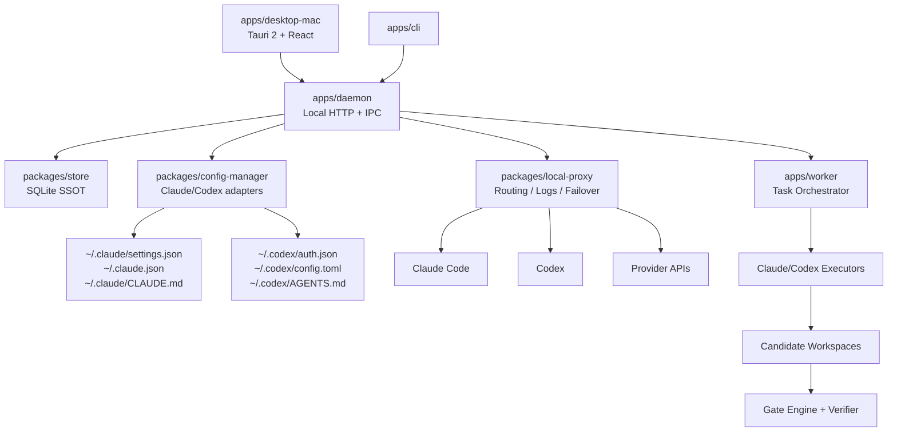
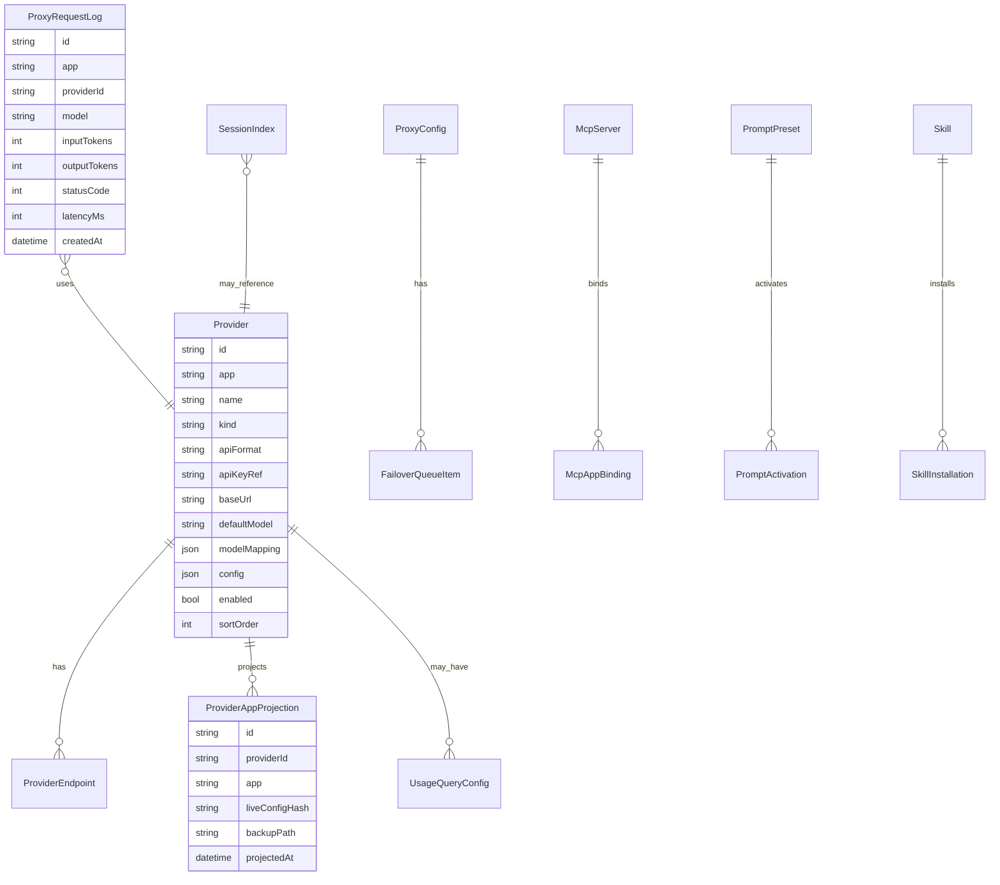
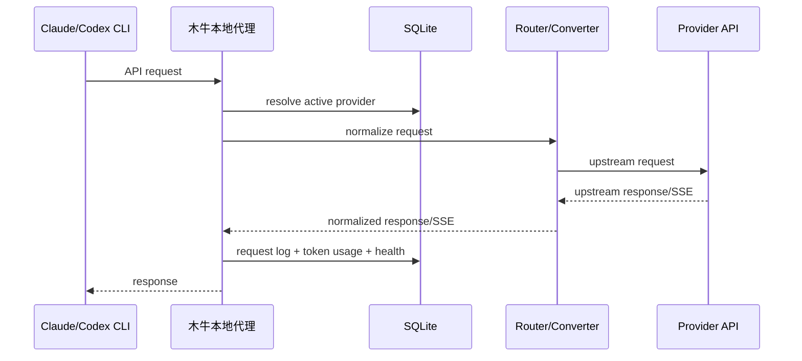
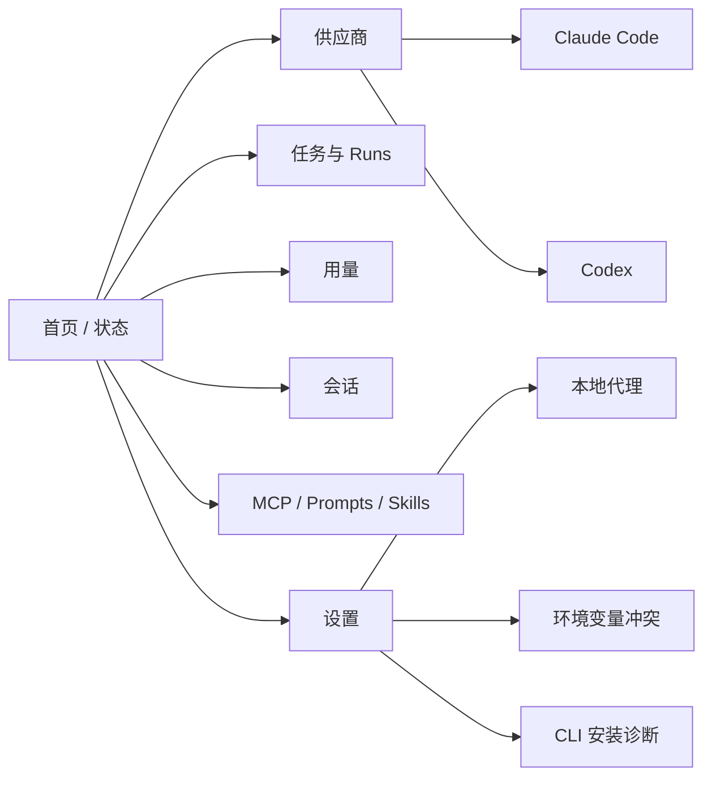

# 木牛参考 CC Switch 的完整改造计划

版本：2026-07-05

> **历史文档（已被取代）：** 本计划记录 2026-07 的桌面兼容层设计，不再描述木牛的默认运行时。当前木牛以内嵌 Agent 直接连接模型 Provider API，不依赖 Claude Code 或 Codex CLI；本文中的“只管理 Claude Code 与 Codex”仅适用于可选 legacy 配置、会话迁移和 executor 兼容范围。当前权威设计见 `docs/plans/2026-08-15-muniu-v0.1-master-design.md`。

命名说明：木牛取自“木牛流马”之意。诸葛亮的木牛流马常被理解为辅助运输、降低消耗、稳定供给的巧器；木牛项目也沿用这个寓意，把模型供应、配置、代理、会话、用量和任务闭环稳定送到需要的位置。下文仍保留当时围绕 Claude Code 与 Codex 兼容层的原始表述，以便追溯设计演进。

## 1. 目标结论

木牛接下来不应复制 CC Switch 的全量产品范围，而应吸收其“本地配置控制面 + 桌面交互 + 代理观测”的成熟设计，叠加木牛当前已经具备的“任务 / run / candidate / gate 工程闭环”。

当前产品定位：

> 木牛是本地优先的 AI Coding Agent 控制平面。内嵌 Agent 直接连接模型 Provider；Claude Code 与 Codex 仅作为可选的本机配置、历史会话和 legacy executor 兼容目标。

必须坚持的边界：

- 核心运行时不依赖 Claude Code 或 Codex CLI；兼容层只管理这两类外部应用。
- 不做 Gemini、OpenCode、OpenClaw、Hermes。
- 不做 Claude Desktop。
- 不做逆向 OAuth 代理，不复刻 CC Switch 的 Codex OAuth 反向代理能力。
- 必须推出 macOS 桌面端，先做 Mac-first，后续是否跨平台另行决策。
- 保留当前 mn 的 API、CLI、Worker、Executor 方向，不把木牛降级成单纯的配置切换器。

## 2. 从 CC Switch 提炼出的能力模型

CC Switch 文档显示，它的核心价值不是单一功能，而是把多个 AI CLI 的配置、供应商、扩展、代理和会话统一成一个本地桌面控制面。对木牛有价值的能力如下。

### 2.1 桌面控制面

可借鉴能力：

- 原生桌面应用。
- 系统托盘快速切换。
- 轻量模式：主窗口销毁，仅保留托盘能力。
- 深色 / 浅色 / 跟随系统主题。
- 开机自启。
- 深度链接导入。
- 自动更新。
- macOS 签名与公证。
- 本地日志和诊断。

木牛取舍：

- P0 只做 macOS 桌面端。
- UI 只出现 Claude Code 和 Codex 两个应用，不做应用可见性复杂开关。
- 托盘菜单按 Claude / Codex 分组。
- 轻量模式进入 P1，因为它对常驻工具体验很关键。
- 深度链接进入 P2，先支持导入 provider / MCP / prompt，不在 MVP 阻塞。

### 2.2 供应商管理

可借鉴能力：

- 供应商预设。
- 自定义供应商。
- 当前启用状态。
- 编辑、复制、排序、删除。
- 端点测速。
- 导入 / 导出。
- 统一供应商：一份配置投影到多个应用。
- 切换时写入不同工具的 live 配置文件。
- 从 live 配置回填到数据库。
- 自动备份和原子写入。

木牛取舍：

- 只保留 Claude Provider 和 Codex Provider。
- 保留“统一供应商”，但限定为同时支持 Claude 与 Codex 的 OpenAI-compatible / relay provider。
- 不追求 50+ 预设，先内置少量高价值预设：
  - Claude 官方
  - OpenAI 官方
  - OpenAI-compatible
  - Anthropic-compatible
  - DeepSeek
  - Kimi
  - OpenRouter
  - SiliconFlow
  - 自定义
- Provider 配置必须进入本地 SQLite，CLI live 配置只是投影结果，不是单一事实源。

### 2.3 Claude Code 配置投影

CC Switch 文档中的关键路径：

- Claude Code 配置目录：`~/.claude/`
- 主配置：`~/.claude/settings.json`
- MCP 配置：`~/.claude.json`
- Prompt 文件：`~/.claude/CLAUDE.md`
- Skills 目录：`~/.claude/skills/`

木牛要支持：

- 写入 `settings.json` 的 `env.ANTHROPIC_API_KEY`。
- 写入 `settings.json` 的 `env.ANTHROPIC_BASE_URL`。
- 可选写入 `ANTHROPIC_AUTH_TOKEN`。
- 可选写入 Claude 通用配置片段。
- 支持跳过 Claude 引导：`skipIntroduction`。
- 支持 VS Code Claude 插件同步作为 P3 可选项。
- 支持 Claude Code provider 切换后的热加载提示，但 UI 仍提供“必要时重启终端”的保守提示。

### 2.4 Codex 配置投影

CC Switch 文档中的关键路径：

- Codex 配置目录：`~/.codex/`
- 认证配置：`~/.codex/auth.json`
- 主配置和 MCP：`~/.codex/config.toml`
- Prompt 文件：`~/.codex/AGENTS.md`
- Skills 目录：`~/.codex/skills/`
- 会话目录：`~/.codex/sessions/`
- 归档会话：`~/.codex/archived_sessions/`
- 会话索引：`~/.codex/state_5.sqlite`

木牛要支持：

- 官方 OpenAI / ChatGPT 登录态保护。
- 第三方 provider 切换默认不覆盖 `auth.json`，除非用户显式选择“API Key 模式写入 auth.json”。
- 第三方 provider 写入 `config.toml`：
  - `model_provider`
  - `model`
  - `model_reasoning_effort`
  - `disable_response_storage`
  - `[model_providers.<id>]`
  - `base_url`
  - `wire_api`
  - `experimental_bearer_token`
  - `model_catalog_json`
  - `[features] goals = true`
- Codex provider 切换后明确提示需要重启 Codex / 终端。
- 对 Chat Completions 供应商，要通过木牛本地路由转换成 Codex 能理解的 Responses 协议。

### 2.5 MCP / Prompt / Skills

可借鉴能力：

- MCP 在 Claude 和 Codex 间统一管理。
- Prompt 预设写入 `CLAUDE.md` / `AGENTS.md`。
- Skills 支持发现、安装、卸载、更新、备份。
- 支持 symlink / copy 两种同步方式。
- 对 live 文件做回填，避免手动修改丢失。

木牛取舍：

- MCP 进入 P2。
- Prompts 进入 P2。
- Skills 进入 P3。
- 只支持 Claude 与 Codex 的目标目录。
- 不接入 Gemini / OpenCode / Hermes。
- 技能源存储默认使用 `~/.mniu/skills/`，同时兼容 `~/.agents/skills`。

### 2.6 本地代理、路由与故障转移

CC Switch 的核心代理模型：

- 本地代理默认监听 `127.0.0.1:15721`。
- 应用接管后，Claude / Codex 的 base URL 指向本地代理。
- 代理根据当前应用和当前 provider 转发请求。
- 代理记录请求日志、token、模型、延迟、状态码。
- 支持协议转换。
- 支持故障转移队列。
- 支持熔断器。

木牛取舍：

- P1 必须实现本地代理基础能力。
- P1 支持 Claude 透传和 Codex Responses 透传。
- P2 支持 Claude Anthropic Messages ↔ OpenAI Chat / Responses 转换。
- P2 支持 Codex Responses ↔ OpenAI Chat Completions 转换。
- P2 支持故障转移和熔断。
- 代理必须可关闭，并能恢复接管前配置。

### 2.7 用量统计

可借鉴能力：

- 代理请求日志统计。
- CLI 会话日志解析。
- 按应用、供应商、模型筛选。
- token 与费用估算。
- 模型定价配置。
- Codex JSONL 会话日志精确解析。

木牛取舍：

- P1 先统计代理请求日志。
- P2 解析 Codex JSONL 会话。
- P2 解析 Claude 会话日志。
- P2 提供模型定价表。
- P3 提供趋势图和成本看板。

### 2.8 环境变量冲突

可借鉴能力：

- 检测系统环境变量是否覆盖 live 配置。
- 识别 `ANTHROPIC_API_KEY`、`ANTHROPIC_BASE_URL`、`OPENAI_API_KEY`。
- 显示来源。
- 删除前自动备份。

木牛取舍：

- P1 必须做只读冲突检测。
- P2 再做“一键清理 + 自动备份”。
- 对密钥只显示脱敏值。

## 3. 木牛当前状态与差距

当前 mn 仓库已经具备：

- `AgentProvider = "claude" | "codex"`，天然符合本次范围。
- API scaffold：project、task、run、events、artifacts。
- CLI scaffold：init、doctor、project、task、run、gates。
- Worker orchestrator：准备候选工作区，按 provider 顺序执行候选。
- Executors：Claude Code、Codex、Mock。
- Gate engine：npm test/typecheck/lint。
- Verifier：确定性候选排序。
- Prisma schema 草案：Project、Task、Run、Candidate、Gate、Artifact、Policy、AuditLog。

当前缺口：

- 无 macOS 桌面端。
- 无系统托盘。
- 无本地 provider 数据库。
- 无 Claude / Codex 配置读写适配器。
- 无原子写入和配置备份。
- 无本地代理。
- 无协议转换。
- 无 provider 健康检测。
- 无请求日志和成本统计。
- 无 MCP / Prompt / Skills 管理。
- 无会话浏览。
- 无持久化 store 的实际实现。
- API 运行 run 仍是同步请求，不适合桌面端长任务体验。

## 4. 目标架构



### 4.1 模块划分

| 模块 | 类型 | 责任 |
|---|---|---|
| `apps/desktop-mac` | 新增 | macOS 桌面端、托盘、窗口、深链接、设置 UI。 |
| `apps/daemon` | 新增或由 `apps/api` 改造 | 本地守护进程，统一提供 desktop/cli API。 |
| `apps/api` | 改造 | 从 demo API 升级为可持久化的 local API，后续可兼容 server 模式。 |
| `apps/cli` | 扩展 | 保留 task/run 命令，新增 provider/proxy/mcp/prompt/doctor 命令。 |
| `apps/worker` | 改造 | run 从同步请求变成后台 job，支持 cancel/resume/log streaming。 |
| `packages/store` | 新增 | SQLite 数据库、migration、backup、transaction。 |
| `packages/config-manager` | 新增 | Claude/Codex 配置解析、投影、回填、原子写入、备份。 |
| `packages/local-proxy` | 新增 | HTTP/SSE 代理、协议转换、接管恢复、日志、熔断。 |
| `packages/provider-catalog` | 新增 | 供应商预设、模型、默认配置、图标元数据。 |
| `packages/usage` | 新增 | token 归一、模型定价、会话日志解析、成本估算。 |
| `packages/extensions` | 新增 | MCP、Prompt、Skills 管理。 |
| `packages/core` | 扩展 | 新增 Provider、Proxy、Session、Usage、Extension 领域类型。 |

### 4.2 本地目录约定

木牛自身数据目录：

```text
~/.mniu/
├── mniu.db
├── settings.json
├── backups/
├── logs/
├── skills/
├── skill-backups/
├── proxy/
│   └── request-logs/
└── deeplink-imports/
```

保留木牛当前项目级目录：

```text
<project>/.mn/
├── config.json
└── worktrees/
```

设计原则：

- `~/.mniu` 管“本机全局工具配置”。
- `<project>/.mn` 管“某个工程项目的任务/run配置”。
- 不再把 provider / MCP / prompt 混入项目目录。

## 5. 数据模型改造

### 5.1 SQLite 优先

Mac 桌面端应采用 SQLite 作为本地 SSOT。当前 `prisma/schema.prisma` 是 PostgreSQL 草案，适合后续企业 server；桌面端 MVP 应新增 SQLite store。

推荐策略：

- `packages/store` 使用 Prisma SQLite 或 Kysely + SQLite。
- 第一阶段不迁移现有 Postgres schema，先新增 desktop/local schema。
- 长期抽象 `Store` interface，让 local SQLite 和 server Postgres 共用领域层。

### 5.2 新增核心表



### 5.3 密钥存储

Mac 桌面端必须把 API Key、OAuth token、WebDAV 密码等敏感信息存到 Keychain。

数据库只保存：

- `apiKeyRef`
- `secretRef`
- 脱敏展示值
- 创建 / 更新时间

P0 可以先用本地加密文件，但进入可发布的 Mac 版本前必须切换到 Keychain。

## 6. 配置管理设计

### 6.1 通用写入纪律

所有 live 配置修改必须满足：

- 修改前自动备份。
- 写临时文件后原子替换。
- JSON/TOML 通过结构化 parser 修改，不做纯字符串替换。
- 保存 live config hash，支持回填和冲突检测。
- 失败时回滚或明确标记 partial。
- 所有写入进入 AuditLog。

### 6.2 Claude Adapter

读写目标：

- `~/.claude/settings.json`
- `~/.claude.json`
- `~/.claude/CLAUDE.md`
- `~/.claude/skills/`

能力：

- `readClaudeLiveConfig()`
- `projectClaudeProvider(providerId)`
- `restoreClaudeProjection(projectionId)`
- `detectClaudeEnvConflicts()`
- `syncClaudeMcp(serverId, enabled)`
- `activateClaudePrompt(promptId)`
- `installClaudeSkill(skillId)`

### 6.3 Codex Adapter

读写目标：

- `~/.codex/auth.json`
- `~/.codex/config.toml`
- `~/.codex/AGENTS.md`
- `~/.codex/skills/`
- `~/.codex/sessions/`
- `~/.codex/archived_sessions/`
- `~/.codex/state_5.sqlite`

能力：

- `readCodexLiveConfig()`
- `projectCodexProvider(providerId, mode)`
- `preserveOfficialAuth()`
- `restoreCodexProjection(projectionId)`
- `writeCodexModelCatalog(providerId)`
- `setCodexGoalMode(enabled)`
- `syncCodexMcp(serverId, enabled)`
- `activateCodexPrompt(promptId)`
- `installCodexSkill(skillId)`
- `indexCodexSessions()`

Codex 写入模式：

| 模式 | 写入 `auth.json` | 写入 `config.toml` | 适用场景 |
|---|---|---|---|
| `official` | 保留官方登录 | 官方 provider 配置 | 官方 OpenAI/Codex |
| `third_party_preserve_auth` | 不覆盖 | provider + token 写入 provider scoped 字段 | 默认第三方模式 |
| `api_key_auth_file` | 写入 `OPENAI_API_KEY` | 写入 model/base_url | 用户显式选择旧式模式 |
| `local_route` | 不覆盖 | base_url 指向木牛代理 | Chat 转 Responses、热切换、用量统计 |

## 7. 本地代理设计

### 7.1 代理职责

代理不是简单转发，它承担：

- 应用识别：Claude / Codex。
- 当前 provider 选择。
- 请求日志。
- token 统计。
- 协议转换。
- 模型映射。
- 故障转移。
- 熔断。
- 配置恢复。

### 7.2 请求链路



### 7.3 协议转换范围

P1：

- Claude Anthropic Messages 透传。
- Codex OpenAI Responses 透传。
- SSE 基础转发。

P2：

- Claude Anthropic Messages → OpenAI Chat Completions。
- Claude Anthropic Messages → OpenAI Responses。
- Codex OpenAI Responses → OpenAI Chat Completions。
- Chat Completions SSE → Responses SSE。
- tool calls / tool results 基础映射。

P3：

- reasoning 参数自适应。
- model catalog 生成。
- cache token 归一化。
- request rectifier。

### 7.4 接管与恢复

接管时：

- Claude `ANTHROPIC_BASE_URL` 指向 `http://127.0.0.1:<port>`。
- Codex `base_url` 指向 `http://127.0.0.1:<port>/v1`。
- 原配置写入 projection backup。

关闭接管时：

- 按 projection backup 恢复。
- 如果 live 文件被用户改动，提示冲突，不强行覆盖。
- 支持“一键重新投影当前 provider”。

## 8. macOS 桌面端计划

### 8.1 技术选择

推荐采用 Tauri 2 + React + TypeScript：

- 与 CC Switch 的桌面实践一致。
- Mac 常驻工具资源占用更低。
- 支持系统托盘、深链接、自启动、自动更新、签名公证。
- Rust 后端适合做文件系统、Keychain、进程和代理控制。

为了复用现有 TypeScript 后端，分两阶段：

1. MVP：Tauri shell 调用本地 daemon HTTP API；daemon 继续基于 Node/Fastify。
2. 产品化：将 provider/config/proxy 等强本地能力迁入 Tauri Rust commands 或 Rust sidecar；任务编排仍可由 Node worker 承担。

### 8.2 桌面信息架构



### 8.3 MVP 页面

P0/P1 桌面端必须包含：

- 总览：Claude/Codex 安装状态、当前 provider、代理状态、最近 run。
- Provider 列表：Claude/Codex 两个 tab。
- 添加 Provider：预设 / 自定义。
- Provider 卡片：启用、编辑、复制、删除、测速。
- 任务页面：创建 task、运行、查看 candidates/gates/events。
- 代理设置：启动/停止、接管 Claude/Codex、端口。
- 日志页面：代理请求日志和应用日志。
- 设置：配置目录、主题、关闭行为、开机自启、轻量模式。
- About：版本、检查更新、安装/升级 Claude Code 与 Codex。

### 8.4 托盘菜单

```text
木牛
├── 打开主界面
├── Claude Code · 当前供应商
│   ├── Claude 官方
│   ├── DeepSeek
│   └── 自定义...
├── Codex · 当前供应商
│   ├── OpenAI 官方
│   ├── DeepSeek
│   └── 自定义...
├── 本地代理：开启/关闭
├── 轻量模式
└── 退出
```

### 8.5 macOS 发布要求

- 最低支持 macOS 12。
- 支持 Intel x64 和 Apple Silicon arm64。
- 产物：
  - `.dmg`
  - `.zip`
  - 后续 Homebrew cask。
- 必须签名和公证。
- 支持自动更新。
- 支持 `mniu://` 深度链接。
- 日志路径：`~/.mniu/logs/`。
- Keychain 存储密钥。

## 9. API 与 CLI 改造

### 9.1 API 新增资源

```text
GET    /v1/system/doctor
GET    /v1/apps
GET    /v1/providers
POST   /v1/providers
GET    /v1/providers/:id
PATCH  /v1/providers/:id
POST   /v1/providers/:id/enable
POST   /v1/providers/:id/duplicate
DELETE /v1/providers/:id
POST   /v1/providers/:id/test-endpoint

GET    /v1/proxy/status
POST   /v1/proxy/start
POST   /v1/proxy/stop
POST   /v1/proxy/apps/:app/takeover
POST   /v1/proxy/apps/:app/restore
GET    /v1/proxy/logs

GET    /v1/mcp/servers
POST   /v1/mcp/servers
PATCH  /v1/mcp/servers/:id
DELETE /v1/mcp/servers/:id
POST   /v1/mcp/servers/:id/bind

GET    /v1/prompts
POST   /v1/prompts
POST   /v1/prompts/:id/activate

GET    /v1/sessions
GET    /v1/sessions/:id
POST   /v1/sessions/:id/open

GET    /v1/usage/summary
GET    /v1/usage/requests
GET    /v1/usage/models
```

### 9.2 CLI 新增命令

```bash
mn doctor
mn provider list --app claude|codex
mn provider add --app codex --preset deepseek --api-key ...
mn provider enable <provider-id>
mn provider test <provider-id>
mn proxy start
mn proxy stop
mn proxy takeover claude|codex
mn proxy restore claude|codex
mn mcp list
mn mcp add ...
mn prompt activate <prompt-id>
mn usage summary
mn desktop open
```

现有 task/run 命令保留。

## 10. 阶段计划

### Phase 0：调研固化与架构准备（1 周）

交付物：

- 本计划文档。
- ADR：Claude Code / Codex 兼容范围（该历史 ADR 已由内嵌 Agent 架构取代）。
- ADR：Mac desktop 技术栈选择。
- ADR：SQLite local store 与 Postgres server store 分层。
- provider/config/proxy 的领域模型草案。

验收：

- 所有“做 / 不做”边界明确。
- 现有测试保持通过。

### Phase 1：Provider 管理与配置投影 MVP（2-3 周）

目标：

- 在无桌面端的情况下，先用 API/CLI 跑通 provider 管理。

任务：

- 新增 `packages/store` SQLite。
- 新增 provider 表与 migration。
- 新增 Claude adapter。
- 新增 Codex adapter。
- 实现原子写入和备份。
- 实现 provider add/list/enable/edit/delete。
- 实现 `mn doctor` 扩展：检测 Claude/Codex binary、版本、配置目录、环境变量冲突。
- 实现少量 provider presets。

验收：

- 能创建 Claude provider 并投影到 `~/.claude/settings.json`。
- 能创建 Codex provider 并投影到 `~/.codex/config.toml`。
- 默认不覆盖 Codex 官方 `auth.json`。
- 修改前有备份，失败可恢复。
- CLI e2e 覆盖临时 HOME 目录。

### Phase 2：Mac 桌面端 MVP（3-4 周）

目标：

- 推出可本地运行的 macOS 桌面端，管理 Claude/Codex provider。

任务：

- 新增 `apps/desktop-mac`。
- Tauri 2 + React shell。
- 接入 local daemon。
- 实现主窗口、Provider 页面、设置页面。
- 实现系统托盘。
- 实现轻量模式。
- 实现开机自启。
- 实现日志查看。
- 实现 `mniu://` deep link 注册框架。
- 打包 unsigned dev DMG。

验收：

- macOS 上双击启动。
- 托盘能切换 Claude/Codex provider。
- 关闭行为可配置：退出 / 托盘 / 轻量模式。
- provider 切换能修改临时 HOME 下的 Claude/Codex 配置。
- Playwright 或 Tauri E2E 截图验证核心页面可用。

### Phase 3：本地代理、用量和故障转移（4-6 周）

目标：

- 实现木牛区别于普通配置管理器的“运行时控制面”。

任务：

- 新增 `packages/local-proxy`。
- 实现代理启动/停止。
- 实现 Claude/Codex 接管与恢复。
- 实现请求日志。
- 实现 provider 健康状态。
- 实现故障转移队列。
- 实现熔断器。
- 实现用量 summary。
- 实现基础 token 归一。
- UI 增加代理状态、请求日志、用量页。

验收：

- Claude/Codex 请求可通过本地代理转发。
- 关闭代理能恢复原 live 配置。
- 代理异常退出后，重启木牛能提示恢复。
- 请求日志可按 app/provider/model 查询。
- 故障转移在模拟 500/timeout 时触发。

### Phase 4：Codex 高级兼容（3-5 周）

目标：

- 解决 Codex 第三方 provider 的核心痛点。

任务：

- Codex official auth preservation。
- Codex model catalog generation。
- Codex Chat Completions → Responses 转换。
- Codex Responses SSE 转换。
- Reasoning 参数适配。
- Goal mode 开关。
- Codex session index。
- 可选：统一 Codex 会话历史，必须带备份和还原。

验收：

- 第三方 provider 切换不覆盖 `auth.json`。
- Chat-only provider 能被 Codex 通过本地路由调用。
- `/model` 能看到 model catalog。
- 修改模型映射后提示重启 Codex。
- 会话迁移只改标签，改前备份，可还原。

### Phase 5：MCP / Prompts / Skills（3-4 周）

目标：

- 覆盖 Claude/Codex 的扩展配置管理。

任务：

- MCP server CRUD。
- MCP app binding：Claude / Codex。
- Prompt preset：Claude `CLAUDE.md`、Codex `AGENTS.md`。
- Prompt live backfill。
- Skills source store。
- Symlink / copy sync。
- Skill install/update/uninstall/backup。

验收：

- 同一 MCP server 可写入 Claude 与 Codex 两套格式。
- Prompt 切换前自动回填 live 文件。
- Skill 卸载前自动备份。
- 临时 HOME e2e 覆盖 Claude/Codex。

### Phase 6：任务闭环与桌面融合（3-5 周）

目标：

- 把木牛原有 task/run 能力接入桌面产品，而不是停留在配置管理。

任务：

- Run 改后台 job。
- 支持 run streaming events。
- Desktop 创建 task。
- Desktop 查看 candidates、gates、winner。
- Provider 选择影响 executor 环境。
- Run 与 provider/proxy usage 打通。
- 支持从桌面打开 candidate workspace。
- 支持 run cancel。

验收：

- 桌面端能创建任务并运行 Claude/Codex candidate。
- 能查看 stdout/stderr/events/gates。
- 能看到 winner 和失败原因。
- 代理日志能关联 runId/candidateId。

### Phase 7：Mac 产品化发布（2-4 周）

目标：

- 形成可分发的 Mac 桌面端。

任务：

- Apple Developer 签名。
- Notarization。
- DMG 背景和安装说明。
- Auto updater。
- Crash/log 导出。
- Homebrew cask 草案。
- 安装文档。
- 卸载文档。
- 安全说明。

验收：

- Intel 和 Apple Silicon 均可安装。
- Gatekeeper 不拦截。
- 自动更新 dry-run 通过。
- `mniu://` 可唤起应用。
- Homebrew 本地 tap 测试通过。

## 11. 测试策略

### 11.1 单元测试

必须覆盖：

- JSON/TOML parser round-trip。
- Claude adapter 投影和恢复。
- Codex adapter 投影和恢复。
- provider preset normalize。
- env conflict scanner。
- local proxy routing decision。
- failover circuit breaker。
- usage price normalization。

### 11.2 集成测试

所有配置写入测试都必须使用临时 HOME：

```bash
HOME=$(mktemp -d) npm test
```

覆盖场景：

- Claude provider enable。
- Codex provider enable with auth preservation。
- Proxy takeover / restore。
- MCP sync to Claude + Codex。
- Prompt activation + backfill。
- Skill install via copy/symlink。
- Codex session migration backup/restore。

### 11.3 桌面测试

必须覆盖：

- 首次启动。
- Provider 添加。
- Provider 切换。
- 托盘切换。
- 轻量模式。
- 深链接导入确认。
- 设置保存。
- 日志页渲染。

### 11.4 安全测试

必须覆盖：

- API Key 不进入日志。
- Deep link 导入前预览和确认。
- 不可信 deep link 不自动写配置。
- 删除环境变量前备份。
- 配置恢复不覆盖用户后续手动修改。
- Codex `auth.json` 默认不被第三方 provider 覆盖。

## 12. 风险与决策

### 12.1 不做 Codex OAuth 反向代理

CC Switch 文档明确提示 Codex OAuth 反向代理使用逆向 OAuth 流程，存在服务条款和账号风险。木牛面向企业研发场景，默认不实现该能力。

替代方案：

- 支持官方 OpenAI/Codex 登录态保留。
- 支持第三方 API Key provider。
- 支持本地路由与协议转换。

### 12.2 本地代理复杂度高

协议转换、SSE、tool calls、reasoning、cache token 都容易出错。必须分阶段：

- P1 透传。
- P2 基础转换。
- P3 完整兼容。

不得在 P1 承诺支持所有 Chat provider。

### 12.3 桌面端与 Node 后端融合

Tauri + Node daemon 的打包复杂。建议先保证 Mac MVP 可运行，再决定是否迁移本地能力到 Rust。

决策门：

- 如果 Node daemon 打包、权限和自启动稳定，则继续 sidecar。
- 如果 sidecar 体验不稳定，则把 store/config/proxy 迁入 Rust，保留 worker 作为独立执行服务。

### 12.4 配置写入会影响用户真实环境

所有真实 HOME 写入前必须：

- 展示 diff。
- 自动备份。
- 支持 dry-run。
- 支持 restore。

CLI 默认支持：

```bash
mn provider enable <id> --dry-run
mn provider enable <id> --home /tmp/test-home
```

## 13. 里程碑完成定义

| 里程碑 | 完成定义 |
|---|---|
| M1 Provider MVP | CLI/API 可管理 Claude/Codex provider，临时 HOME e2e 通过。 |
| M2 Mac Desktop MVP | macOS 桌面端可启动、托盘可切换 provider、设置可保存。 |
| M3 Proxy MVP | Claude/Codex 可被本地代理接管，日志和恢复可用。 |
| M4 Codex Advanced | 第三方 Codex provider 不覆盖官方 auth，Chat provider 可经路由使用。 |
| M5 Extensions | MCP/Prompt/Skills 管理覆盖 Claude/Codex。 |
| M6 Task Fusion | 桌面端能创建并观察木牛 task/run/candidate/gate。 |
| M7 Mac Release | signed + notarized DMG，自动更新和深链接可用。 |

## 14. 第一批可执行任务清单

建议从以下任务开始，不直接开桌面端：

1. `T001` 定义 Provider / App / Projection / SecretRef 类型。
2. `T002` 引入 SQLite local store 和 migration runner。
3. `T003` 实现 Claude config adapter，临时 HOME 测试。
4. `T004` 实现 Codex config adapter，临时 HOME 测试。
5. `T005` 实现 provider API：list/add/enable。
6. `T006` 扩展 CLI：provider list/add/enable/doctor。
7. `T007` 加入配置备份和原子写入工具。
8. `T008` 加入 env conflict scanner。
9. `T009` 写 Mac desktop ADR，确认 Tauri sidecar 方案。
10. `T010` 生成 desktop wireframe 和 Mermaid 架构图。

这 10 个任务完成后，再进入 macOS 桌面端 MVP，风险最低。

## 15. 参考资料

- CC Switch 官方文档：https://www.ccswitch.io/zh/docs?section=getting-started
- CC Switch GitHub 仓库：https://github.com/farion1231/cc-switch
- CC Switch 用户手册：`/tmp/cc-switch-docs/docs/user-manual/zh/`
- CC Switch Codex DeepSeek 路由指南：`/tmp/cc-switch-docs/docs/guides/codex-deepseek-routing-guide-zh.md`
- CC Switch Codex 官方登录保留指南：`/tmp/cc-switch-docs/docs/guides/codex-official-auth-preservation-guide-zh.md`
- CC Switch Codex 统一会话历史指南：`/tmp/cc-switch-docs/docs/guides/codex-unified-session-history-guide-zh.md`
- 木牛当前技术文档：[TECHNICAL_DESIGN.md](./TECHNICAL_DESIGN.md)
