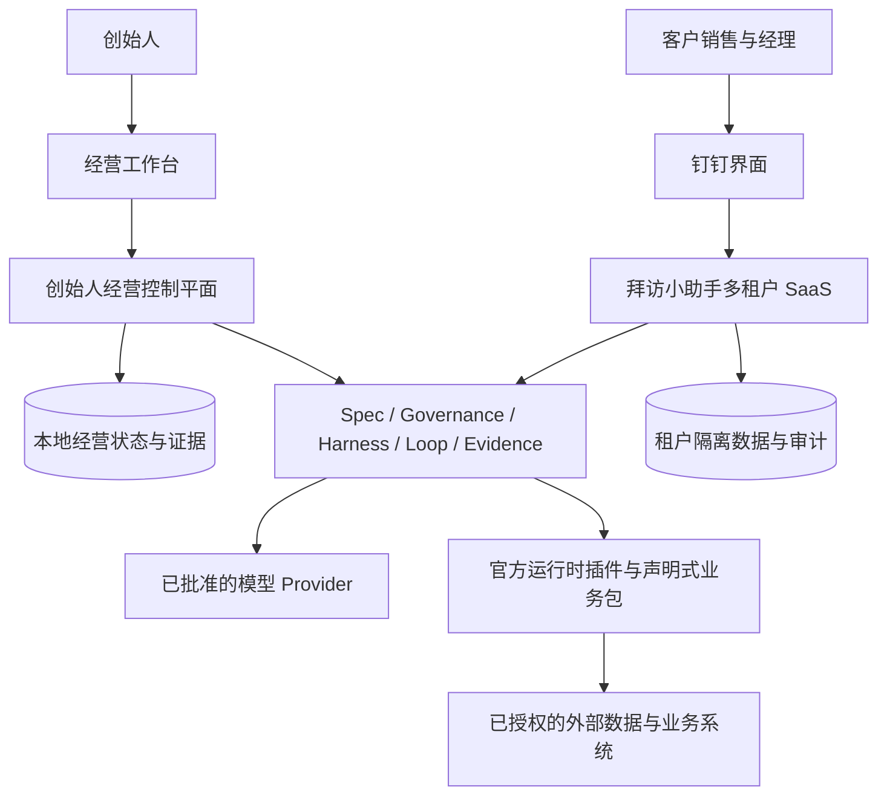
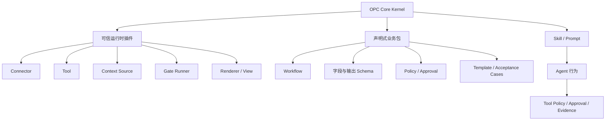
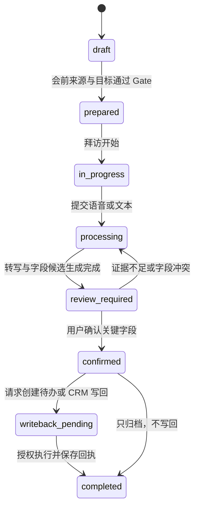

# Muniu OPC Agent OS 产品架构蓝图

Muniu OPC Agent OS 把一人公司的客户承诺转成可执行、可审批、可验收、可结算的 `OperationRun`。它沿用 Muniu 的 `Spec → Governance → Harness → Loop → Evidence` 控制链，把模型、工具和插件放进明确的权限、预算与停止条件中。

本文描述 `v0.3.0 Developer Preview` 的目标架构。仓库中的 `codex/v0.2-platform` 已实现 app-server v2、Agent Event V3、运行时插件清单、多 Agent 图和企业网关；`codex/v0.3-opc-core` 已实现首批 OPC 协议。多租户经营存储、公开 RPC、钉钉连接器和拜访助手产品仍属于 `v0.3.0` 建设范围。接口版本与产品版本分别管理。

## 1. 设计依据

### 1.1 Block 提供组织模型

Block 在 [From Hierarchy to Intelligence](https://block.xyz/inside/from-hierarchy-to-intelligence) 中提出：传统层级承担信息汇总、决策传递和跨团队协调。远程工作留下的决策、讨论、代码、设计、计划与进度，则为持续更新的公司模型提供了原始材料。文章把目标系统拆成能力、世界模型、智能层和界面，并把高风险、伦理、陌生情境与信任判断留给处在业务边缘的人。

这套模型仍是 Block 对组织转型的主张。原文同时说明转型处在早期，部分环节可能先失效，因而不能把“公司已经能由 AI 自主运行”当成已验证事实。

### 1.2 OPC 的瓶颈是创始人自己

一人公司没有中间管理层，信息仍会堵在创始人这里。客户为什么愿意付费、承诺了什么、任务做到哪一步、模型为什么修改输出、哪项动作需要批准，常常散在聊天、文档和记忆中。创始人一旦停止路由，公司也随之停止。

OPC Agent OS 要接住四类工作：保留经营事实，把重复动作变成能力，按客户结果协调执行，在高影响动作前停下来请求授权。系统不能替创始人承担法律和商业责任，也不能用自动化数量代替付费、使用和续费证据。

### 1.3 Block 与 Muniu 的对应关系

| Block 组织对象 | OPC Agent OS | Muniu 控制机制 |
| --- | --- | --- |
| 能力 | 检索、转写、核验、生成、发送、写回等可复用单元 | Tool、Connector、Gate、Plugin |
| 公司与客户模型 | 客户、机会、承诺、交付、决策、异常和指标记录 | Spec、Session、Artifact、Store、Trace |
| 智能层 | 选择工作流、组装能力、控制预算、处理失败 | Agent Host、Harness、Loop、Verifier |
| 界面 | 创始人工作台、钉钉、客户界面、API | Desktop、CLI、API、插件视图 |

Muniu 还补上了 Block 文章没有展开的控制要求：一次执行必须绑定不可变规格、治理快照、上下文、工具、预算、Gate、审批与证据。这个约束决定了 OPC Agent OS 的边界。

### 1.4 与 DeepSeek Harness 的差异

比较基线为 DeepSeek Harness `dsh-v0.1.1-rc.2`，提交 `b150a551b8d465e31e418e1b2eaf5e79bbb7d28e`。该版本擅长通用 Agent 执行：模型适配器、工具、会话日志、Agent Loop 和界面都可以由插件替换；权限预设组合沙箱模式与审批策略；扩展系统支持动态工作流和可信代码。参见其[架构](https://github.com/deepseek-ai/DeepSeek-Harness/blob/b150a551b8d465e31e418e1b2eaf5e79bbb7d28e/docs/architecture.md)、[审批](https://github.com/deepseek-ai/DeepSeek-Harness/blob/b150a551b8d465e31e418e1b2eaf5e79bbb7d28e/docs/subsystems/approval.md)和[权限预设](https://github.com/deepseek-ai/DeepSeek-Harness/blob/b150a551b8d465e31e418e1b2eaf5e79bbb7d28e/docs/subsystems/permission-presets.md)。

Muniu 不以替换性和工具数量作为主要产品优势。现有差异来自受治理执行控制链：六级单调收紧治理、签名标准包、限时豁免、不可变 Harness、受保护事件摘要链、独立验收 Gate，以及评审、试运行、签名晋升和回滚的学习流程。

`v0.3.0` 把这条控制链用于经营承诺。客户原话、承诺、规格、动作授权、交付、验收、到账和学习使用同一组摘要引用。系统同时调度机器执行和创始人注意力，不能用模型置信度决定权限。DeepSeek Harness 解决 Agent 怎样执行；Muniu OPC Agent OS 负责判断一次经营承诺能否执行、由谁承担后果，以及哪些证据允许它结束。

| 维度 | DeepSeek Harness 当前契约 | Muniu 已实现基础 | `v0.3.0` 目标 |
| --- | --- | --- | --- |
| 执行 | 高度可替换的通用 Agent Harness | HarnessManifest 与受治理 Loop | 不可替换信任内核加官方领域模块 |
| 治理 | 会话级沙箱、权限预设和一次工具审批 | 单调治理、预算、豁免、签名标准包 | 治理客户承诺、经营动作和人工时间 |
| 证据 | 可重建会话的追加日志 | 摘要链、保护视图、Gate 和 TraceGraph | 追踪原始承诺、验收、回款和学习 |
| 学习 | 支持动态扩展和可信代码 | 提案、评审、试运行、晋升与回滚 | 经营经验经证据审核后进入业务包 |
| 产品边界 | 当前公开契约未定义一等经营承诺、结算和注意力对象 | 已有租户执行与企业网关 | 多租户经营控制面和本地受控发布 |

## 2. 双层系统

OPC Agent OS 同时服务创始人经营和客户产品，但两层不能共用未分区的数据仓库或凭据。



### 2.1 创始人经营层

创始人经营层默认本地优先、混合运行。客户访谈、商机、报价、试点、交付、成本和复盘保存在本地事实来源中；云模型与外部连接器按明确配置调用。外部调用仍受数据策略、费用预算、工具授权和审计约束。

这一层只服务一人公司的经营活动，不向客户暴露内部机会判断、定价过程或其他客户信息。

### 2.2 客户产品层

拜访小助手采用多租户 SaaS。所有业务对象、对象存储路径、检索索引、会话、审批、用量与审计事件都必须带 `tenantId`，服务端从认证上下文确定租户，不能接受请求体替换租户身份。

每个租户独立保存钉钉授权、数据权限、字段模板、保留期限与写回策略。跨租户检索、上下文拼接、缓存命中和 Agent 会话恢复均按默认拒绝处理。

### 2.3 共享内核与隔离数据面

两层共享规格、治理、执行和证据的语义契约，不共享运行中的状态与凭据。创始人可以把经营层验证过的模板提交为 `LearningProposal`，经审查和试运行后发布为官方业务包；客户产品不能读取创始人尚未发布的经营记录。

## 3. 一次经营承诺如何进入系统

总链路固定为：

```text
经营信号 → 商机 → 付费试点 → 客户承诺 → Spec → Run
        → Gate / 审批 → 交付 → 验收 / 收款 → Learning Proposal
```

对外履约必须先有明确的客户承诺。访谈、内部实验和售前准备也可以进入受治理执行，但使用内部 Spec，并与付费交付分开统计。未经付费或授权的想法可以保存在机会记录中，不能被 Agent 自动升级为产品路线或客户义务。


### 3.1 `SpecRevision`：客户承诺的机器可读版本

每次交付使用批准后的 `SpecRevision`，至少写清：

- 客户结果、交付物和适用场景；
- 不做什么，以及不允许系统推断什么；
- 可读取的数据、来源、授权人与保留期限；
- 接口、数据、状态、权限、异常、质量和可观测性契约；
- 正向、负向和边界验收案例；
- 时间、模型费用、外部服务费和人工投入预算；
- 风险、未知项、负责人和解除条件。

需求变化必须创建新 revision。运行中的模型不能为了完成任务修改验收条件，也不能用新摘要覆盖原始承诺。

### 3.2 `GovernanceSnapshot`：逐层收紧经营边界

V1 沿用 Muniu 的治理层级，不新增一套并行优先级：

| Muniu scope | OPC 含义 |
| --- | --- |
| `builtin` | 系统不可放宽的安全与证据规则 |
| `organization` | SaaS 租户或一人公司；它是数据隔离和授权的上界 |
| `team` | 产品线、销售团队或工程团队 |
| `project` | 客户账户、交付项目或代码仓库 |
| `service` | 合同、订阅、标准服务或工作流 |
| `task` | 一次具体经营或拜访 Run |

required gates、禁止动作和受保护数据取并集；Provider、命令和网络 allowlist 取交集；预算取最小值；审批采用更严格的要求。客户规则可以收紧公司的默认规则，不能在任务层静默放宽。

### 3.3 `HarnessManifest`：固定本次允许使用的能力

`HarnessManifest` 把批准后的 Spec 和治理快照编译成一次执行清单，固定以下内容：

- 客户与任务上下文，以及每份上下文的来源和 digest；
- Provider、模型、插件、Skill、Prompt、Tool 和 Connector 版本；
- 可读取和写入的数据范围；
- 网络、命令、Secret 引用和外部副作用策略；
- 必须运行的 Gate、输出 schema 和 artifact 位置；
- 最大时长、token、费用、候选数、修复次数和外部动作数；
- 停止条件、人工接管方式和失败后的上下文交接。

同一个 Run 不接受运行时能力漂移。插件、模型、工作流或客户规则发生变化时必须新建 Run，并保留旧绑定和旧证据。新的 execution generation 只用于故障恢复，仍需复用原 Run 的不可变绑定。

### 3.4 七阶段经营 Loop

| 阶段 | 主要工作 | 可观察结果 |
| --- | --- | --- |
| 发现 | 收集信号、来源和客户背景 | 来源清单、未知项和初始问题 |
| 资格判断 | 判断客户、问题、授权和预算是否匹配 | 继续、拒绝或补充信息的决定 |
| 规格与报价 | 固定客户结果、范围、验收、价格和风险 | 批准的 Spec 与商业承诺 |
| 执行 | 在 Harness 约束内调用能力并生成候选 | 候选交付物、调用记录和用量 |
| 验证 | 运行确定性 Gate 与必要的人工检查 | Gate 结果、缺口和修复请求 |
| 批准与交付 | 对外发送或写回前取得授权 | 审批记录、交付版本和接收人 |
| 结算与学习 | 记录验收、费用、回款、反馈和异常 | 经营指标与 Learning Proposal |

修复循环受预算和次数限制。连续失败、输入冲突、权限不足、成本超限或高影响 Gate 失败时，Run 转人工，不允许以更弱的检查继续。

### 3.5 Run、审批与证据契约

OPC 领域扩展不改变 `GateResultV2` 的通过、失败、错误、跳过和不支持语义。业务 Gate 仍需返回规则 ID、工具版本、输入输出 digest、artifact、时间和对应的 Spec 条款。

以下接口是目标架构的新增公开契约：

```ts
interface OpcBudgetV1 {
  execution: Record<string, number>;
  maxExternalActions?: number;
  maxHumanMinutes?: number;
  maxExternalAmount?: {
    currency: string;
    minorUnits: string;
  };
}

interface OperationRunV1 {
  schemaVersion: 1;
  id: string;
  tenantId: string;
  domainId: "coding" | "opc" | string;
  subjectRefs: Array<{ kind: string; id: string; digest: string }>;
  specRef: { id: string; version: string; digest: string };
  governanceDigest: string;
  harnessDigest: string;
  domainModuleRef: { id: string; version: string; digest: string };
  workflowRef: { id: string; version: string; digest: string };
  generation: number;
  status:
    | "queued"
    | "running"
    | "waiting_approval"
    | "needs_human"
    | "completed"
    | "failed"
    | "cancelled";
  currentStage: string;
  budgetUsage: Record<string, number>;
  evidenceHeadDigest?: string;
}

interface AuthorityDecisionV1 {
  schemaVersion: 1;
  id: string;
  tenantId: string;
  runId: string;
  actionId: string;
  generation: number;
  governanceDigest: string;
  decision: "approve" | "reject" | "request_changes" | "defer";
  actor: string;
  actorRole: string;
  inputDigest: string;
  idempotencyKey: string;
  decidedAt: string;
  deferUntil?: string;
}

interface OperationEventV1 {
  schemaVersion: 1;
  id: string;
  tenantId: string;
  runId: string;
  sequence: number;
  kind:
    | "source_captured"
    | "model_attempt"
    | "tool_call"
    | "gate"
    | "approval"
    | "artifact"
    | "external_receipt"
    | "metric";
  actor: string;
  sourceRefs: string[];
  payloadRef: string;
  previousDigest?: string;
  digest: string;
  createdAt: string;
}
```

`OpcBudgetV1` 包装现有执行预算，不在 `GovernanceBudget` 或 `HarnessStopConditions` 中静默追加经营字段。`LearningProposal` 继续使用提案、审查、试运行、晋升和回滚流程。现有 `kind` 不包含 OPC 业务包与插件配置；实现时必须创建新 schema version，增加 `business_pack`、`workflow` 和 `plugin_config`，不能在旧枚举中塞入未声明值。

## 4. 经营记录与事实边界

OPC Agent OS 使用结构化记录维护最小公司模型。记录可以存入一张表或多个数据库，以下语义关系不能省略。

| 记录 | 必需内容 | 作用 |
| --- | --- | --- |
| `CustomerRecord` | 客户身份、授权、购买结果、验收偏好、禁区 | 说明服务谁和允许读取什么 |
| `Opportunity` | 信号、问题、预期价值、证据、下一步验证 | 区分想法、访谈和付费需求 |
| `CustomerCommitment` | 范围、价格、时间、双方责任、批准人 | 确定公司已经承诺什么 |
| `DeliveryRecord` | Spec、Run、版本、交付物、验收和回款 | 串联接单、执行和结果 |
| `DecisionRecord` | 问题、选项、依据、反证、决定与复查条件 | 解释为什么这样做 |
| `CapabilityRevision` | 输入、输出、工具、版本、测试、费用和权限 | 判断动作能否复用 |
| `ExceptionEvent` | 失败类型、影响、发现方式、接管和补偿 | 避免用“模型错误”掩盖具体原因 |
| `MetricObservation` | 口径、样本、时间窗、数值和来源 | 约束经营结论的证据范围 |

所有记录遵守四项不变量：

1. 原始语音、文本、订单、合同、反馈、审批和费用回执按证据对象保存，使用 digest 绑定。
2. 转写、摘要、分类和建议属于派生结果，可以重算，不能覆盖原始证据。
3. 模型生成的事实在人工确认或权威数据源验证前标记为 `proposed`。
4. 关键状态变化追加 actor、时间、来源和前后 digest；修订以新版本表示，不改写历史。

## 5. 信任内核、领域模块与业务包

稳定内核只负责契约、治理、生命周期、策略、执行和证据。行业数据、业务流程、连接器与界面通过插件或声明式业务包提供。



### 5.1 三类扩展

运行时插件由 Cordis Context 管理依赖、服务、effect、清理和重载。它是与宿主进程等权的可信可执行代码，可以接触宿主可用的文件、网络和凭据，因此不能描述为沙箱。

声明式业务包只包含字段、工作流、模板、策略、Gate 引用和验收案例。业务包可以由租户选择和配置，但不能注入 TypeScript 或任意命令。

Skill 与 Prompt 负责告诉 Agent 怎样使用已批准能力。它们不能增加权限，也不能绕过 Tool Registry、审批、预算或证据持久化。

### 5.2 `RuntimePluginManifestV2`

`RuntimePluginManifestV2` 在 v0.2 的通用清单上增加发布签名、信任类别和领域贡献，不再维护 OPC 专用插件清单。

```ts
interface RuntimePluginManifestV2 {
  schemaVersion: 2;
  name: string;
  version: string;
  integrity: string;
  release: {
    sequence: number;
    publishedAt: string;
  };
  signature: {
    algorithm: "ed25519";
    keyId: string;
    value: string;
  };
  trustClass: "official-domain" | "official-connector";
  entry: string;
  skills: string[];
  mcpServers: string[];
  hooks: string[];
  tools: string[];
  requiredCapabilities: string[];
  configSchema: Record<string, unknown>;
  contributes: {
    domains: string[];
    recordSchemas: string[];
    workflows: string[];
    gates: string[];
    connectors: string[];
    renderers: string[];
  };
  externalEffects: string[];
  migrations: Array<{ id: string; fromVersion: string; toVersion: string }>;
}
```

`integrity` 是发布包内容的摘要，不包含运行时生成状态。`configSchema` 只描述普通配置和 Secret 引用，不能携带 Secret 值。每项外部副作用都必须注册稳定 ID，供 Governance 和 Tool Policy 引用。

### 5.3 安装、重载和卸载

`v0.3.0` 只接受本地开发插件与官方签名插件。npm 安装必须使用精确 semver，安装记录保存来源、版本、完整性、签名、配置 digest 和时间。

插件变更按以下顺序执行：

1. 验证来源、签名、版本和完整性。
2. 解析依赖、配置 schema、权限和迁移计划。
3. 在新的 Cordis Context 中加载并运行健康检查。
4. 健康检查通过后原子切换；失败时保留旧运行时。
5. 记录加载、配置、切换、失败、卸载和清理事件。
6. 卸载时按 effect 逆序释放监听器、计时器、连接和服务。

多租户 SaaS 只允许运营方安装运行时插件。租户只能启用已批准的声明式业务包和租户配置，不能上传或执行自己的插件代码。

官方签名不构成进程隔离。运行时插件属于 SaaS 的可信计算基，插件缺陷可能影响全部租户；V1 通过限制来源、运营方安装、代码审查、精确版本、凭据服务和完整审计管理风险，不宣称插件之间或插件与宿主之间存在强隔离。

### 5.4 扩展点

| 扩展点 | 输入与输出要求 | 约束 |
| --- | --- | --- |
| Connector | 读取或写入外部系统，返回稳定资源 ID 与回执 | 凭据按租户隔离；写入必须幂等或提供补偿 |
| Tool | 使用 JSON Schema 声明参数与结果 | 标记只读或有副作用；经过集中授权 |
| Context Source | 返回带来源、优先级和 digest 的上下文片段 | 超出上下文预算时可解释地省略 |
| Workflow | 引用受信阶段处理器、Gate 和停止条件 | 不能携带任意可执行代码 |
| Gate | 返回 pass、fail、error、skipped 或 unsupported | required gate 缺失或跳过时失败关闭 |
| Renderer | 把已批准数据生成预览或交付格式 | 不直接发送，不修改事实记录 |
| View | 展示插件状态、配置、审批和证据 | 不在客户端重新决定权限 |

## 6. 注意力调度与高影响动作审批

机器队列只调度 `OperationRun`。注意力队列调度需要人类承担后果的决定，覆盖审批、例外、承诺冲突、证据不足和临期事项。注意力项包含决策简报、可选动作、受阻承诺、截止时间、预计人工分钟、所需角色和证据引用。

排序规则固定为：已逾期优先、后果等级降序、最早客户承诺期限、受阻承诺数量降序、创建时间、ID。业务包可以收紧截止时间和批准角色，不能改变排序字段含义，也不能以模型置信度提高权限。

审批绑定 `tenantId`、Run generation、`inputDigest`、`governanceDigest` 和幂等键。输入、政策、模块版本或 generation 变化后，旧审批不能重放。没有有效授权时，Run 进入 `waiting_approval` 或 `needs_human`。

模型是否有把握不能决定是否执行高影响动作。V1 按动作后果设置审批：

| 动作 | 默认策略 | 批准人 |
| --- | --- | --- |
| 读取公开信息或租户已授权数据 | 可自动执行并留日志 | 无额外审批 |
| 生成内部草稿、候选或预览 | 可自动执行并运行 Gate | 无额外审批 |
| 修改系统内部的可回滚草稿 | 按风险和预算执行 | 创始人或租户策略指定人员 |
| 对外发送消息或文件 | 必须批准 | 创始人或客户授权人 |
| 创建钉钉待办、CRM 写回或生产发布 | 必须批准 | 客户授权人 |
| 报价、合同、交期或服务范围承诺 | 必须批准 | 创始人；涉及客户确认时由双方留痕 |
| 付款、退款、收款账户变更或自动报价承诺 | `v0.3.0` 不注册执行能力 | 不适用 |
| 删除、批量导出或跨境传输敏感数据 | 必须批准 | 数据授权人 |

同一人可以在 OPC 中兼任执行者与批准人，系统仍需记录他是在何种角色下批准。客户数据写回至少由该租户的授权人确认，创始人不能代替客户确认业务事实。

## 7. 首个业务包：木牛拜访小助手

### 7.1 产品判断

拜访小助手是合理的首个验证方向，但尚未经过付费、持续使用和续费证明。它把范围收在一次工业 B2B 客户拜访，入口限定为钉钉，首版不替换 CRM，也不扫描全量聊天；这使输入、输出、批准人和后续动作都能被观察。

OPC Agent OS 可以减少试点配置、上下文整理、执行留痕和模板复用的重复劳动。它不能证明销售团队愿意付费，也不能替代数据授权、企业采购和真实拜访中的信任判断。

### 7.2 产品组成

拜访小助手由可组合的扩展构成：

- 钉钉 Connector：接收授权输入，返回消息、用户、组织和待办回执；
- 转写能力：保留原始音频、转写版本、模型与时间；
- 企业信息 Context Source：只读取公开或客户已授权的数据；
- 拜访业务包：字段、状态机、审批、Gate、模板和验收案例；
- 会前简报与访后整理 Skill：生成候选，不直接确认事实；
- CRM Connector：首版可选，只有批准后才能写回。

垂直先行不等于先发布通用插件市场。试点先使用内部稳定接口完成真实交付；第二个客户重复使用同一流程，且至少两套模板能跨客户复用后，再冻结通用接口。

### 7.3 领域对象

| 对象 | 关键字段 |
| --- | --- |
| `Visit` | `tenantId`、客户、联系人、时间、目的、参与人、状态、Spec 与 Run 引用 |
| `VisitSource` | 原始语音或文本、来源、采集时间、授权、digest、保留期限 |
| `VisitBrief` | 客户变化、历史沟通、目标、关键问题、未知项、来源引用、版本 |
| `VisitClaim` | 类型、内容、来源片段、`proposed/confirmed/rejected`、确认人和时间 |
| `Commitment` | 承诺方、内容、责任人、期限、证据、确认状态 |
| `NextAction` | 动作、责任人、截止时间、依赖和状态 |
| `WritebackRequest` | 目标系统、预览、幂等键、批准、回执和补偿状态 |

`VisitClaim` 的类型限于事实、需求、异议、风险和未知项。承诺与下一步单独建模，避免把模型摘要中的一句话直接变成客户义务。

### 7.4 状态机



任何阶段都可以转入受审计的 `cancelled` 或 `failed` 终态。失败不会删除原始输入、已有审批和外部回执。

### 7.5 一次完整拜访 Run

1. 销售在钉钉创建拜访，填写客户、联系人、时间、目的和参与人。Connector 保存钉钉资源 ID 与租户身份，不读取未授权聊天。
2. 系统生成 `SpecRevision`，把客户结果定义为“形成可确认的会前简报、访后事实和带责任人的下一步”。外部发送与写回列入必须审批动作。
3. Harness 绑定客户已授权历史、公开来源、模型、插件版本、上下文与费用预算。会前 Gate 检查来源、日期、未知项和必填字段。
4. 拜访结束后保存原始语音或文本。转写、摘要与字段提取各自生成版本，并通过来源片段关联到 `VisitSource`。
5. 访后 Gate 检查事实与判断是否分开、关键字段是否有证据、承诺是否包含责任人与期限、是否出现跨租户引用。失败项回到修复循环，不能进入写回。
6. 销售确认或拒绝每个关键字段。经理是否需要二次确认由租户业务包决定。
7. 系统生成待办或 CRM 写回预览。客户授权人批准后，Connector 使用幂等键执行，并保存目标资源 ID、响应 digest 和失败补偿状态。
8. Run 保存耗时、token、模型与外部服务费、人工修订时间、异常、客户反馈和最终交付物。复用建议只生成 `LearningProposal`，不能自动修改后续模板。

### 7.6 主要风险与验证办法

| 风险 | 当前未知 | 90 天内的验证办法 |
| --- | --- | --- |
| 付费意愿 | 目标客户是否愿意为一次完整拜访流程付费 | 只统计真实付款的试点，不用免费体验替代 |
| 每周使用 | 销售是否会在真实拜访中持续使用 | 按团队记录真实拜访、字段确认和后续动作 |
| 经理采用 | 经理是否读取记录并据此判断风险 | 记录经理查看、修订和推进动作，不只收满意度反馈 |
| CRM 重叠 | 客户是否认为现有 CRM 已覆盖问题 | 试点限定会前、访后和下一步，记录拒绝购买的具体原因 |
| 数据授权 | 企业允许哪些来源、模型和保留期限 | 试点开始前形成数据清单；未授权数据默认拒绝 |
| 多租户隔离 | 数据、缓存、检索和会话能否始终按租户分区 | 用跨租户负例验证 API、Connector、上下文和恢复路径 |
| 人工交付工时 | 标准客户每月人工投入能否接近或低于 16 小时目标 | 逐 Run 记录创始人的配置、修订、支持和异常处理时间 |

## 8. 商业验证与建设顺序

商业计划书中的数量都是未来 90 天的目标证据，不是现有经营成果。

| 验证关 | 目标证据 | 未达到时的处理 |
| --- | --- | --- |
| 客户问题 | 15 次目标岗位访谈及对应原始记录 | 收缩岗位、行业或拜访场景，不扩建平台 |
| 付费意愿 | 3 个限定团队与流程的付费试点 | 调整问题、交付物、价格或购买者 |
| 真实使用 | 真实拜访中的每周使用、字段确认和后续行动 | 检查入口、字段、经理采用和人工负担 |
| 续费 | 至少 1 个试点转为季度订阅或续费 | 区分价值不足、价格不合适与采购阻力 |
| 可复用交付 | 2 套跨客户可复用模板 | 保持项目服务形态，不提前冻结通用 SDK |
| 人工投入 | 标准客户每月人工投入接近或低于 16 小时目标 | 识别最耗时环节，只自动化重复且可验收的部分 |

建设顺序服从这些证据：

1. 用创始人经营层管理访谈、商机、报价、试点和反馈。
2. 为首个付费试点实现最小多租户、钉钉输入、原始证据、字段确认和批准后写回。
3. 记录每次人工修订、异常、费用和客户使用，不用 Agent 调用次数充当效果指标。
4. 第二个客户复用同一能力后，提取声明式业务包和正式插件接口。
5. 续费与人工投入达到目标证据后，再扩大产品范围或支持更多连接器。

## 9. 指标

经营层只保留会改变下一步决策的指标：

- 从有效商机到付费试点的周期与转化；
- 从客户承诺到验收的周期；
- 每次交付的模型、外部服务与人工成本；
- Gate 失败率、人工修订时间和重复异常；
- 准时交付、客户验收、续费与单位交付毛利。

拜访小助手增加以下产品观测：

- 真实拜访中的周使用情况；
- 会前简报和访后记录的确认情况；
- 从原始输入到确认记录的耗时；
- 含责任人与截止时间的下一步比例；
- 待办或 CRM 写回的批准、成功和补偿记录；
- 销售与经理是否在后续推进中读取记录。

V1 不预设未经试点验证的效果阈值。每项指标同时保存口径、样本数、时间窗和来源，避免把少量使用记录写成普遍效果。

## 10. `v0.3.0` 非目标

`v0.3.0` 不包含：

- 完整 CRM、商机流程、合同和组织报表；
- 扫描租户全量聊天或无差别导入客户资料；
- 未经确认的对外发送、钉钉待办或 CRM 写回；
- 自动接受价格、合同、付款、退款或交期承诺，以及任何支付执行；
- 面向租户的开放插件市场或第三方运行时代码；
- 工业生产告警、工单、控制或变更执行；
- Learning Proposal 自动晋升为默认工作流；
- 用仓库测试或本地 fixture 宣称生产合规、安全认证或市场验证。

## 11. 验收场景

| 场景 | 操作 | 必须得到的结果 |
| --- | --- | --- |
| 付费试点进入执行 | 批准客户范围、价格、授权和验收 | Run 绑定不可变 Spec、Governance 与 Harness digest |
| 语音到确认记录 | 提交语音、转写、提取并人工修订 | 每个确认字段可追溯到原始来源与修订人 |
| 未批准写回 | Agent 请求创建钉钉待办 | Tool Policy 阻止执行并产生待审批记录 |
| 跨租户访问 | 租户 A 请求租户 B 的记录或缓存 | 默认拒绝，不把内容加入上下文，并写安全审计 |
| 插件重载失败 | 新插件版本健康检查失败 | 旧运行时继续服务，失败与配置 digest 进入审计 |
| 预算超限 | token、费用、时长或修复次数达到上限 | Run 停止并交还完整上下文，不降级策略继续执行 |
| 执行失败 | Connector 超时或返回未知结果 | 保留原始输入、调用 ID、审批和未知状态，不盲目重试 |
| 学习提案 | 多次人工修订形成模板建议 | 只创建 Learning Proposal，未经审查和试运行不生效 |

## 12. 新读者检查

读者应能只凭本文回答以下问题：

1. 创始人经营层和客户产品层共享什么，又隔离什么？
2. 一次客户承诺怎样变成可验收的 Run？
3. 运行时插件、声明式业务包和 Skill/Prompt 的权限有什么差别？
4. 哪些动作必须由创始人或客户授权人批准？
5. 拜访记录中的事实如何追溯到原始语音或文本？
6. 90 天后根据哪些证据继续、收缩或调整产品？

若其中任何问题需要依赖创始人的口头解释，相关契约仍不完整。

## 资料边界

- Block：[From Hierarchy to Intelligence](https://block.xyz/inside/from-hierarchy-to-intelligence)
- Muniu：[架构](architecture.md)、[Enterprise Spec–Harness–Loop](ENTERPRISE_SDD_LOOP.md)、[插件开发](plugin-authoring.md)
- 内部参考：《Block 的 AI 原生公司实验走到哪了？我从中整理出一套 OPC 操作系统》
- 内部参考：《木牛科技商业计划书：木牛拜访小助手》

两份内部参考只提供 OPC 方法、业务假设和写作背景。本文不把其中的未来目标、价格或效果写成已取得的经营成果，也不复制个人联系方式。
