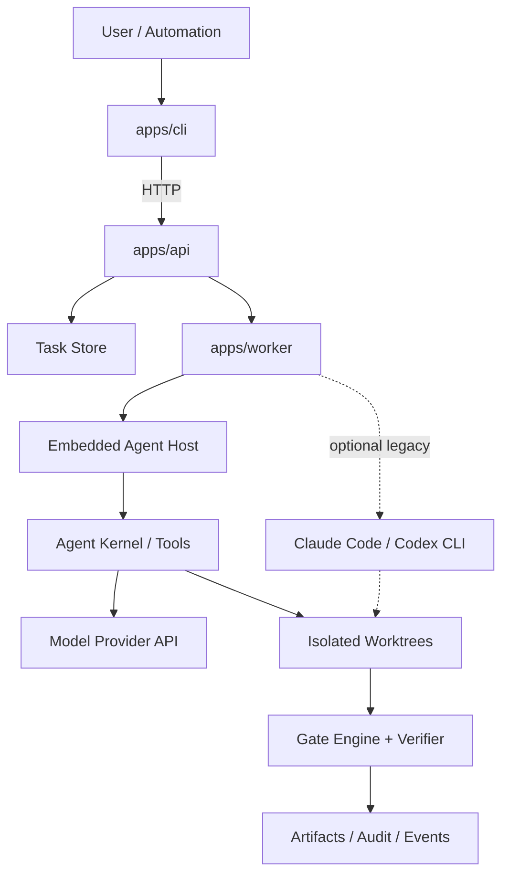
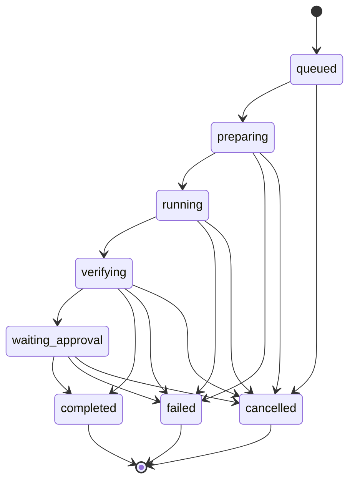

# 木牛 mn 技术实现文档

## 1. 定位

木牛 `mn` 是企业级微服务研发场景中的 AI Coding Agent 控制平面。名字取自“木牛流马”：取其工程化运输、调度和供给之意，把分散的 agent、候选实现、门禁和审批装进一套可搬运、可追踪、可复用的研发流程中。默认执行路径是直接连接模型 Provider 的内嵌 Agent Kernel，不依赖 Claude Code 或 Codex CLI 进程。

核心目标：

- 将自然语言需求转化为结构化任务、候选实现、验证报告和审批建议。
- 通过稳定模型协议支持 DeepSeek、OpenAI-compatible、OpenAI Responses 与 Anthropic Messages provider，并允许多候选运行。
- 面向微服务系统提供架构影响分析、接口契约检查、数据迁移风险检查和 owner 审批。
- 为长任务提供 checkpoint、compact summary、artifact 和 resume 能力。
- 默认自托管、本地优先，不上传源码遥测。

非目标：

- v1 不做自动合并。
- 不自动把仓库内验证冒充真实生产 IdP、KMS/Vault、集群切流或灾备验收。
- v1 不替代 CI/CD，而是调用和汇总现有验证信号。

当前实现采用同一领域内核的 `local` / `enterprise` 双 profile。企业 Spec–Governance–Harness–Loop、配置、API 和验收细节以 [Enterprise Spec–Harness–Loop](ENTERPRISE_SDD_LOOP.md) 为准；本文后续提到 Provider、Session、Proxy、桌面诊断和本地文件 queue 的段落仅属于 local profile。

## 2. 系统架构



### 2.1 组件

- `apps/api`：项目、任务、run、candidate、gate、artifact、policy 的中心化 HTTP API。
- `apps/cli`：开发者入口，负责初始化、注册项目、创建任务、触发 run、查看门禁。
- `apps/worker`：执行编排器，负责候选分配、worktree 准备、executor 调用、gate 聚合。
- `packages/core`：领域模型、状态机、策略、上下文生成、门禁工具。
- `packages/specs`：SpecSet/SpecRevision、严格校验、legacy wrapper 与 Spec Kit 适配。
- `packages/governance`：Standard Pack、单调解析、waiver、签名 registry、lock 与 snapshot。
- `packages/harness`：context、Gate/Sandbox capability、预算和不可变 Manifest 编译。
- `packages/loop`：七阶段 governed workflow、有界 repair、checkpoint/resume 与审批。
- `packages/evidence`：Eval Asset、Trace Graph、drift、Learning Proposal 与成熟度。
- `packages/agent-*`：闭合协议、append-only 会话、LLM 流、工具授权、Kernel 与 Host 的内嵌 Agent 运行时。
- `packages/executors`：可选 Claude Code/Codex CLI legacy 适配器和 Mock executor。
- `packages/verifier`：候选评分、候选对比、LLM verifier 扩展点。
- `packages/connectors`：Git 仓库索引、服务发现、契约发现，后续扩展 GitHub/GitLab/Slack/Feishu。

### 2.2 Spec–Harness–Loop 模型

`governed-increment-v1` 固定为七个阶段：Discovery → Specification → Impact/Architecture → Implementation → Verification → Approval/Demo → Learning。运行前先把 approved Spec 和分层 Standard Pack 解析成唯一 GovernanceSnapshot，再编译不可变 HarnessManifest；每阶段持久化 attempt、artifact digest、预算和失败分类。Verification 只允许有界 repair，Learning 只产出不能自动激活的提案。旧任务继续走 `classic-v1`。

## 3. 领域模型

### 3.1 Project

`Project` 表示一个企业代码仓库或工作区：

- `rootPath` 是本地 Git 根目录。
- `services` 由索引器发现或人工配置。
- `policyId` 指向执行策略。

### 3.2 Service

`Service` 表示微服务边界：

- `path` 是服务目录。
- `owners` 用于审批和责任归属。
- `contracts` 保存 OpenAPI、protobuf、GraphQL、AsyncAPI 等契约引用。

### 3.3 AgentTask

`AgentTask` 是可执行任务：

- `intent` 支持 analyze、design、implement、review、repair。
- `targetServices` 限定影响范围。
- `acceptanceCriteria` 是验收标准，必须进入 prompt 和 verifier。
- `strategy` 决定 provider、候选数量、沙箱、门禁、审批策略。

### 3.4 Run

`RunRecord` 是一次任务执行：



所有 terminal 状态不可再迁移。

### 3.5 Candidate

每个 candidate 绑定一个 provider 和一个工作区：

- `provider` 为 `claude` 或 `codex`。
- `worktreePath` 是隔离目录。
- `result` 保存 stdout、stderr、summary、artifact。
- `gates` 保存候选级门禁。
- 当 API local proxy 正在运行时，orchestrator 会给 executor 进程注入 `MN_RUN_ID`、`MN_CANDIDATE_ID` 和带 `/mn/runs/:runId/candidates/:candidateId` 前缀的 provider base URL，使代理日志能把真实请求关联回 run/candidate。已关联的非流式和文本 event-stream 2xx provider 响应会写入本地 replay cache，重复请求命中时直接返回缓存响应并标记 proxy log replay；包含 tool-call 的响应默认不写入 replay cache，旧 tool-call replay record 也默认不回放；provider 可用 `config.toolReplayPolicy.tools` 按工具名声明 `readonly` 或 `idempotent` 后允许安全工具 replay，旧 `config.replayToolCalls: true` 仍作为兼容的全量 opt-in；桌面 Provider 表单保留 legacy opt-in checkbox。provider `config.idempotencyHeaderName` 可开启上游幂等 header 注入，值由同一 replay key 派生，并且不会覆盖调用方已有同名 header。Chat Completions SSE 的多工具交错 `tool_calls` delta 已有本地回归，转换到 Responses SSE 和 Anthropic Events 时会按 tool call index 分离 id/name/arguments。
- 桌面 Provider 表单可编辑 legacy `replayToolCalls` checkbox，以及 readonly、idempotent、side-effect 三类工具名；保存后归一写入 `config.toolReplayPolicy.tools`。
- CLI `mn provider add` 可通过 `--replay-tool-calls`、`--tool-readonly`、`--tool-idempotent` 和 `--tool-side-effect` 创建带工具级 replay policy 的 provider。
- Proxy request log 会携带 tool-call replay metadata，包括工具名、effect 和 replaySafe；桌面 Observability 的 Proxy Logs 行会显示工具 replay 摘要。

## 4. Public API

### 4.1 HTTP API

```text
GET    /healthz
GET    /v1/capabilities
GET    /v1/workflows
GET    /v1/harness-profiles
GET    /v1/system/doctor
GET    /v1/system/diagnostics
POST   /v1/system/env-cleanup
GET    /v1/providers
POST   /v1/providers
GET    /v1/providers/export
POST   /v1/providers/import
POST   /v1/deep-links/preview
POST   /v1/deep-links/import
POST   /v1/providers/model-catalog/sync-due
GET    /v1/providers/:id
PATCH  /v1/providers/:id
POST   /v1/providers/:id/model-catalog/sync
GET    /v1/providers/:id/model-catalog/audit
POST   /v1/providers/:id/enable
POST   /v1/providers/:id/duplicate
POST   /v1/providers/:id/test-endpoint
DELETE /v1/providers/:id
POST   /v1/projects
GET    /v1/projects/:id
POST   /v1/projects/:id/index
POST   /v1/tasks
GET    /v1/tasks/:id
POST   /v1/tasks/:id/runs
GET    /v1/projects/:id/effective-governance
GET    /v1/projects/:id/policy/explain
POST   /v1/spec-sets
POST   /v1/spec-sets/:id/revisions
POST   /v1/spec-sets/:id/revisions/:revision/approve
GET    /v1/standard-packs
POST   /v1/standard-packs/import
POST   /v1/standard-packs/:id/activate
POST   /v1/waivers
GET    /v1/eval-assets
POST   /v1/eval-assets
GET    /v1/trace-graphs
POST   /v1/trace-graphs
GET    /v1/learning-proposals
POST   /v1/learning-proposals
GET    /v1/audit-events
GET    /v1/run-jobs/queue
GET    /v1/run-jobs/queue/:id
POST   /v1/run-jobs/queue/claim
POST   /v1/run-jobs/queue/:id/heartbeat
POST   /v1/run-jobs/queue/:id/release
POST   /v1/run-jobs/queue/:id/events
POST   /v1/run-jobs/queue/:id/update
POST   /v1/run-jobs/queue/:id/finish
GET    /v1/runs/:id
GET    /v1/runs/:id/events
POST   /v1/runs/:id/approve
POST   /v1/runs/:id/cancel
POST   /v1/runs/:id/resume
GET    /v1/runs/:id/artifacts
GET    /v1/runs/:id/artifacts/archive
GET    /v1/runs/:id/artifacts/:artifactId
GET    /v1/artifacts/store
POST   /v1/artifacts/store/cleanup
POST   /v1/runs/:id/workspaces/cleanup
POST   /v1/skills/registry/sync
GET    /v1/skills/registry/profiles
POST   /v1/skills/registry/profiles
GET    /v1/skills/registry/profiles/:id
PATCH  /v1/skills/registry/profiles/:id
DELETE /v1/skills/registry/profiles/:id
POST   /v1/skills/registry/profiles/:id/sync
GET    /v1/sessions
GET    /v1/sessions/:id
GET    /v1/sessions/:id/export
```

local profile 默认使用 MemoryStore + 可选 JSON snapshot。enterprise profile 使用 PostgreSQL metadata/queue/outbox 作为重启恢复源、S3-compatible artifact 和追加式审计；启动时从一致性 snapshot hydrate，并以 digest/CAS 防止 checkpoint 回退。

Provider API 以本地 SSOT 为事实源，支持 CRUD、复制、启用前 dry-run、live HTTP probe，以及迁移 JSON 导入/导出。`GET /v1/providers/export` 可按 app 过滤，导出 provider 元数据、模型定价和非敏感配置；密钥只导出 `apiKeyEnv` 这类环境变量名引用，本地加密 secret 与 keychain 引用会被省略。Provider API key 和 MCP env 默认写入本地 AES-GCM 加密 vault；设置 `MN_SECRET_VAULT_BACKEND=keychain` 时，`LocalSecretVault` 会通过 macOS Keychain generic password backend 保存 secret，并在 provider 上记录 `type: "keychain"` 的 secret ref，MCP env 会记录 `mniu:keychain:` ref；live probe、配置投影和 MCP projection 解析会复用同一 resolver。桌面 Provider 表单会回填并写入常用 `modelCatalog` 字段，包括模型 ID、展示名、上下文窗口、input/output 每百万 token 单价，以及 cached input、cache creation、cache read、reasoning output 分项单价，供 usage 成本估算复用。`POST /v1/providers/:id/model-catalog/sync` 支持 inline JSON 或 `sourceUrl` 同步单个 provider 的 `modelCatalog`，默认 dry-run，确认后写入目录和 `config.modelCatalogSync` 元数据，记录来源、同步时间、模型 hash、模型数量和 `maxAgeDays`；URL 同步可选择保存 `config.modelCatalogSyncPolicy`，记录 source URL、mode、maxAgeDays 和 refresh interval。`replace` 模式删除缺失模型，`merge` 模式保留现有模型并追加/更新输入模型；响应返回 added/updated/removed/unchanged 预览。`GET /v1/providers/:id/model-catalog/audit` 基于同步元数据和当前目录 hash 返回 `never_synced` / `fresh` / `stale` / `changed`，用于判断价格表是否过期或被手动改动。`POST /v1/providers/model-catalog/sync-due` 会遍历已保存 policy 的 provider，dry-run 或确认刷新从未同步、过期、手动改动或已到 refresh interval 的目录，适合由 cron/launchd 调度；API 也可用 `MN_PROVIDER_MODEL_CATALOG_SYNC_INTERVAL_MS` 显式开启内置 scheduler，并用 `MN_PROVIDER_MODEL_CATALOG_SYNC_APP`、`MN_PROVIDER_MODEL_CATALOG_SYNC_PROVIDER_IDS`、`MN_PROVIDER_MODEL_CATALOG_SYNC_LIMIT` 限定范围。该同步机制不硬编码当前官方价格，真实官方/企业价格源 preset 和真实源差异验证仍是后续范围。`POST /v1/providers/import` 支持 dry-run，确认写入时创建 disabled provider 并跳过同 app/name/baseUrl/defaultModel 的重复项，不会自动投影 live 配置。`POST /v1/deep-links/preview` / `POST /v1/deep-links/import` 支持 `mniu://import/provider|mcp|prompt?payload=<base64url-json>`、`data` 或 URL 编码 `json` payload；Provider 深链复用 provider import schema，确认后仍只创建 disabled provider；MCP/Prompt 深链只导入本地 SSOT，后续仍需显式 project/activate 才写 live 配置。MCP projection 会解析本地 vault 中的 env secret：Claude 写入 `.claude.json` 的 `mcpServers`，Codex 写入官方 `config.toml` 形态的 `[mcp_servers.<name>]`、`args = [...]` 和 `[mcp_servers.<name>.env]` 子表，投影响应仍会对 secret 做脱敏。

桌面 Observability 复用 `/v1/usage/summary`、`/v1/sessions`、`/v1/proxy/logs` 和 `/v1/proxy/health`，同屏展示 usage、session、proxy log 与 provider health/circuit 状态。Proxy Health 列展示 provider name、`healthy` / `degraded` / `circuit_open` / `unknown`、连续失败次数、最近状态码、latency 和最近错误或成功时间；对 `degraded` / `circuit_open` provider 可调用 `POST /v1/proxy/health/reset` 清除本地 health/circuit 记录，让下一次真实请求重新评估。Provider 可通过 `config.healthPolicy.failureThreshold` 与 `config.healthPolicy.circuitOpenMs` 覆盖默认的 3 次失败 / 60 秒 circuit 策略，桌面 Provider 新增/编辑表单会回填并写入这两个字段，API 在 live probe 和 local proxy health event 两条路径都会使用同一 policy。可重复 E2E 会用临时 upstream 生成 healthy provider，用不可达 upstream 连续 probe 触发 `circuit_open`，再通过桌面按钮重置为 `unknown`，同时覆盖桌面 Provider 表单 policy 创建/回填/更新，不依赖真实 provider key。

Skills registry sync 以 JSON index 作为可远程化的 source 分发格式：条目包含 `SKILL.md` 文件清单、version、sha256 和可选 Ed25519 signature。签名条目可声明 `publicKeyId`，registry index 可声明 `publicKeys` 与 `revokedPublicKeyIds`，API/CLI/桌面还可传入 `trustedPublicKeys` 与额外 revoked key IDs；验签会按 `publicKeyId` 选择受信 key，多 key 且 entry 未声明 key id 时拒绝避免歧义，revoked key 会以 `400 invalid skill registry` 拒绝同步。registry index 还可声明 `releaseMetadata`：同步层会对不含 metadata 的 canonical registry payload 计算 `registrySha256`，校验 metadata hash、Ed25519 signature、`publicKeyId`、撤销 key 和 `expiresAt`；`requireReleaseMetadata` 会拒绝缺 metadata、缺签名、hash mismatch、signature mismatch 或过期发布元数据。API 默认 dry-run，确认同步时写入 `mniuRoot/skills/<name>`，对已有 source 做 `skill-backups/registry-<name>/` 备份，并按已有 skill record 版本判定 `new` / `update` / `refresh` / `current` / `downgrade`；`requireSignature` 会拒绝缺 entry 签名、未受信 key、revoked key 或验签失败的条目。

Registry trust profile 保存在本地 SSOT，记录 profile name、registry URL、`requireSignature`、`requireReleaseMetadata`、legacy public key、trusted public keys 和 revoked public key IDs。CLI `mn skill registry-profile add|list|sync|delete`、API `/v1/skills/registry/profiles*` 和桌面 Extensions 的 Profile selector 复用同一个 profile sync 路径；profile sync 仍先 dry-run，确认后才写入 source store。该机制覆盖本地 trust policy、key rotation、撤销列表、可信 registry preset 和 signed release metadata 基础；托管 registry 发布流程、TUF/Sigstore provenance、透明日志和 CDN/cache 发布治理仍属于后续发布级范围。

`POST /v1/runs/:id/resume` 接受 `failed` / `cancelled` run，按原 task 创建 replacement run，并在旧 run 与新 run 的 events 中写入关联 ID。API 启动恢复 interrupted run 时默认会将其标记为 failed，并对 run record 中已有的可读取 artifacts 执行本地 artifact store 补偿持久化；真实 Claude/Codex executor 开始执行后会把 stdout/stderr 持续写入 workspace root 下的 candidate checkpoint 文件，若 API 重启时发现 running candidate 已有 checkpoint 输出，会把这些部分输出恢复到 failed result 并进入 artifact persistence。设置 `MN_API_STATE_PATH` 后，snapshot 同时保存 run job lifecycle：`startRunJob()` 或 `{ "queueOnly": true }` 会写入 `queued` job，worker 开始时标记 `running`，terminal run 会标记 `completed` / `failed` / `cancelled`，并记录 attempt、priority、recovered、startedAt、finishedAt、resumeFromRunId 和 interruptedAt。`POST /v1/tasks/:id/runs` 可通过 `queuePriority` 设置 `-1000..1000` 的本地队列优先级；CLI 对应 `mn run --priority`。run job 启动还会获取 `mniuRoot/run-job-leases/<run-id>.lock`，通过 TTL/heartbeat 防止多个 API 进程重复执行同一 run，过期 lock 可由后续实例回收；同时会写入 `mniuRoot/run-job-queue/<run-id>.json` 持久队列 item，记录 queued/running/terminal 状态、project/task、attempt、priority、owner 和时间戳。`GET /v1/run-jobs/queue?status=claimable`、`POST /v1/run-jobs/queue/claim`、heartbeat、release、events、update 和 finish 提供外部 worker runner 协议基础；claimable item 按 priority 从高到低排序，同 priority 下按创建时间 FIFO，再用 runId 保证确定性；claim 写入 `ownerId`、`claimToken`、`claimedAt`、`claimExpiresAt` 和 `heartbeatAt`，过期 claim 会重新变为 claimable，active claim 可追加 events、写入 running run snapshot，并提交 terminal run 触发 artifact persistence 和 queue terminal 状态。API 还会写入 `mniuRoot/run-job-workers/<owner-id>.json` worker registry，queue claim/heartbeat/release/finish 与直接 worker heartbeat 都会更新 worker idle/running/stale、capacity、activeRunIds、activeRunId、lastSeenAt、heartbeatExpiresAt 和完成/失败/释放计数；同一 owner 的 activeRunCount 达到 capacity 且心跳未过期时，claim 返回 `worker_at_capacity` 且不认领新 job；`GET /v1/run-jobs/workers`、CLI `mn run workers` 和桌面 Task Fusion `Worker Fleet` 面板可查询本地 fleet slots。CLI `mn run worker --capacity` 可作为独立外部进程声明本地 slots、认领并执行 queued run，`mn run --queue-only` 可只入队不在 API 进程内启动。API-managed local proxy 会把已关联非流式和文本 event-stream 2xx provider 响应写入 replay record；同一 app/provider/model/method/target URL/request hash/run/candidate 的重复请求会命中缓存，避免再次访问 upstream provider。包含 tool-call 的 provider 响应默认不写入或命中 replay record，避免重复触发客户端工具执行；provider 可用 `config.toolReplayPolicy.tools` 按工具名声明 `readonly` 或 `idempotent` 后允许安全工具 replay，旧 `config.replayToolCalls: true` 仍作为兼容的全量 opt-in。provider `config.idempotencyHeaderName` 显式配置时，同一 replay key 还会作为上游幂等 header 发送给 provider。Chat SSE multi-tool 转换已有本地回归。设置 `MN_API_AUTO_RESUME_RUNS=1` 后，尚未进入候选执行、没有 candidate 的 `queued` / `preparing` run 会用原 runId 自动重放，已有 candidate 且这些 candidate 全部是 `completed` / 带 result 或 `queued` / 无 result 的 checkpoint run 会跳过已完成 candidate、继续执行 queued candidate 并补跑剩余 candidate。存在 running/failed/cancelled candidate 的 run 仍需要显式 replacement resume；当前 priority/capacity 是本地 admission/claim 保护能力，生产级队列后端、跨机器 worker fleet 调度/公平性、抢占、provider tool-call 完整幂等重放和 provider 原生 idempotency 结果验证仍属于后续持久化队列能力。旧变量 `MN_API_AUTO_RESUME_PENDING_RUNS=1` 继续兼容。

terminal run 的可读取 artifacts 会写入本地 artifact store：默认在 `mniuRoot/artifacts/runs/<run-id>/` 保存 `index.json` 和内容文件。配置 `MN_ARTIFACT_REMOTE_STORE_PATH` 后，同一 index/content 会镜像到 filesystem-backed remote store；配置 `MN_ARTIFACT_REMOTE_STORE_TYPE=s3|gcs`、bucket、prefix 和本地 backend path 后，同一 index/content 会按 S3/GCS-compatible object key 布局镜像，并在 artifact remote ref 中记录 `s3://bucket/prefix/...` 或 `gs://bucket/prefix/...` URI、sha256、bytes 和 bucket/prefix 元数据。本地持久内容缺失时，下载和 archive 会按 sha256 从 remote backend 兜底恢复。正常完成、approve 后 completed、cancelled、failed 和启动恢复 interrupted failed 路径都会尽力触发 artifact persistence。`GET /v1/runs/:id/artifacts` 会合并当前 run record 与 artifact store index，并支持 `candidateId`、`provider`、`kind`、`gate`、`source`、`persisted` query 筛选；`GET /v1/runs/:id/artifacts/:artifactId` 会优先返回本地持久化内容，其次返回 remote backend 内容，最后回退到 synthesized artifact 或 candidate workspace 内文件；`GET /v1/runs/:id/artifacts/archive` 会返回包含 `manifest.json` 和可读取 artifact 内容的 tar archive，且复用同一组筛选条件供 CLI 和桌面 Run Detail 批量下载。下载响应会暴露 `content-disposition` 等 header，供桌面 Run Detail 使用服务端文件名触发 artifact 下载；桌面端在 Tauri 环境中优先调用原生 save dialog + fs 写入，非 Tauri 或 native save 失败时回退浏览器 `<a download>`。

`GET /v1/artifacts/store` 汇总本地 artifact store；配置 remote backend 时还会返回 remote 类型、rootDir、本地对象 backend 的 bucket/prefix/URI prefix、run/artifact/bytes 汇总，并返回 cleanup audit 最近记录和最后一次手动 cleanup 策略摘要。`POST /v1/artifacts/store/cleanup` 支持 `dryRun`、`keepLatestRuns`、`maxAgeDays`、`maxBytes` 和 `scope=local|remote|both`，默认只预览/确认删除 run 级本地 artifact store 目录；remote/both scope 按同一 policy 清理 filesystem mirror 或 S3/GCS-compatible object backend 的 run 目录。响应只返回 runId、artifact 数、bytes、时间、删除原因和 scope，不暴露本地 artifact store 绝对存储路径；remote scope 会返回 remote 类型、bucket/prefix 或 mirror root 摘要。手动 cleanup 请求会写入 `mniuRoot/artifacts/cleanup-policy.json` 并追加 `cleanup-audit.jsonl`，配额自动清理也会追加 `trigger=quota` 的审计记录。设置 `MN_ARTIFACT_STORE_MAX_BYTES` 后，API 会在 artifact 持久化后按 bytes 水位自动清理旧 run 目录；`MN_ARTIFACT_STORE_QUOTA_KEEP_LATEST_RUNS` 控制自动清理时保护的最新 run 数，默认 `1`。真实云 S3/GCS 鉴权、跨机器同步和企业级对象存储 lifecycle policy 仍是后续能力。

`POST /v1/runs/:id/workspaces/cleanup` 只接受 terminal run，且只清理 workspace root 内的 candidate path；Git worktree 候选优先通过 `git worktree remove --force` 清理，并删除 worker 创建的 `mn/<run>/<candidate>` 分支，非 Git snapshot 回退为普通目录删除。

Session API 从本机 Claude/Codex JSONL 目录即时索引，不写入本地 SSOT。parser 使用流式读取，避免大文件一次性载入内存；概要索引按 JSONL 文件 `mtimeMs` / `size` 做进程内增量缓存，查询搜索需要消息文本时会补充缓存 searchable text。`GET /v1/sessions` 支持 `app`、`homeDir`、`query`、`offset`、`limit` 和 `redact`；`GET /v1/sessions/:id` 支持按 id 读取解析消息。`GET /v1/sessions/:id/export` 返回 `mniu.session.export` JSON 文档，包含 metadata、是否脱敏和完整 session detail，并默认使用 `redact=true`；调用方必须显式传 `redact=false` 才能导出原始本地内容。`redact=true` 会遮蔽常见 API key、Bearer token 和用户 HOME 路径。桌面 Observability 的 session 列表/详情默认启用 `redact=true`，并提供脱敏开关重新读取列表和详情；当前 session 导出按钮会复用同一脱敏状态导出 `mniu.session.export` JSON，并在 Tauri 环境中优先使用原生保存对话框。真实 Codex 样本中常见的 `event_msg` / `response_item` 与 `payload.type` / `payload.message` schema 已覆盖；本机真实 Claude 小样本已做无内容 schema scan 和 parser smoke，`.claude/history.jsonl` 保持为 prompt/history metadata 而不混入 project session 列表；同等规模 Claude 大样本仍取决于更多真实历史数据。

本地代理会把 `x-mn-run-id` / `x-mn-candidate-id` header 或 `/mn/runs/:runId/candidates/:candidateId/...` 路径前缀解析为内部关联元数据。转发 upstream 时会剥离所有 `x-mn-*` header 和内部路径前缀，避免把木牛元数据泄漏给 provider。

### 4.2 CLI

```bash
mn init
mn doctor
mn doctor env-cleanup --name OPENAI_API_KEY --yes
mn doctor env-cleanup --source all --yes
mn diagnostics export --out mniu-diagnostics.json
mn provider model-catalog sync <provider-id> --file catalog.json
mn provider model-catalog sync <provider-id> --url https://example.test/catalog.json --mode merge --save-policy --yes
mn provider model-catalog audit <provider-id> --max-age-days 30
mn provider model-catalog sync-due --app codex --yes
mn project register --root . --name example
mn project index
mn standards validate|import|diff|activate|lock
mn spec init|import|validate|diff|approve|status
mn policy explain
mn workflow list|show
mn task create --title "fix bug" --service api --prompt "..." --acceptance "tests pass"
mn run --spec <spec-set>@<revision> --workflow governed-increment-v1 --harness-profile enterprise
mn run --task <task-id> --priority 10
mn run worker --capacity 2
mn run watch <run-id>
mn run resume <run-id>
mn gates report <run-id>
mn audit export
```

企业 CLI 从 `MN_API_TOKEN` 读取 JWT，并对 JSON、SSE 和 artifact 下载请求统一发送 Bearer header；只接受 token 本体，不持久化也不打印。交互命令使用 human principal，queue worker 使用带最小 scopes 的 machine principal。`mn doctor` 读取 `/v1/system/doctor`，展示本机 binary、Claude/Codex 配置目录和 managed env 冲突。`process.env` 冲突来自当前 API 进程环境；shell profile 冲突来自 bash/zsh/fish/csh/tcsh 常见一行赋值；launchd 冲突来自用户 `~/Library/LaunchAgents/*.plist` 的 `EnvironmentVariables` 字典；IDE 冲突来自 VS Code/Cursor/Windsurf/VSCodium user `settings.json` 的 `terminal.integrated.env.osx|linux|windows`。所有密钥只返回脱敏值、来源和位置。`mn doctor env-cleanup` 调用 `/v1/system/env-cleanup`，默认 dry-run 且默认只清理 shell profile；确认时 API 会先备份目标文件，再删除明确匹配的 `export ANTHROPIC_API_KEY|ANTHROPIC_BASE_URL|OPENAI_API_KEY=...`、bash/zsh `declare|typeset -x ...`、fish `set -gx/-Ux ...`、fish `conf.d/*.fish` 或 csh/tcsh `setenv ...` 行。CLI 可通过 `--source shell|launchd|ide|all` 显式选择 launchd/IDE；launchd 清理只删除 `EnvironmentVariables` 中的 managed env key/string pair，IDE 清理会解析 JSONC 并删除 terminal env block 内的 managed env 字段。当前进程的 `process.env` 不尝试修改父 shell 或应用已存在环境，而是在 cleanup 响应里返回 `manualActions`，例如 `unset OPENAI_API_KEY` 和重启终端/IDE 提示。`mn diagnostics export` 读取 `/v1/system/diagnostics` 并原样导出 `mniu.diagnostics` JSON，可用 `--out` 写文件；这为无桌面端环境提供同一套截断、脱敏后的日志/crash 诊断包。

桌面 Settings/Doctor 区块复用同一组 API：加载 `/v1/system/doctor` 展示 process env、shell profile、launchd 与 IDE settings 冲突，`预览清理` 调用 `/v1/system/env-cleanup` 的 dry-run，`确认清理` 再提交 `dryRun:false`。UI 会显式传入 shell/launchd/IDE 三类 sources，并展示 API 返回的备份路径；当前进程 `process.env` 保持只读边界，但会显示 manual action 计数、`unset NAME` 命令和重启提示。当前实现不解析任意 shell 表达式，只处理明确可删除的一行 managed env 赋值；真实用户 HOME/父 shell manual remediation 执行确认仍是后续外部验证范围。

桌面 Settings 保存会同步 `launchAtLogin`：Tauri 环境调用 `@tauri-apps/plugin-autostart` 的 `enable` / `disable` 并通过 `isEnabled` 回读状态；非 Tauri 浏览器验证环境只保存偏好并提示 fallback。当前证据覆盖 plugin wiring、Tauri CLI 识别和浏览器 E2E，真实 macOS Login Items 安装后实测仍需 native build 环境。

桌面 close behavior 在 Tauri 环境订阅当前窗口 `onCloseRequested`：`quit` 不阻止原生关闭，`tray` 调用 `preventDefault()` 后隐藏当前窗口，`lightweight` 调用 native `enter_lightweight_mode` 销毁主 WebView，命令不可用时回退到 Tauri JS `destroy()`。托盘 `open` 会在 `main` 窗口不存在时用 `WebviewWindowBuilder::from_config()` 按原窗口配置重建主窗口，托盘 `light_mode` 会销毁现有主窗口。非 Tauri 浏览器验证环境只覆盖设置持久化。`npm run verify:desktop-close-behavior` 会静态校验 close-request listener、最新 settings ref、quit 放行、tray hide、lightweight destroy、native command、托盘重建和 listener cleanup；真实 macOS WebView 关闭按钮、托盘恢复和轻量模式压力 smoke 仍需 native build/E2E 证据。

### 4.3 可选 legacy Executor Interface

以下接口只服务于 `classic-v1` 兼容路径。内嵌 Agent 使用 `agent-protocol`、`agent-llm`、`agent-tools`、`agent-kernel` 与 `agent-host`，不会生成或启动外部 CLI 命令。

```ts
export interface AgentExecutor {
  provider: "claude" | "codex";
  run(input: AgentRunInput): Promise<AgentRunResult>;
}
```

Claude Code executor 默认调用：

```bash
claude --print --output-format stream-json --verbose --permission-mode default
```

Codex executor 默认调用：

```bash
codex exec --cd <worktree> --sandbox workspace-write --ask-for-approval never <prompt>
```

## 5. 上下文 Harness

每次 run 生成 `RunContext`：

- 项目摘要。
- 目标任务。
- 目标服务。
- 架构简报。
- 验收标准。
- 历史失败。
- compact summary。

Prompt 结构：

```text
# Mission
# Architecture Brief
# Required Output
# Previous Failures
```

长任务续跑不能直接重放完整日志，只携带：

- 上一次机器摘要。
- 变更文件清单。
- 失败门禁。
- stderr tail。
- 下一步建议。

## 6. 微服务能力

仓库索引器 v1 通过常见 marker 发现服务：

- `package.json`
- `go.mod`
- `Cargo.toml`
- `pyproject.toml`
- `pom.xml`
- `build.gradle`
- `openapi.yaml`
- `proto/`

跨服务任务默认触发人工审批。后续版本扩展：

- owner 文件解析。
- OpenAPI breaking-change 检测。
- protobuf 兼容性检测。
- migration safety checker。
- service dependency graph。
- contract test orchestration。

## 7. 门禁与 verifier

门禁优先级：

1. 确定性检查：test、lint、typecheck、contract、安全扫描。
2. 结构化策略：是否跨服务、是否触碰保护路径、是否需要 owner。
3. LLM verifier：只用于候选排序、风险解释和人工审批建议。

Verifier v1 已实现确定性评分：

- 候选执行成功加分。
- pass gate 加分。
- warn gate 少量扣分。
- fail gate 强扣分且阻塞 winner。

生产版 LLM verifier 设计：

- 支持 OpenAI-compatible endpoint。
- 支持 score 与 compare 两种模式。
- 支持 criteria preset。
- 支持 cross-provider 评估，即一个 provider 生成，另一个模型评估。
- 不具备自动合并权限。

## 8. 安全模型

默认安全策略：

- 候选在独立 worktree 中运行。
- 受保护路径包括 `.env`、`.env.local`、`secrets/`、`.ssh/`。
- 命令必须进入 allowlist。
- 高风险任务必须人工审批。
- 所有 stdout、stderr、artifact 和 gate 均进入审计。
- 默认不上传源码遥测。

enterprise 已增加的边界：OIDC/JWT、六个人类角色、独立 machine worker principal/scopes、tenant/project 隔离、enterprise route allowlist、受控 project roots、签名 Standard Pack、S3/OTLP 和 append-only domain audit。API 为每次 claim 签发 HMAC sandbox attestation；参考 Docker backend 以只读 rootfs/源码、独立 scratch、禁网、资源限制、drop capabilities、非 root 和 tool allowlist 真正执行 Gate，并把 runtime evidence 与 Gate digest 绑定。证据历史只能追加，crash/reclaim 后的新 worker/container 不得改写旧 Gate 归属。生产部署仍需企业接入真实 IdP、KMS/Vault、sandbox fleet、secret redaction/DLP、audit retention 和灾备策略。

## 9. 存储设计

local profile 使用 `MemoryStore`；设置 `MN_API_STATE_PATH` 后写本地 JSON snapshot，并用文件 lease/queue/worker registry 支持单机恢复。Provider/Projection/Proxy/MCP/Prompt/Skill 仍是 local SSOT。enterprise profile 使用 PostgreSQL 的 `mn_metadata`、`mn_run_jobs`、`mn_outbox`、`mn_audit_events`；claim token 绑定 tenant/run/worker/capability/expiry，checkpoint 以 digest CAS 更新 payload，lease expiry 后新 worker读取最新确定状态。大型 artifact 使用 S3-compatible store，不把日志、diff 和报告直接塞入 metadata。

核心表：

- `Project`
- `Service`
- `Task`
- `Run`
- `Candidate`
- `GateResult`
- `Artifact`
- `Policy`
- `AuditLog`

大型内容不要直接写入数据库：

- 日志。
- diff。
- 测试报告。
- trace。
- verifier report。

这些内容进入 artifact store，本地默认在 `mniuRoot/artifacts` 下保存。当前实现提供基础本地文件持久化，覆盖 terminal 非成功和 API 恢复补偿路径，并提供 retention / quota cleanup API/CLI、cleanup 策略/审计持久化、可选配额水位自动清理、run artifacts archive 批量下载、artifact 查询/下载筛选、filesystem-backed remote mirror foundation、S3/GCS-compatible object key/URI backend foundation、remote scope cleanup foundation、桌面 Task Fusion store 管理入口和 Run Detail candidate workspace 打开入口；真实云对象存储鉴权、企业级 lifecycle policy 和跨机器同步仍是后续能力。

## 10. 可观测性

v1 已有事件模型：

- `status`
- `stdout`
- `stderr`
- `gate`
- `artifact`
- `approval`
- `error`

生产版要求：

- OpenTelemetry trace。
- structured logs。
- token usage。
- cost usage。
- command audit。
- artifact digest。
- run timeline。

## 11. 测试策略

当前测试覆盖 Spec revision/Spec Kit、规范单调合并/签名/waiver、Harness 确定性与 secret 脱敏、Gate runner/evidence、七阶段 Loop/预算/无进展/恢复、Eval/Trace/Learning、API/OIDC/RBAC/跨租户、PostgreSQL restart/reclaim/CAS、S3/OTLP、path traversal/symlink escape、Docker enforced sandbox、CLI 和桌面回归。企业 fixture 另外覆盖跨服务正例，以及 contract breaking、共享数据所有权、无 rollback 与 protected path 四类负例。

仍属于外部生产验收而非仓库测试的范围：真实模型 provider smoke、可选 legacy Claude/Codex executor smoke、企业 IdP/Vault/KMS、生产 scanner 规则库、remote sandbox fleet、数据库 HA/灾备、对象存储 lifecycle、集群容量/混沌、Apple 签名与公证。

验收标准：

- `npm run build` 通过。
- `npm run typecheck` 通过。
- `npm test` 通过。
- Docker Compose enterprise E2E 完成 approved Spec → Governance/Harness → cross-service Gate/repair → owner approval → evidence/audit/learning。
- 内嵌 Agent 的协议、会话、模型、工具、Kernel、Host 与 REST/SSE 测试通过；可选 legacy adapter 保持编译通过。
- 文档能让新工程师独立理解系统边界和实现路径。

## 12. 发布计划

v0.1.0 开源发布制品固定为 `muniu-v0.1.0-source.tar.gz`、Node 22 的 `muniu-v0.1.0-node22-macos-arm64.tar.gz` / `muniu-v0.1.0-node22-macos-x64.tar.gz` portable 包，以及 `ghcr.io/muniu-ai/muniu:v0.1.0` API/demo 镜像。v0.1.0 不发布或启用桌面运行时 updater，也不生成 updater archive、manifest 或 `latest.json`；unsigned universal APP/ZIP/DMG 与 `packaging/homebrew/Casks/mniu.rb` 仅保留为后续签名桌面发布的本地验证工程，不属于 v0.1.0 公开制品。`npm run verify:mac-release` 校验该发布边界以及本地 cask、DMG 和中文发布文档，`npm run verify:mac-packaged-app` 验证 DMG 内容、双架构 daemon、隔离 Keychain CRUD、进程生命周期与 `mniu://` 处理。Tauri panic hook 会把 Rust panic 追加到 `~/Library/Logs/dev.muniu.desktop/panic.log`，并保护性替换疑似 secret/token/password。API `GET /v1/system/diagnostics` 会收集受限且脱敏的木牛日志、专属 app 日志和相关 DiagnosticReports；桌面 Settings/Doctor 与 CLI `mn diagnostics export` 均可导出诊断包。Developer ID 签名、Apple 公证、Gatekeeper、真实 updater 下载/安装、packaged crash 写入与双架构干净机验收仍属于后续生产化范围。

### 当前

- local/enterprise 双 profile、内嵌 Agent 默认执行路径，以及可选 Claude Code/Codex legacy executor 和 Mock executor。
- Spec/Governance/Harness/Loop/Evidence、动态 capabilities、微服务影响分析和多语言 Gate。
- OIDC/RBAC、PostgreSQL、S3、OTLP、签名规范包、Docker Compose 企业验收 fixture。

### 后续生产化

- 真实 IdP/Vault/KMS、sandbox worker fleet、PostgreSQL HA/灾备和对象存储 lifecycle。
- 企业实际 SAST/SCA/license/secret scanner runner 与大规模容量/混沌测试。
- GitHub/GitLab connector、受审批 PR/merge、Production chart 与 Web dashboard。
- Developer ID/公证/updater/干净机发布验收。
