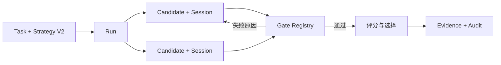
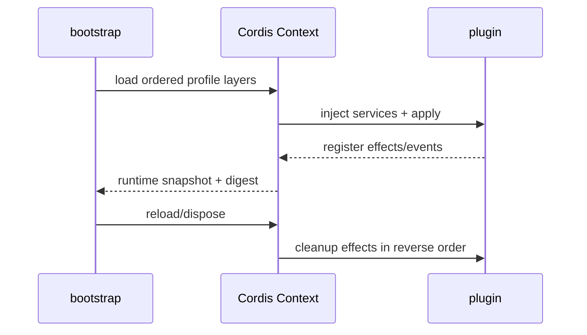
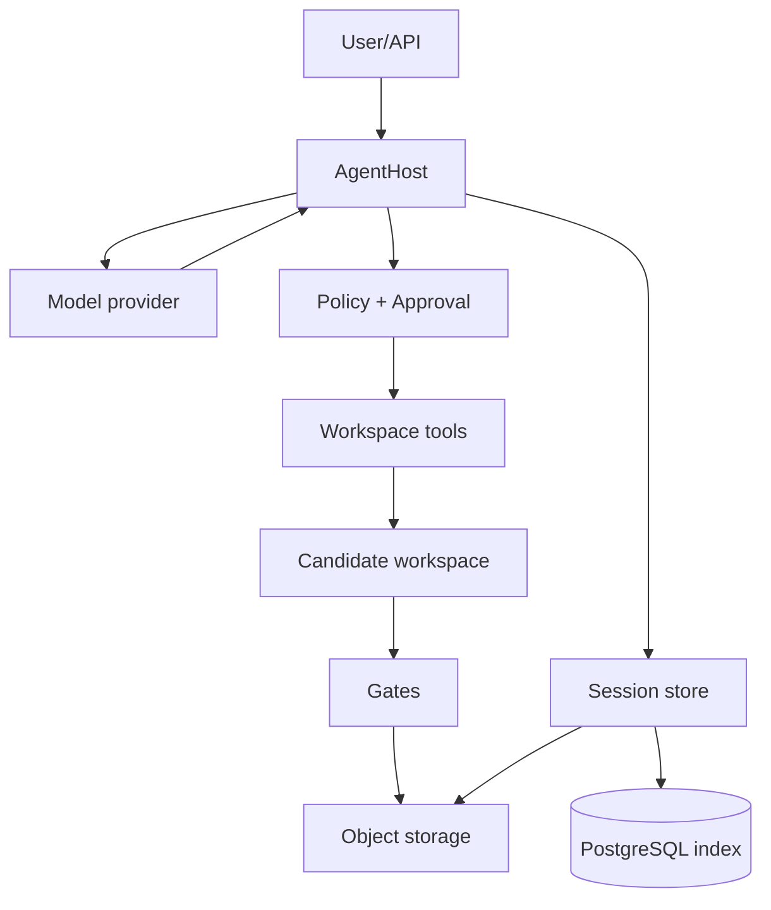
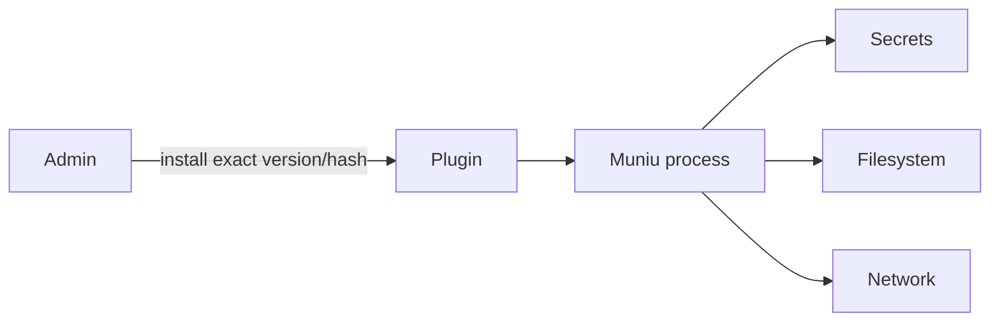
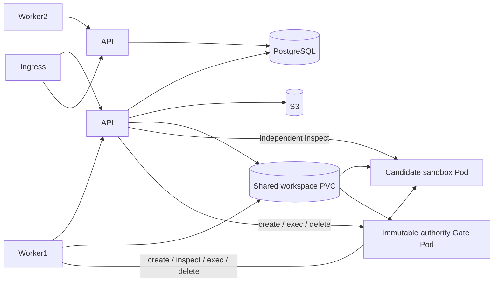

# 架构

## 运行闭环

每个 candidate 拥有 `AgentExecutionBindingV1`，其中绑定 session、runtime、provider/model、Harness、治理策略、effect policy 和 sandbox capability 摘要。

## Cordis 生命周期

API、Worker、Desktop 使用独立根 Context；每个 Agent session 再隔离 `agentHost`、`agentSession`、`toolRegistry` 和 `modelRuntime` 服务。

## 数据流

企业会话把事件索引、序号和摘要存入 PostgreSQL；受保护事件与模型运行时 overlay 写入 S3。读取时同时验证对象大小、SHA-256、事件摘要和链。

## 插件信任边界

插件不是沙箱。第三方插件拥有宿主进程权限，必须由管理员显式信任。

## Kubernetes 拓扑

源码由 API 写入 S3 内容寻址存储，Worker 凭活跃 claim 下载并校验后物化到共享 PVC。候选 Pod 不读取 S3、不挂载 Kubernetes token，也没有默认网络。Worker 只控制候选 Pod；API 使用独立 RBAC 再次验证实际 Pod，并在第二个只读 Pod 中权威重放 Gate。该路径在 v0.1.0 标记为实验性，并由 Kind + Calico 探针验证核心隔离契约。
